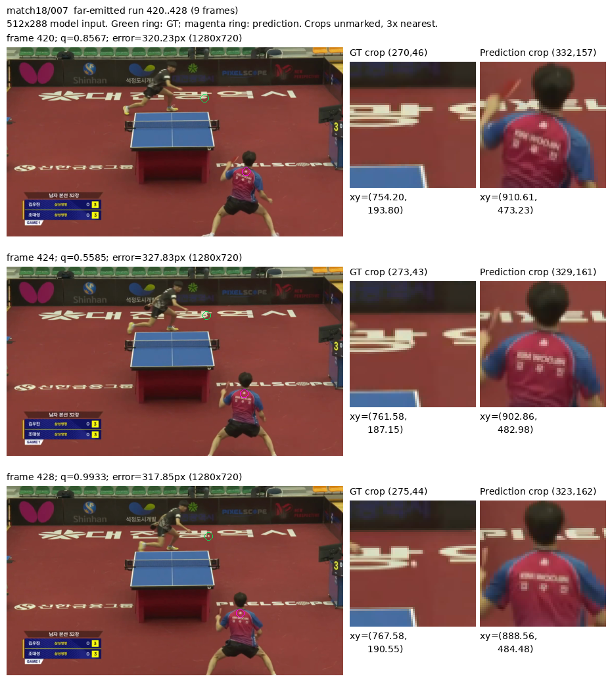
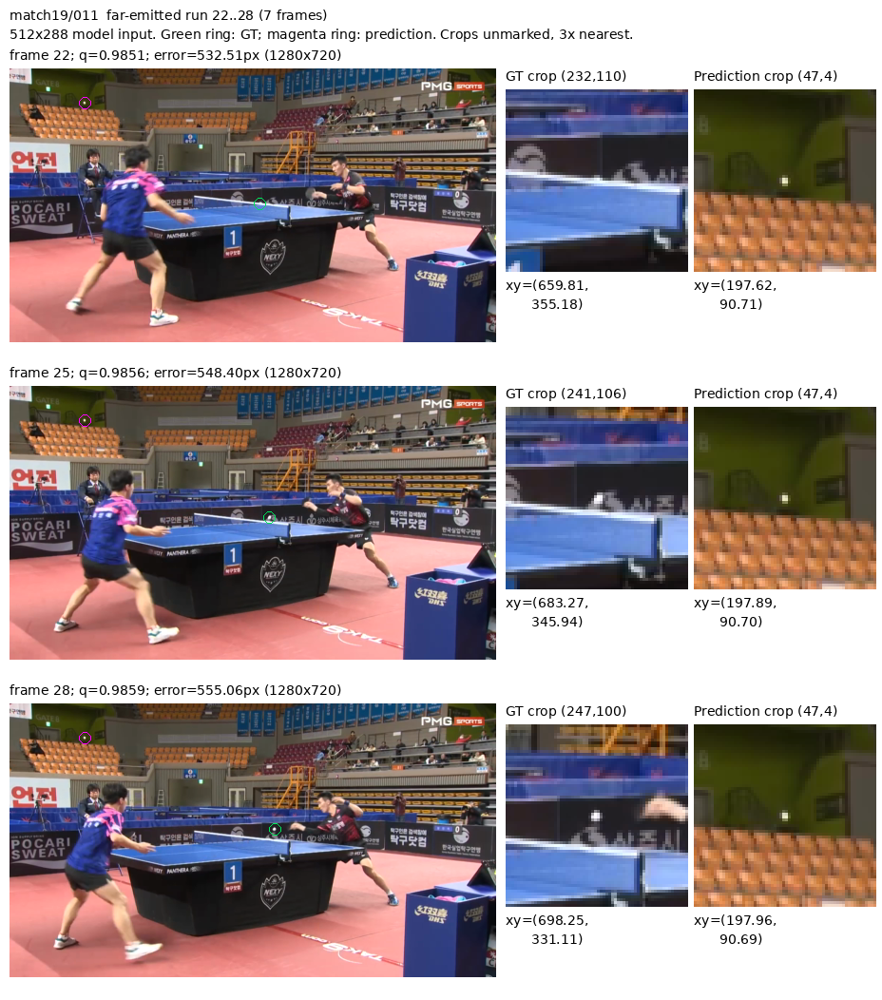
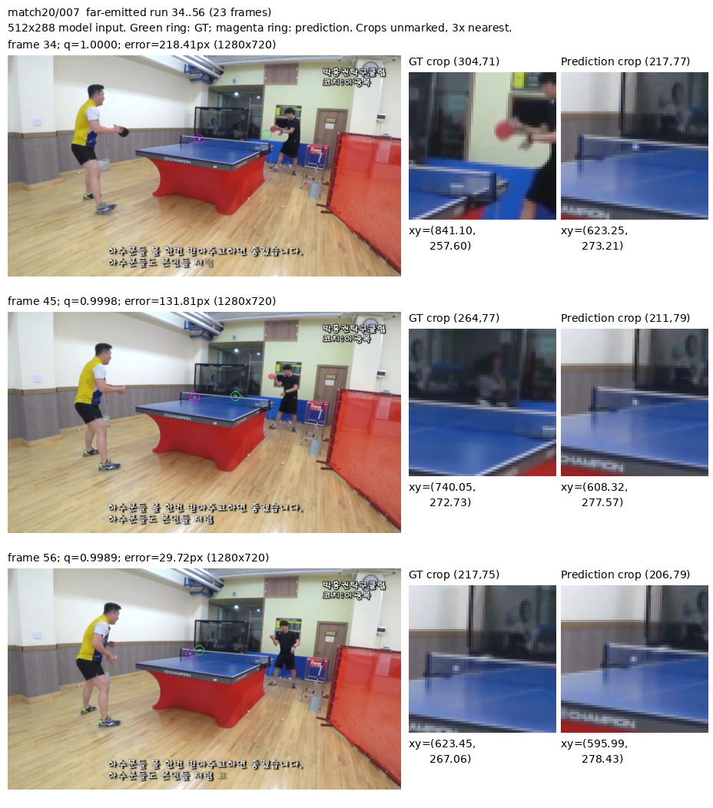
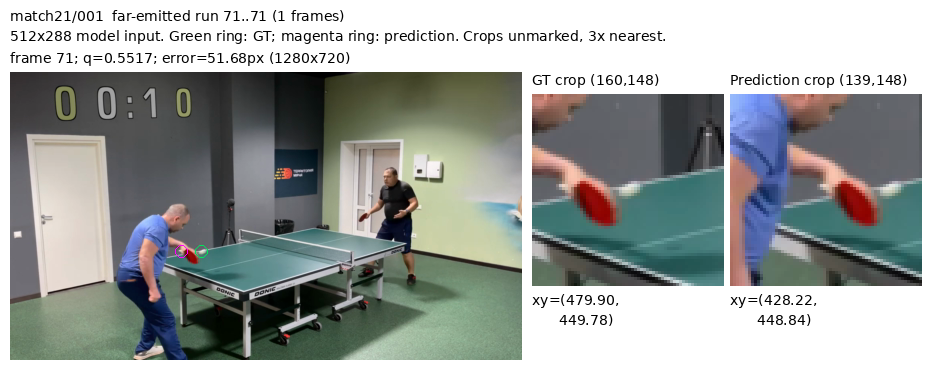

# BlurBall 残留错误是孤立偏差还是持续错误输出

日期：2026-09-12。状态：已完成。性质：固定真实历史 best6 的探索性诊断，不是新的模型比较或选优协议。以下范围与选样规则在统计、看图前写定。

## 问题与限定范围

[局部重心读出](2026-09-12-blurball-local-readout.md)已改善一部分细位置误差，但远错位和可见拒绝仍在。既有[历史中心邻近诊断](2026-09-12-blurball-temporal-control.md)已排除多数远错位只是直接复制旧 GT 中心的解释；本次不重做该结论，只研究错误的时间组织。

使用已保存的 `dino_midpoint_seed0/local_readout/val_predictions.csv`，固定 best6、15×15/T1 重心、原 q 与 0.5 阈值，全部 match18–21 验证目标。最终 22–25 不访问；正在运行的 repeat-current 模型、选优和评价不变。

先把每帧分成六种互斥状态：V1 正确发出（原图误差 <4px）、V1 近错位发出（4≤误差<16px）、V1 远错位发出（误差≥16px）、V1 拒绝、V0 发出、V0 拒绝。V0 不计算位置误差，也不直接解释为物理无球。这里只分析实际发出的位置；拒绝状态不能因为内部还有坐标就被当成背景误检。

按 `(game, clip, original_frame_id)` 构造每种状态的最大连续段，状态变化、rally 变化或真实帧号有缺口即截断。既定合法窗口已排除内部边界两侧的跨界目标，不能重新补齐。记录完整长度分布、逐比赛数量以及长度至少 4 的段贡献了多少帧；不依据结果另选“长期”阈值。

选择 4 帧的理由是当前输入仅三帧：连续四个目标的首末输入窗已无公共图像。但连续错误不能因此解释成隐藏状态积累，当前模型本就没有跨窗口持久状态；它也可能来自持续背景、可见性或重复场景条件。

对于发出位置的连续段，记录预测坐标包围盒对角线；它是所有预测点两两距离的上界，不是精确轨迹直径。仅对 V1 段记录 GT 坐标同类量，以区分预测几乎不动和真实目标变化。不能仅靠这些数值把某位置命名为背景。

视觉样例预先限定为：每个验证比赛选择最长的 V1 远错位发出段，长度平局按 clip 和起始原帧号排序；最多四段，各取首、中、末，重合去重后至多三个不同目标帧。先保存选择再看图，不按画面“像背景”挑样本。只读取现有 512×288 RGB 缓存，展示的是模型输入分辨率，不冒充原视频的高分辨率细节；无新解码或 forward。

若长段包含稳定干扰物且真球在变化，它支持把持续错误候选/背景竞争作为下一阶段的具体问题；若主要为零散或动态错位，则不以本诊断支持静态背景机制。无论哪种结果，都不能代替真实历史与重复当前帧的最终配对对照，也不能证明某类新模块有效。

## 实际结果

统计覆盖全部 **14,192 个验证目标**，形成 2,734 个最大状态连续段。以下比例的分母是对应状态的帧数，不是全部验证帧，也不是连续段数。

| 状态 | 帧数 | 段数 | 最长段/帧 | ≥4 帧段中的帧数 | 占该状态帧数 |
|---|---:|---:|---:|---:|---:|
| V1 正确发出，误差 <4px | 9,660 | 924 | 76 | 9,062 | 93.81% |
| V1 近错位发出，4≤误差<16px | 388 | 325 | 5 | 13 | 3.35% |
| V1 远错位发出，误差≥16px | 709 | 343 | 23 | 309 | 43.58% |
| V1 拒绝 | 2,139 | 713 | 30 | 1,326 | 61.99% |
| V0 发出 | 432 | 161 | 58 | 234 | 54.17% |
| V0 拒绝 | 864 | 268 | 20 | 567 | 65.62% |

远错位的完整长度分布为：`1:221, 2:55, 3:23, 4:6, 5:8, 6:11, 7:7, 8:4, 9:2, 10:2, 12:2, 13:1, 23:1`，格式为“长度:段数”。其 ≥4 帧的 44 段贡献了 309 帧；同时仍有 221 个单帧段，不能将全部远错位解释为持续吸附。其他状态的完整分布保存在输出 JSON。

相比之下，近错位发出主要是短段。但近/远类别本身由阈值切分，同一个错误位置若因 GT 运动跨越 16px，状态段也会被截断；这里测得的是**某种输出状态的持续**，不等于已经关联了某个干扰物的身份。也不能从总体段长直接推断各类错误的物理寿命。

### 比赛间差异不能被总体比例掩盖

| 比赛 | V1 远错位帧 | 远错位段 | 最长段 | ≥4 帧段中的远错位帧 | 占本比赛远错位帧 |
|---|---:|---:|---:|---:|---:|
| match18 | 204 | 119 | 9 | 42 | 20.59% |
| match19 | 139 | 100 | 7 | 15 | 10.79% |
| match20 | 357 | 115 | 23 | 252 | 70.59% |
| match21 | 9 | 9 | 1 | 0 | 0.00% |

309 个长段远错位帧中，252 个来自 match20，占 81.55%。因此，**本模型的持续远错位现象在某些来源很突出，但没有跨四场一致出现。** match21 的主要问题也不能用这九个孤立远错位代表：它还有 979 个 V1 拒绝和 138 个 V0 发出。此处未为这些状态另挑视觉样例，不能给其原因下结论。

### 按预先规则选出的四段

下表的两类跨度均为该段**所有帧**坐标包围盒对角线，单位是 1280×720 原图像素。图像只展示列出的首/中/末目标。右侧 64×64 输入像素 crop 使用最近邻放大 3 倍，未覆盖定位标记；绿色/紫色圈仅出现在全图缩略视图。

| 比赛/rally | 原帧段 | 长度 | 预测跨度上界 | GT 跨度上界 | 展示目标帧 |
|---|---|---:|---:|---:|---|
| match18/007 | 420–428 | 9 | 24.76 | 15.08 | 420、424、428 |
| match19/011 | 22–28 | 7 | 0.34 | 52.05 | 22、25、28 |
| match20/007 | 34–56 | 23 | 29.94 | 219.20 | 34、45、56 |
| match21/001 | 71 | 1 | 0.00 | 0.00 | 71 |

**match18：持续运动前景干扰的样例。** 三张抽样帧的预测都落在近端运动员后颈、肩背或球衣区域，并随人物略有位移。GT 位于远端挡板、红色地面与广告字附近；这个输入分辨率不足以独立确认极小浅色内容是否为球。它支持“持续选中运动员区域”，不能称为静态背景，也不能断言未展示的六帧都命中同一身体部位。



**match19：固定背景亮点的明确样例。** 三张图中，预测均指向看台上方绿色墙面上的小亮点；七帧预测坐标全部在不足 0.35px 的跨度上界内。GT 沿球台上方变化，后两张 crop 有与球/短拖影相容的浅色内容。抽样帧的 q 约 0.985，误差约 533–555px。这说明当前模型会持续、高 q 地选中一个背景亮点，**不是只把正确球位置偏移了几像素**。但没有测量该处的 feature correspondence，不能进一步声称已查明某个匹配算子失效。



**match20：球网结构附近的持续误选。** 首、中、末预测都落在左侧球网边缘/网柱连接附近，GT 从远端运动员附近向左侧球台变化。预测不是完全固定的图像像素：整个 23 帧段的跨度上界约 29.94px，而 GT 约 219.20px；这只能结合画面解释为持续选中相近球网结构，不能把坐标变化全部当成物体自身运动或定量相机运动。首帧 GT 附近视觉证据较弱，中、末帧可见浅色球状内容。三张抽样的 q 均接近 1，误差从约 218px 变为 30px；误差下降也不意味着预测已开始跟随球。



**match21：只得到一个球拍附近的孤立错误。** 预测位于近端运动员红色球拍拍面或边缘；GT 在其右侧球台上缘附近，有极小浅色点但不能从此输入单独确认。该比赛所有远错位段长度均为 1，按规则只能取同一个首/中/末帧并去重，不能为凑三帧读取不属于该段的邻帧；它不提供持续性的视觉证据。



## 判断与下一步

本次把“远尾仍在”推进到了更具体的事实：**至少存在固定背景亮点、球网结构和运动员区域这几种重复误选；但它们不是同一种 motion 失败，而且长段主要集中在 match20。** 仅优化局部中点读出不能解决预测对象已经选错的问题。

当前模型每个三帧窗口独立计算，不把上一窗口预测写回下一窗口。因此，本次连续错误不能归因于在线记忆被污染或预测误差递推。重复窗口中的干扰持续存在，就可能多次独立诱发同一错误。未来如果引入候选身份关联或在线记忆，才需要另外分析其增益和错误传播；不能以这份结果预先证明需要记忆模块。

这也约束“时间一致性就是球证据”的想法：背景亮点和球网同样可以持续可见，运动员也可以连续移动；稳定、可匹配或有运动都不足以单独确认球。后续机制需要保留目标身份/外观与当前视觉证据，不能仅奖励平滑或跨帧一致。

样例按错误段长度选择，未按高速或长拖影筛选，所以它们不是“高速专属失败”的证明。[KeepTrack 文献补读](../literature/2026-09-12-distractor-association.md)进一步区分了候选身份、dustbin 和在线记忆；对本项目而言，若未来增益仅来自单帧外观区分，也不能据此宣布取得 motion representation 贡献。

当前继续完成已经锁定的[真实历史与重复当前帧对照](2026-09-12-blurball-temporal-control.md)。上述样例是探索性失败解释，不进入模型选优，也不新增一次后处理扫描。只有最终对照与其他必要证据到齐，再判断哪类历史利用机制值得做最小实验。

## 实际运行与产物

输入来自[已完成的固定局部读出](2026-09-12-blurball-local-readout.md)，模型、标签版本、合法窗口和 q 均未改变。统计脚本为 [analyze_blurball_error_runs.py](../../scripts/analyze_blurball_error_runs.py)，基于 `eea5717` 工作区新增；使用 Conda `zshihyc` 的 CPU 路径。没有新增模型、依赖、视频解码、训练或内容指纹。

在项目根目录实际执行：

```bash
/home/zshyc/miniforge3/envs/zshihyc/bin/python scripts/analyze_blurball_error_runs.py --self-check
/home/zshyc/miniforge3/envs/zshihyc/bin/python scripts/analyze_blurball_error_runs.py \
  --predictions outputs/blurball/dino_midpoint_seed0/local_readout/val_predictions.csv \
  --output outputs/blurball/error_persistence
/home/zshyc/miniforge3/envs/zshihyc/bin/python outputs/blurball/error_persistence/render_selected.py
```

最小自检通过，覆盖 q=0.5、严格 4/16px 边界、V0 无位置误差、原帧缺口、比赛/rally/state 截断与选样去重。独立代码审查确认六状态计数与连续段产物一致。渲染首次将 CHW 缓存直接传入图像库而报错；按既有缓存格式转为 HWC 后完成，未改缓存或重新解码。

输出保存在 `outputs/blurball/error_persistence/`：`summary.json` 保存整体及逐比赛完整长度分布，`runs.csv` 保存全部最大状态段，`selected_runs.json` 保存看图前确定的选择，`render_selected.py` 保存图像生成步骤。文档仅保留四张必要图，未导出全部帧。
