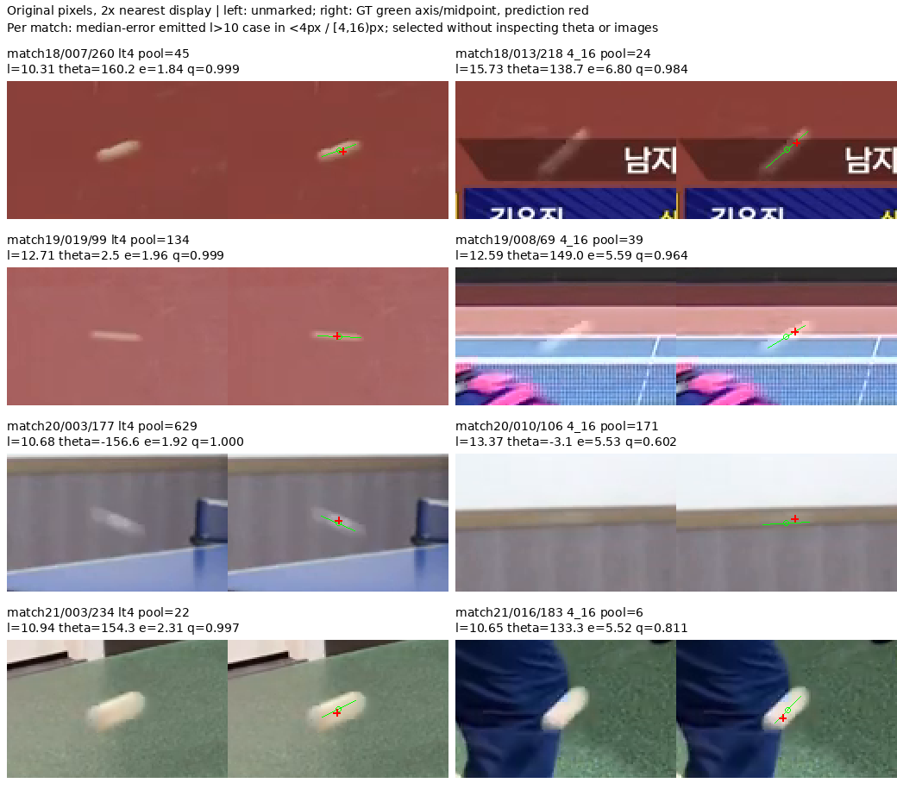

# BlurBall基线完成：长拖影的中点精度与沿轴偏差

日期：2026-09-12。状态：30epoch基线、保存预测复算、沿轴探索和有限源帧查看已完成。

正式基线协议：[因果中点v2](../protocols/blurball-causal-midpoint-v2.md)，其余条件继承[v1](../protocols/blurball-causal-midpoint-v1.md)。实现、源边界修复和早期训练过程保存在[9月11日记录](2026-09-11-blurball-midpoint.md)。沿轴分解与示例选择是在看到正式分组结果后追加的探索，不能冒充事前锁定的机制检验。

## 结论与研究决定

基线已经学会自动定位，训练/验证PCK@4分别97.12%/76.72%。自然长拖影的确对应一种严格中点精度困难：`l>10`验证PCK@4为65.72%，放宽到16px则为84.88%，且大多数目标没有拒绝输出。三个验证match的长拖影PCK@4低于各自中等拖影组，第四场match20不成立；因此保留“长拖影细定位困难”的局部判断，结束“拖影越长整体越难、模糊是当前全部错误主因”的宽泛解释。

追加探索发现，长拖影中242个`4≤e<16px`样本的误差明显偏向GT拖影轴，93.39%为平行分量大于垂直分量，四场比赛方向一致。训练侧也有相似现象。这允许下一步先检验固定模型的坐标读出是否已经能纠正部分偏差，尚不足以启动blur辅助、几何分支或新的对应模块。

全验证集仍有大量远位置错误、可见拒绝和V0误出。这个近轴子集只占全部3,002个PCK@4失败的242个，即8.06%；即使全部纠正且不破坏其他位置，也只对应总体PCK约1.88个百分点。研究价值必须来自可区分的机制和可重复的自动定位收益，不能用漂亮局部图代替整体任务。

## 实际运行与复算

- 运行：`outputs/blurball/dino_midpoint_seed0/`，训练代码版本`e932250e6a26fa81807211398706be6b2d01fa57`。运行中的边缘量化修复未改变任何训练目标、预测坐标或评价，细节见前一记录。
- 输入真实`[t−2,t−1,t]`，监督t；使用修订后的连续窗口。训练38,854目标，验证14,192目标；其中V1分别33,002/12,896。最终match22–25未使用。
- 官方DINOv3 ConvNeXt-Tiny LVD-1689M前两阶段加随机SpatialProbe；原权重文件名及路径在run config保留。总参数1,272,577，头37,537；192通道/帧，三帧拼接，288×512输出格和独立缺失类。
- 前缀与头共同更新，float32、无AMP、无增强、batch8、seed0、固定30epoch。具体学习率、损失和选优规则没有因验证表现改变。
- 环境为Conda `zshihyc`、PyTorch 2.10.0+cu130、RTX 5070 Ti Laptop GPU。总记录耗时36,575.64秒，约10.16小时；峰值allocated显存5,271.82MiB。耗时包含训练期间一次未独立计时的诊断暂停，不能当纯设备训练时间或部署吞吐。一次RGB缓存生成的180.30秒另计。

原运行命令（项目根目录）：

```bash
/home/zshyc/miniforge3/envs/zshihyc/bin/python scripts/train_blurball_midpoint.py \
  --rgb-cache data/cache/blurball/rgb_512x288_all_h2 \
  --output outputs/blurball/dino_midpoint_seed0 \
  --epochs 30 --batch-size 8 --seed 0
```

进程正常结束。epoch0–30历史完整，所有训练loss有限；按最大本地F1@4、其次F1@8、最早同分的规则选中**epoch6**。最后epoch30的验证PCK@4为75.57%、本地F1@4为77.14%，没有替代最佳checkpoint。训练后结果均来自best6，不把epoch30训练loss与best6训练位置指标混成同一状态。

保存预测检查`outputs/blurball/check_saved_midpoint.py`已通过一次：从run保存的内部边界重建目标，核对全部38,854/14,192个目标身份、原位置和visibility，再从CSV复算总体及原定全部分组，确认与results、best epoch及其历史指标一致。它不重跑模型。此后只有追加诊断，没有再执行同一份预测完整性检查。

## 总体结果：保持原分母

所有距离为原图像素，容差严格`<r`。raw PCK使用全部V1的空间argmax，包括q低于0.5而拒绝输出的帧。emitted PCK仅以V1中q≥0.5者为分母；它不能代替raw结果。

| best6指标 | 训练 | 验证 |
|---|---:|---:|
| 全部目标 / V1 | 38,854 / 33,002 | 14,192 / 12,896 |
| raw PCK@4 | 97.12% | 76.72% |
| raw PCK@8 | 99.05% | 81.06% |
| raw PCK@16 | 99.42% | 81.65% |
| raw误差中位数 / 均值 | 1.14 / 2.34 | 1.94 / 61.47 |
| raw RMSE | 21.24 | 161.17 |
| emitted V1数量 | 32,561 | 10,757 |
| emitted PCK@4 | 97.70% | 88.19% |
| emitted误差中位数 / 均值 | 1.13 / 1.60 | 1.71 / 18.14 |
| emitted RMSE | 9.91 | 76.99 |
| 本地F1@4 | 96.82% | 78.78% |
| 作者定义F1@4 | 97.93% | 83.16% |
| 本地F1@8 / @16 | 98.62% / 98.90% | 82.87% / 83.41% |

@4训练计数为TP31,811、FP1=750、FP2=151、可见拒绝441、TN5,701；验证为TP9,487、FP1=1,270、FP2=432、可见拒绝2,139、TN864。中位误差很低但均值/RMSE很高，说明远错位与拒绝帧的原始argmax长尾不能忽略。

本地F1将FP1同时计入FP与FN，作者定义只计入FP。分数差不是两个模型的差。输入输出、划分和预处理均不等于作者完整BlurBall方法，不能把这张表与其论文数字直接排名。

## 自然半长度：两类失败混在同一总体指标中

`l`为原图streak半长度，不是球半径、球尺寸或帧间位移。下面分组只覆盖V1，V0的432个FP2不被分配到任何l组；l=0也不自动表示一个清晰、静止、易检测的球。

| 验证l组 | V1数量 | raw PCK@4 / @16 | 中位误差 | @4 TP / FP1 / 可见拒绝 | emitted PCK@4 |
|---|---:|---:|---:|---:|---:|
| 0 | 3,805 | 70.41% / 73.46% | 2.24 | 2,481 / 243 / 1,081 | 91.08% |
| (0,2] | 985 | 74.82% / 78.48% | 1.81 | 689 / 81 / 215 | 89.48% |
| (2,5] | 4,598 | 84.32% / 86.32% | 1.65 | 3,741 / 301 / 556 | 92.55% |
| (5,10] | 2,245 | 78.89% / 85.57% | 1.93 | 1,746 / 299 / 200 | 85.38% |
| >10 | 1,263 | 65.72% / 84.88% | 2.68 | 830 / 346 / 87 | 70.58% |

长拖影输出1,176/1,263例，仅拒绝6.89%；FP1由@4的346降为@16的106，240个已输出位置落在4–16px区间。全部raw位置该区间有242例，其中2例被q拒绝。相反，l=0拒绝28.41%，且从4px到16px的PCK增量仅3.05个百分点。不能用条件输出分数的变化把两类失败叫作同一种blur失效。

训练侧对应五组的PCK@4依次为98.08%、97.88%、98.76%、97.92%、88.54%；最长组@16为98.43%。所以长拖影严格中点误差不是仅在验证域才出现。但最佳epoch以验证选出，不能由此判定训练已完全收敛、误差不可约或标签错误。

## 分比赛：符合的部分与反例同时保留

验证四场均1280×720；这排除了验证组间原分辨率差异，没有控制曝光、场景、运动阶段、背景和标签清晰度。`l>10`中949/1,263例来自match20（75.14%），match21只有30例，帧数不等于独立证据数量。

| match | 全V1 PCK@4 | (2,5]数量；PCK@4 | (5,10]数量；PCK@4 | >10数量；PCK@4 / @16 | >10 emitted PCK@4 |
|---|---:|---:|---:|---:|---:|
| 18 | 81.59% | 1,623；86.14% | 466；86.70% | 80；56.25% / 86.25% | 57.69% |
| 19 | 82.05% | 670；87.76% | 383；86.95% | 204；65.69% / 84.80% | 68.37% |
| 20 | 62.65% | 700；65.57% | 865；63.47% | 949；66.28% / 84.51% | 72.05% |
| 21 | 80.97% | 1,605；89.22% | 531；91.34% | 30；73.33% / 93.33% | 75.86% |

match18/19/21在原定l组内支持长拖影严格精度困难，且拒绝不是唯一解释，因此原协议允许继续一次有限诊断。match20是raw PCK单调解释的明确反例，不能因为其emitted分数方向不同而消除它。长拖影PCK@16在四场均明显高于@4，因此追加问题锁定在细位置偏差，不将之改称普遍检测困难。

## 追加探索：误差相对GT无向轴的分解

对V1、有限theta且l>0的样本，设`dx=pred_x−x_gt`、`dy=pred_y−y_gt`，图像y向下：

```text
e_parallel = dx cos(theta) + dy sin(theta)
e_perp     = −dx sin(theta) + dy cos(theta)
```

theta以度存储，计算时转弧度。使用绝对分量避免把无向轴当作有符号速度；l=0不定义轴。这里GT只用于事后描述，模型没有获得GT轴、GT crop或GT查询。沿轴误差不等于沿真实运动方向误差，曝光轨迹不等于帧间速度。

[诊断脚本](../../scripts/analyze_blurball_midpoint.py)按原身份关联缓存metadata与已验证预测，保存`axis_errors.json`，分训练/验证、match、原定l组、raw/emitted/rejected以及原4/8/16px误差带。相邻误差带4–8与8–16合并的4–16汇总用于本问题，没有扫描新阈值。手算测试验证0/90/180度方向、旋转保距、严格垂轴4px和空子集，1项通过。

| 验证l>10、raw误差4–16px | 数量 | 绝对平行误差中位数 | 绝对垂直误差中位数 | 平行分量更大 | 垂直误差<4px |
|---|---:|---:|---:|---:|---:|
| 合计 | 242 | 5.32 | 1.31 | 93.39% | 94.21% |
| match18 | 24 | 6.39 | 1.39 | 100.00% | 95.83% |
| match19 | 39 | 4.95 | 1.02 | 97.44% | 97.44% |
| match20 | 173 | 5.27 | 1.36 | 91.91% | 93.64% |
| match21 | 6 | 4.66 | 1.22 | 83.33% | 83.33% |

训练同组377例，平行/垂直绝对误差中位数5.19/1.07px，93.63%平行占优。验证中其余正l组在同一4–16误差带的平行占优比例为58.33%、66.30%、84.67%（对应(0,2]、(2,5]、(5,10]）。这支持误差方向与拖影几何的关联。

不能只留下这一条件成功：验证全体l>10的平行/垂直误差中位数为2.27/1.10px，平行占优73.95%；另有191个raw误差≥16px，不能假定都位于真实拖影内。图像轴、运动方向和场景结构相互相关，分解没有控制这些因素，也没有估计曝光或证明误差来自某一网络层。单seed、同开发数据、看结果后分析均限制结论强度。

实际命令：

```bash
/home/zshyc/miniforge3/envs/zshihyc/bin/python -m unittest discover \
  -s tests -p 'test_blurball_midpoint_axis.py' -v
/home/zshyc/miniforge3/envs/zshihyc/bin/python scripts/analyze_blurball_midpoint.py \
  outputs/blurball/dino_midpoint_seed0
```

## 有限源帧查看

每场取l>10、q≥0.5中误差<4与4–16两组各自按误差排序的上中位样本，共8例；同误差按原rally和帧号排序。未按theta、沿轴程度或肉眼挑选。只解码这8个目标的原始源视频帧，128×80原像素crop，最近邻放大2倍显示；未改变模型输入或标注。选择身份/数值保存在`visual_cases.json`，生成命令为`python outputs/blurball/render_midpoint_cases.py`。



图中match18/013/218与match19/008/69的预测沿同条可见拖影偏离标注中点，并更靠近较亮的一端；背景分别有字幕边界、球台及网线。match20/010/106的拖影非常弱，邻近强水平边缘，不能仅凭crop确信网络选择了亮端点。match21/016/183的白色拖影邻近深色衣物边缘，预测仍在亮白区域，其误差方向肉眼不如前两例清晰，不能归为统一的沿轴亮端偏移。

这8例只用于分辨可见现象。它们不证明全数据标注错误、不提供独立人工中心真值，也不能证明“所有错误都取了亮端点”。图中拖影和球外观尺度明显不同，更不能把l统一解释成几像素球的尺寸。

## 下一步的边界

下一项已锁定为[固定局部读出诊断](../protocols/blurball-local-readout-v1.md)。先排除最便宜的竞争解释：固定最佳模型的局部概率形状，是否只因argmax读出而浪费了已有中点证据。若一次无GT的固定读出能同时改善全体PCK/F1并减少多比赛沿轴误差，应先接受读出解释，再评价剩余误差，不能把这种改进包装成新的motion表示。

若固定读出无效，也只能否定该读出配方；hard CE没有保证热图为曝光强度或中心后验，不能据此宣称像素或特征已经丢失几何信息。自动视觉拖影读出、背景竞争和跨帧运动仍是不同候选，需要下一项事前可区分设计。当前不训练新模块、不改旧协议、不读最终测试，也不把一个DINO基线称作完成了old/new backbone × motion的2×2归因。

2026-09-12后续结果：[固定局部读出已完成](2026-09-12-blurball-local-readout.md)。不改变权重或q，PCK@4提高1.4578个百分点，本地F1@4提高1.4366个百分点，长拖影四场均有净收益；因此接受已有logit读出的部分解释，暂缓新blur几何模块。本页原argmax统计保留为原基线事实。
