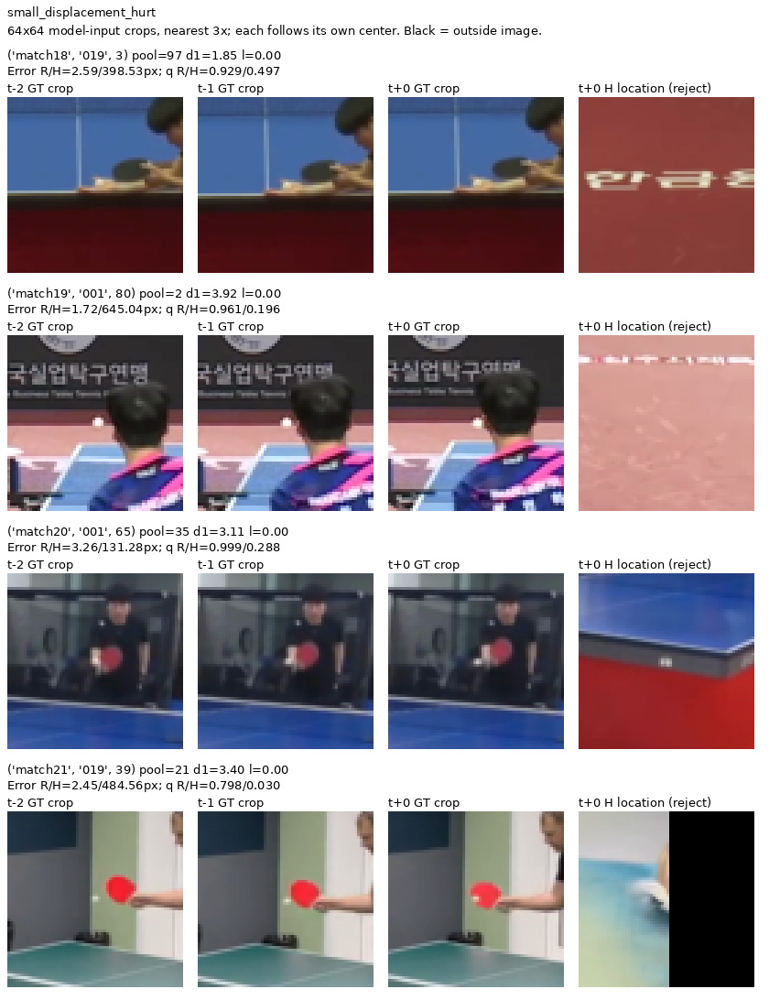
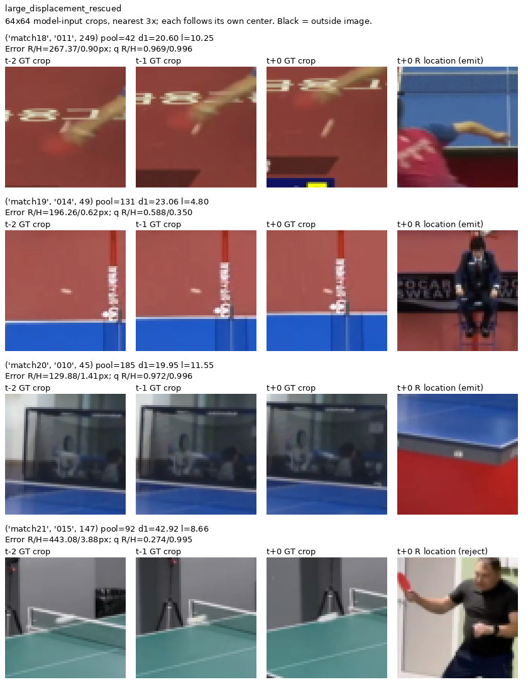

# BlurBall中点定位是否从真实历史取得增量

日期：2026-09-12。状态：采用repeat最佳第1轮权重的开发配对分析已完成。
协议：[完整时序输入控制v1](../protocols/blurball-full-temporal-control-v1.md)。

## 为什么现在需要这项训练

固定局部重心已经改善当前三帧模型的位置，不能继续仅凭沿轴偏差设计blur模块。但该模型的logits本身包含三帧输入，读出阳性没有回答历史的作用。Tennis上的单帧/真实历史对照也不能直接代替BlurBall的自然拖影中点任务。

因此采用repeat_current控制，保持官方预训练初始化、三槽参数化、标签、共同目标和损失。双方依原argmax规则选best，再共同使用固定15×15、T=1重心；history的已有权重、预测和局部logit缓存直接复用。实际训练设置如下。

## 实施范围与验证

[原训练入口](../../scripts/train_blurball_midpoint.py)仅增加实际输入选择。在v2连续窗口与6个内部边界目标排除完成后，repeat将模型输入的三个索引替换为当前帧；所有目标身份保持。配置明确`temporal_input=repeat_current`及`t,t,t`，原history默认路径保留。没有新模型类或新依赖。

[局部读出入口](../../scripts/analyze_blurball_readout.py)同步按run真实输入模式提取验证特征，并从该run的results核对其最佳epoch；旧history缺少输入模式字段时遵循其原来使用真实三帧的事实。历史局部读出产物直接复用，repeat已生成自己的局部缓存与原q复现证据。

真实GPU单batch检查已通过：7个V1与1个V0、原frame2–8及57，模型三槽RGB与各自当前帧完全相同。全部合法目标38,854/14,192及6个内部边界排除保持。输出`[8,147457]`，loss11.15012，prefix/head梯度范数71.8869/9.1974，均有限且非零；AdamW一步及原验证唯一帧路径通过。参数1,272,577不变；检查耗时1.07秒、峰值allocated5,277.22MiB，不能当正式性能。

该检查发生在8e05230之后的本次工作区修改，脚本及结果保留在`outputs/blurball/repeat_current_smoke/`。它验证索引/标签与实际训练通路，没有重做数据下载、完整源内容审查或已拒绝的单encode训练优化。

## 正式运行

实际执行命令（项目根目录，Conda zshihyc）：

```bash
/home/zshyc/miniforge3/envs/zshihyc/bin/python -u scripts/train_blurball_midpoint.py \
  --rgb-cache data/cache/blurball/rgb_512x288_all_h2 \
  --output outputs/blurball/dino_repeat_current_seed0 \
  --temporal-input repeat_current --epochs 30 --batch-size 8 --seed 0 \
  > outputs/blurball/dino_repeat_current_seed0.log 2>&1
```

输出为独立run目录。实际config记录代码版本36bdd7cd7213f8a9050124e8b9f0ba7d57878fc4、repeat_current、t/t/t、seed0、30epoch、38,854/14,192目标及1,272,577参数，均符合已锁定设置；没有继承smoke的一步参数。训练耗时以原history.jsonl记录为准。

## 实验设置与权重选择

| 条件 | history | repeat_current |
|---|---:|---:|
| 计划训练轮数 | 30 | 30 |
| 实际完成训练轮数 | 30 | 21 |
| 按原规则选出的最佳epoch | 6 | 1 |
| 训练目标数 | 38,854 | 38,854 |
| 验证目标数 | 14,192 | 14,192 |
| 验证比赛 | match18–21全部四场 | match18–21全部四场 |

选优规则为argmax本地F1@4最大、其次F1@8、最早同分。两组选优机会不同，因此本次用于开发机制分析，不作为等训练预算的论文归因。比赛范围与样本范围保持既定划分，不因实际训练轮数减少match或验证目标。

repeat第1轮权重的PCK@4为71.9448%，本地F1@4为69.5839%；保存权重已精确复现原验证记录。使用这份权重继续研究，不再重训本组。原配置、权重和日志保留原路径。

训练入口现支持每个完整epoch保存`last.pt`，包括模型、AdamW、NumPy/Torch/CUDA随机状态、最佳权重和日志边界；原命令追加`--resume`可恢复新格式快照。CPU与CUDA下一步采样、随机前向及AdamW更新已和连续运行精确一致。恢复粒度为完整epoch；本项历史运行仍使用原保存的best权重。

## 训练期间的有限探索：远错位是否停留在历史中心

这里仅使用**已完成history模型**的保存预测与原v2真实历史标签，不使用repeat的预测，也不改变配对分组。问题是：当前错误位置与两帧可见历史的GT中点有多接近？若多数错误只是落在旧中心，才有理由把直接历史位置滞留作为主要失效动机；否则不应默认用运输旧坐标解释或修补多数错误。

对每目标，只使用原V1历史中点，计算`min_delta ||pred_t−GT_(t−delta)||`，没有可见历史时该量未定义；按已有严格4/16px容差统计。当前V0的占位坐标不参与距离，当前V1误差只对其合法当前中点计算。空间邻近仅与复制解释相容，不证明模型因果上复制历史；反之远离旧坐标也不排除模型使用了外推轨迹先验。

| history最佳模型的当前群体 | 原argmax：数量 / 有可见历史 / 距历史<4 / <16 | 固定重心：数量 / 有可见历史 / 距历史<4 / <16 |
|---|---:|---:|
| V1、已输出、当前误差≥16px | 712 / 692 / 0 / 5 | 709 / 689 / 0 / 4 |
| V1、拒绝输出的原空间预测 | 2,139 / 2,069 / 71 / 379 | 2,139 / 2,069 / 74 / 376 |
| V0、仍输出位置 | 432 / 101 / 1 / 3 | 432 / 101 / 1 / 3 |

多数已输出远错位不是“直接落在旧GT中心附近”。重心的709例只有4例在任一可见旧中心16px内；另外331/432个V0误出没有可见历史标签。不能据此断言历史毫无作用或所有错误都是纯背景，因为可能有历史外推、当前视觉混淆等不同机制，本项没有区分它们；不将简单旧中心滞留当作默认主因。

产物`outputs/blurball/dino_midpoint_seed0/history_proximity.json`保留两种解码的全体及四match计数。CPU从原CSV按match/rally/原Frame对齐源窗口，复用原float坐标，没有视频解码、GPU计算、新标签或阈值扫描。本项为运行期间的描述性探索，不能冒充事前主要终点。

## 配对实现与验证

[CPU配对入口](../../scripts/compare_blurball_temporal.py)现已完成；它只读取两run的保存预测和history run保存的原窗口，分别比较argmax与局部重心，并保留各模型自己的q。按原定历史四状态、双端V1位移三档、l、match与长l×match报告完整救回/破坏。当前V0只进入FP2/TN等检测计数，位置配对分母为0。

一项合成测试通过：真实近/远历史顺序、恰好4/16px的位移边界、当前V0不参与几何、两模型可有不同q但同模型两解码q不变、错位目标身份拒绝。入口要求保存预测及评价结果齐备后执行。

随后补齐同一目标的**输出与位置状态配对**。仅看raw PCK与F1的边际差值，不能区分一例检测救回究竟伴随哪种变化；这会影响协议中“细位置证据”与“可见输出/背景抑制”的后续取舍。每个既定群体、每种解码均按4/8/16px报告V1四状态转移：`correct_emitted`、`wrong_emitted`、`correct_rejected`、`wrong_rejected`；矩阵行是repeat，列是history。V0单独配对输出/拒绝，不使用其占位坐标计算误差。

例如，错位输出→正确输出表示两模型都输出时的容差内定位救回；正确但拒绝→正确输出表示两模型位置都已达标时的输出恢复；错位且拒绝→正确输出则同时改变两个状态。反向破坏也完整保留。这里“正确性不变”只指指定容差内的二值状态，不保证两坐标相同；状态计数也不是F1的线性因果分解。各模型始终使用自己的原q，阈值仍为0.5，没有交换分数、扫描阈值或更改主要判定。

扩展原有一项合成测试后，新增状态输出先因缺失而失败；补齐实现后通过。样例包含严格4px边界、恰好q=0.5、位置与输出共同变化、正确位置被拒绝，以及V0误出；三种容差下的矩阵边际均与原评价器的TP、FP1和拒绝计数一致。此功能只读取保存预测，不增加模型forward。

## 配对结果：历史收益与代价同时存在

使用两组已选最佳权重，对全部14,192个合法验证目标进行开发比较，其中12,896个V1。覆盖match18–21全部四场，保持既定数据划分。

导出、固定读出和CPU配对使用代码`7331c7c`。原best1的训练/验证预测导出耗时193.78秒，验证的原argmax指标精确复现训练记录。repeat局部读出另用52.27秒，全部原argmax与q精确复现，输出/拒绝判断不变，峰值allocated353.24MiB；没有训练更新或重新解码视频。history的原预测与局部缓存直接复用。

实际命令为：

```bash
/home/zshyc/miniforge3/envs/zshihyc/bin/python -u outputs/blurball/evaluate_interrupted_repeat.py
/home/zshyc/miniforge3/envs/zshihyc/bin/python -u scripts/analyze_blurball_readout.py outputs/blurball/dino_repeat_current_seed0
/home/zshyc/miniforge3/envs/zshihyc/bin/python scripts/compare_blurball_temporal.py --history outputs/blurball/dino_midpoint_seed0 --repeat outputs/blurball/dino_repeat_current_seed0 --output outputs/blurball/repeat_vs_history_seed0_exploratory.json
```

主产物`outputs/blurball/repeat_vs_history_seed0_exploratory.json`保存配置、权重选择与完整配对统计。所有指标保持原像素严格容差、各模型自己的q及0.5阈值，没有为使结果更好重新选epoch、读出窗口或阈值。

### 总体：位置收益不是仅由输出阈值造成

| 读出与指标 | repeat best1 | history best6 | history变化（百分点） |
|---|---:|---:|---:|
| argmax raw PCK@4 | 71.9448% | 76.7215% | +4.7767 |
| argmax raw PCK@16 | 76.5741% | 81.6532% | +5.0791 |
| argmax本地F1@4 | 69.5839% | 78.7793% | +9.1954 |
| 固定重心raw PCK@4 | 73.7671% | 78.1793% | +4.4122 |
| 固定重心raw PCK@16 | 76.6129% | 81.7075% | +5.0946 |
| 固定重心本地F1@4 | 71.3026% | 80.2159% | +8.9133 |

argmax在@4救回1,180、破坏564，净增616；固定重心救回1,041、破坏472，净增569。raw位置评价不依赖q，因此不能把全部收益归为更保守的输出判断。另一方面，两模型分别训练且选优机会不同，这不是仅替换输入后的严格因果效应，也没有隔离对应、背景变化、外观或轨迹先验。

固定重心的四场PCK@4净增分别为：match18 +0.8528、match19 +9.7772、match20 +6.6129、match21 +4.0275个百分点；argmax四场也都为正。两种读出方向一致，但来源幅度差异明显，四场不能当作大量独立复现。repeat自身也从固定重心获益，说明读出机制具有跨这两个checkpoint的作用，不应全部归为history特有改进。

### 位移：大位移获益，小位移出现反例

仅纳入当前与相应历史均有V1中心的目标；d为原图中心位移，不是球尺寸归一化速度。下表均为固定重心，Δ1和Δ2分别分析，不能把同一目标重复当独立样本。

| 真实历史位移组 | V1数量 | repeat / history PCK@4 | @4救回 / 破坏 | @4 / @16变化（百分点） |
|---|---:|---:|---:|---:|
| Δ1，d<4 | 1,849 | 80.476% / 78.908% | 126 / 155 | −1.568 / −3.461 |
| Δ1，4≤d<16 | 7,156 | 76.537% / 79.402% | 426 / 221 | +2.865 / +3.494 |
| Δ1，d≥16 | 3,675 | 67.837% / 77.660% | 450 / 89 | +9.823 / +11.891 |
| Δ2，d<4 | 600 | 85.667% / 79.000% | 28 / 68 | −6.667 / −8.833 |
| Δ2，4≤d<16 | 3,961 | 77.329% / 78.642% | 237 / 185 | +1.313 / +0.909 |
| Δ2，d≥16 | 7,986 | 72.590% / 79.126% | 724 / 202 | +6.536 / +7.851 |

argmax同样在两种小位移组退步，在中、大位移组获益。这个异质性比“所有位移同幅改善”更支持继续研究时间信息的组织与使用，但尚未控制场景、拖影和目标难度的共同变化。现有简单拼接已经能在大位移组获益，不能反过来声称它看不到大位移；GT位移也不能直接作为未来推理门控输入。

### 拖影：长拖影收益成立于这次探索，l=0不支持普遍增益

固定重心l>10的1,263个目标，PCK@4从56.690%到69.359%，救回206、破坏46，净增160；PCK@16净增16.785个百分点。argmax对应@4净增12.827、@16净增16.865个百分点。

| 长拖影来源 | 数量 | 重心@4救回 / 破坏 | 净增（百分点） |
|---|---:|---:|---:|
| match18 | 80 | 24 / 3 | +26.250 |
| match19 | 204 | 55 / 8 | +23.039 |
| match20 | 949 | 118 / 33 | +8.957 |
| match21 | 30 | 9 / 2 | +23.333 |

四场均有净增，match20占据多数长拖影目标，match21仅30个目标。相反，l=0组3,805个目标的重心@4净减少2例，@16净减少12例；argmax@4虽净增24，@16仍减少12。不能将历史的作用写成所有球状态下的一致改善，也不能把l当作球直径或帧间位移。

### 输出状态：减少误出，同时增加可见目标拒绝

| 固定重心的状态计数 | repeat | history |
|---|---:|---:|
| V1，输出且误差<4（TP） | 9,459 | 9,660 |
| V1，输出但误差≥4（FP1） | 3,016 | 1,097 |
| V0，仍输出（FP2） | 1,161 | 432 |
| V1，拒绝输出 | 421 | 2,139 |
| V0，拒绝输出（TN） | 135 | 864 |

V0配对中，history抑制730次repeat误出，同时新引入1次；历史标签含V1的389个当前V0目标，误出从358降到101。这个控制没有出现该群体整体更严重的“历史延续误出”，但V0仍只表示无合法可见中点，不保证物理无球。

代价是V1拒绝增加1,718例。@4状态矩阵中，双方都输出的目标有855次错位→正确、192次正确→错位，说明位置本身确有双向变化；同时有243次正确输出→正确但拒绝，反向只有22次。另有1,138次错位输出→错位且拒绝。降低误出、纠正位置和增加拒绝必须分别报告，不能把更高F1都解释为准确运动，也不能把矩阵当作F1的线性因果分解。

V1但两帧历史均V0的146个目标也有重心@4净增23例；该小群体不提供可靠的双端可见中心对应标签。它提醒我们保留背景变化或隐含视觉证据等解释，但不能据V0推断历史图像内绝无球证据。

## 条件拆分与图例：小位移不等于应该关闭历史

总体小位移PCK下降可能混合了比赛、外观和目标状态差异。为了判断它是否支持按位移抑制历史，追加两个有针对性的CPU视图：Δ1位移档×match，以及Δ1位移档×l=0/正l；不做所有变量的全交叉，也不改变全部match18–21的评价范围。只复用固定重心保存预测、原标签与现有`_group`指标；每种拆分的目标数均核对为原位移档的完整分区。它是描述性条件分析，不是因果调整。

实际入口`outputs/blurball/temporal_cases/conditions.py`，产物同目录`conditions.json`。下表每格为该match的V1数量 / history相对repeat的PCK@4变化（百分点），仍要求当前和前一帧均有合法V1中心。

| match | d<4 | 4≤d<16 | d≥16 |
|---|---:|---:|---:|
| 18 | 1,106 / −3.436 | 2,550 / +1.020 | 267 / +14.232 |
| 19 | 48 / +8.333 | 576 / +6.424 | 947 / +11.510 |
| 20 | 278 / +5.396 | 1,452 / +3.306 | 1,432 / +9.986 |
| 21 | 417 / −2.398 | 2,578 / +3.646 | 1,029 / +6.900 |

大位移组在每场内部均获益，其总体阳性不只是四场权重混合所致。小位移则两场正、两场负，match19仅48例；match20的小位移@4虽然提高，@16仍下降3.957个百分点。因此不能将总体退步写成各比赛、各容差下统一的低速失效。

| Δ1位移与拖影组 | 数量 | @4救回 / 破坏 | @4 / @16变化（百分点） |
|---|---:|---:|---:|
| d<4，l=0 | 1,598 | 94 / 141 | −2.941 / −4.881 |
| d<4，l>0 | 251 | 32 / 14 | +7.171 / +5.578 |
| 4≤d<16，l=0 | 2,048 | 129 / 92 | +1.807 / +2.441 |
| 4≤d<16，l>0 | 5,108 | 297 / 129 | +3.289 / +3.915 |
| d≥16，l=0 | 87 | 10 / 6 | +4.598 / +14.943 |
| d≥16，l>0 | 3,588 | 440 / 83 | +9.950 / +11.817 |

小位移的负结果集中于l=0混合群体，有拖影的小位移目标仍获益；但这两项边际拆分没有消除match与l的共同变化。l来自已有拖影半长度标签，不能把l=0等同于物理静止，也不能把观察到的相关性变成GT条件门控。

### 固定选例检查模型实际看到的图像

每场分别从“小位移、repeat位置<4而history≥4”和“大位移、repeat≥4而history<4”取**错误一方位置误差的上中位样例**，同分按clip和原帧号确定。先保存选择，再看图；不按图像内容、q或l挑选。两组各四例只用于解释，完整评价仍是全部14,192个目标。选择与原坐标/q保存在`outputs/blurball/temporal_cases/selected.json`，渲染入口为同目录`render.py`。

图像仅从已有512×288 RGB缓存裁剪64×64区域，最近邻放大3倍；各时间帧分别按其标注中心取局部图，**不能由图内球的相对位移估计运动**。第四列是当前帧错误一方的原位置附近图像；标为`reject`时该位置并未实际发出。黑色区域是图像外填充；图例没有恢复原图丢失的细节，也不是新的输入或标注。



这四例均为l=0、history q<0.5；球位于手、球拍或身体邻域，repeat位置达标且发出。它们提示应关注当前外观证据与可见输出的保留，但不能将整组重新标为准备发球或把合法V1删除。history的远处候选在这些例子中均被拒绝，不能描述成实际输出了远处错误轨迹。



大位移例子中，repeat错误位置可落在人体、背景或球台边缘，history位置达到4px容差。match19的history q约0.350，仍拒绝该正确位置，说明原位置救回不自动等于检测救回。图例没有测量特征对应，也不能据“选回球”推断网络采用了真实物理匹配。

## 当前研究决定

**不重训这组旧对照，继续研究时间证据的条件收益与代价。** 现有探索已显示跨比赛、跨读出的总体位置增量，以及大位移/长拖影的更大增量；同时小位移退步、可见目标拒绝增加，构成必须保留的反例。它足以选择下一项开发诊断，不足以宣布等预算正式归因或新颖性成立。

下一步需要区分的是：当前网络利用了哪些目标相关历史或背景变化，什么情况下这种利用破坏当前证据。条件拆分已否定“低位移一律关闭历史”的简单判断。DQAligner/MIST定向补取仍未取得可读正文，已有固定作者源码边界继续有效，见[来源更新](../literature/tiny_motion_evidence.md)；不重复同一路径，也不由访问限制推断已有对齐方法不足。继续围绕这组真实反例确定有区分力的干预，不直接扩大搜索半径、叠门控，也不把GT位移/l交给推理。已停止的关系辅助与集中度配方不因总体阳性自动重开。
