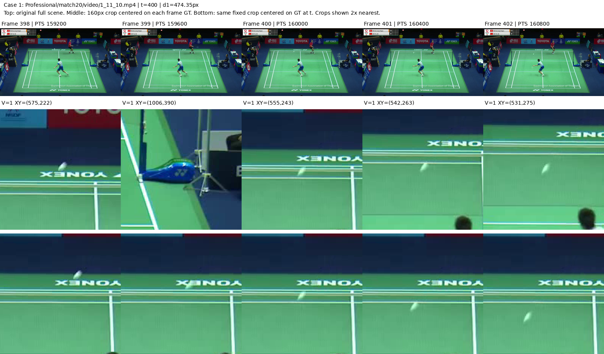
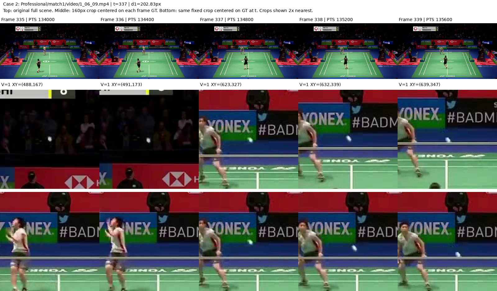
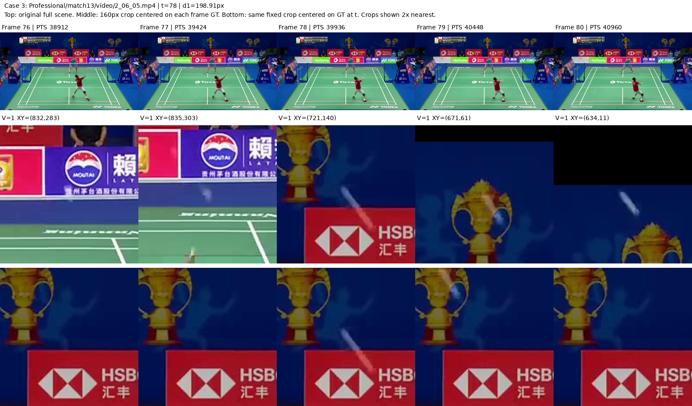
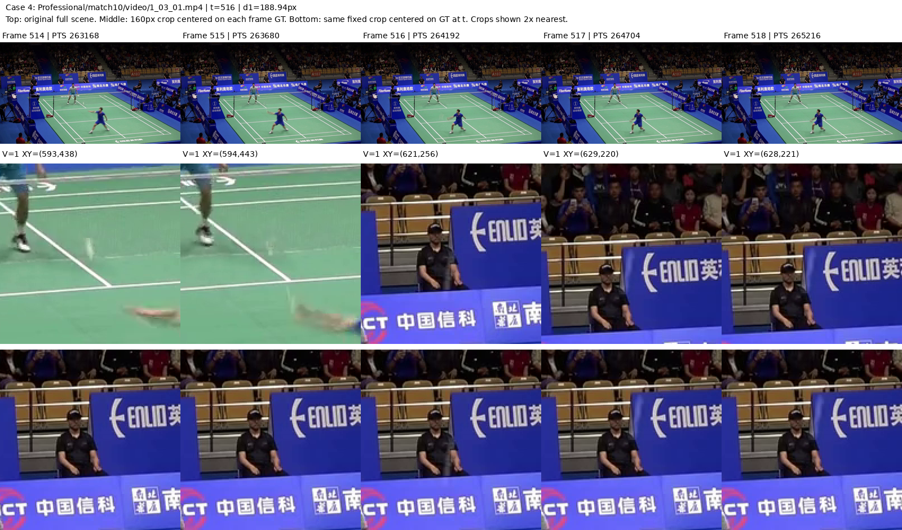

# Shuttlecock 极端位移与两帧历史的联合覆盖

日期：2026-09-12。状态：已完成。性质：训练侧探索性诊断，不是模型实验或新数据划分。

## 问题和预先限定的范围

[已有独立帧对统计](2026-09-10-shuttlecock-displacement.md)显示相邻位移多数被旧局部范围覆盖，但最大值约 474 像素尚未视觉核对。本次不重做该分位数结论，只回答两个尚未解决的问题：同一当前目标的近两帧历史合起来是否仍不覆盖，以及最大的标签跳变是否有真实视觉依据。

沿用[开发划分](../protocols/shuttlecock-development-motion-v1.md)：只读 Professional match1–20、Amateur match1–3 的原始训练标签；验证仅使用已保存的 manifest 归属，验证/Test 标签不打开。原视频、CSV 与标签版本不修改。

联合几何仅考虑当前 `Visibility=1`、原 `Frame` 为 `[t−2,t−1,t]` 的完整标注窗口；历史 V0 可以作为图像输入，但不提供可见中心几何。分开统计无可见历史、至少一个可见历史被覆盖、所有可见历史均未覆盖。近历史为 36×64 格 R2、远历史 R4，使用各 rally 的真实图像尺寸。这是 GT 支持域，不是模型匹配率；没有球尺寸，不计算 rho。

视觉样本在看图前按以下规则确定：每个训练 rally 取最大的双端合法 V1 相邻帧 L2 位移，再全局降序取前四个不同 rally，平局按路径/帧号排序。每例只提取 `t−2…t+2` 的至多五帧，保留原帧号与解码 PTS；邻近未来帧仅用于解释数据，不进入任何训练输入。

每个选中视频只顺序解码一次到所需最后一帧，保留少量原分辨率抽样图，供后续复查，避免重复解码。此项是本次新增的局部视觉诊断，不改变原 v1 纯标签统计的已完成范围，也不展开全数据视频缓存。

若发现跳变来自片段边界或明显标注不一致，则按样本记录并限制极端数值的论文解释；不静默删行或修标签。若是连续画面中的可见快速运动，也只确认这些样本，不能用四例推断整体困难程度或新结构必需。

## 实际结果

### 1. 两帧联合几何支持

154 个训练 rally 中有 60,471 个当前 V1、原始三帧标注齐全的目标；另有 168 个可见目标缺少完整历史标注窗口，未拼接或补齐。统计仍使用原标签，没有因后述样例而删行。

| 同一目标的历史状态 | 数量 | 占全部 60,471 个目标 |
|---|---:|---:|
| 两帧历史均非 V1 | 769 | 1.2717% |
| 至少一帧 V1 历史被对应局部范围覆盖 | 59,120 | 97.7659% |
| 有 V1 历史，但全部未被对应局部范围覆盖 | 582 | 0.9624% |

有可见历史的分母为 **59,702**，联合覆盖率为 `59120 / 59702 = 99.0252%`。两帧历史都为 V1 的目标有 57,378 个。这里“覆盖”指当前 GT 与相应历史 GT 的落格 Chebyshev 距离分别不超过 R2、R4；不是候选发现成功率、特征匹配率或定位准确率。无 V1 历史也不等于历史图像毫无可用视觉信息。

同一完整窗口队列中，近帧双端 V1 共 58,881 对，覆盖 58,017 对；远帧双端 V1 共 58,199 对，覆盖 57,293 对。不同分母不得直接作百分点增益归因；尤其不能把旧记录的所有独立相邻帧对与本次完整三帧窗口当作相同样本。

582 个联合未覆盖窗口分布在 22 个来源比赛中：Professional 20 场合计 578 个，Amateur match1/2 分别 3/1 个，match3 为 0。最多的是 Professional match13，51 个，占全部未覆盖窗口的 8.76%；该比赛有可见历史时的覆盖率为 97.17%。因此它们不全来自某一个 rally 或单个异常源；但这些仍是未经逐帧视觉确认的标签几何，不能据此排除更多标注异常。

### 2. 预选四例与真实时间

四例均成功顺序解码一次，保留原分辨率的 20 张无叠加标记 PNG；没有全量视频展开。`showinfo=checksum=0` 只记录所需 PTS 等元信息，不计算帧校验和。解码帧号、数量和 PTS 与选择记录一致。

| 例 | Professional 比赛 / rally | 所核对跳变 | 相邻标签位移 | 当前目标联合覆盖 | 五帧 PTS 步长 / time base |
|---|---|---|---:|---|---|
| 1 | match20 / `1_11_10` | 399→400 | 474.35 px | 是；398→400 仅 29.00 px | 400 / `1/11988`，约 33.37 ms |
| 2 | match1 / `1_06_09` | 336→337 | 202.83 px | 否 | 400 / `1/11988`，约 33.37 ms |
| 3 | match13 / `2_06_05` | 77→78 | 198.91 px | 否 | 512 / `1/12800`，40 ms |
| 4 | match10 / `1_03_01` | 515→516 | 188.94 px | 否 | 512 / `1/15360`，约 33.33 ms |

以下图的上排为整帧缩略图，中排为分别以每帧原 GT 为中心的 160×160 裁剪，下排为固定在目标帧 GT 位置的同尺度裁剪；裁剪放大两倍用最近邻显示。中排各列裁剪原点不同，不能把它们看作固定相机下的运动轨迹。图只用于文档，未作为视觉输入、伪标签或新监督。

**例 1：最大值由明显的孤立标签异常主导。** 398–402 的原标签依次为 `(575,222) → (1006,390) → (555,243) → (542,263) → (531,275)`。画面场地、球员与背景连续，未见切镜；398、400–402 附近可见连续区域内的白色球迹，而 399 的标签突跳到右侧网柱/背景区域，裁剪未呈现与前后球迹相符的独立羽球证据。不能把 474.35 px 当成已确认真实球位移；目前也没有确定 frame399 的正确中心，不用插值伪造。远帧 398 能覆盖当前 400，说明仅报最大的相邻跳变还会掩盖另一支历史的几何支持。



**例 2：快速球迹可见，但最大跳变的两个端点未同时确认。** 场景连续，335 附近有独立白点，337–339 的标注附近有连续向右下移动的白色球迹。336 标签附近位于暗色观众背景，目前无法可靠辨认羽球。没有足够证据把 202.83 px 确认为同一真实球的相邻位移，也不能仅因位移大就判错标签。



**例 3：78–80 的快速上行球迹明确，77→78 的极值仍未完全核实。** 连续画面中，78–80 的明亮拉长球迹连续向左上移动，与标签位置相符；76–77 靠近广告背景，无法可靠确认各自羽球中心。它支持视频确实含快速、模糊的球运动，但不足以确认 198.91 px 这个具体跳变；“后续真实运动”与“极端帧对标签正确”分开记录。



**例 4：当前五帧不能作确定判断。** 未见明显切镜；514–515 的标注处靠近场地和球员，516–518 移到看台/座椅背景附近。后几帧的小亮结构与背景竞争，当前抽样没有充分分离出可确认的独立球迹。保留为真实快速跳变或标签异常尚不能区分，不推测拍击、加速度或正确坐标。



这四例按极值选择，并非随机样本，不能估计整体错误率。没有发现这四个局部片段的明显切镜，也不证明所有发布 rally 的内部都连续。

## 运行与产物

使用 Conda `zshihyc`，无新增依赖、无 GPU 计算。新增[分析脚本](../../scripts/analyze_shuttlecock_support.py)复用已有 `causal_windows`、落格和联合覆盖实现；只写派生记录。具体命令在项目根目录执行：

```bash
python scripts/analyze_shuttlecock_support.py --self-check
python scripts/analyze_shuttlecock_support.py --output outputs/shuttlecock/extreme_motion_review
python outputs/shuttlecock/extreme_motion_review/render_samples.py
```

小样例验证检测“缺失帧被重编号”“V0 被当成可见对应”“只统计近历史而漏掉远历史救回”这些会改变计数的错误，已通过。分析与四例解码均正常完成。独立只读审查确认训练范围、真实帧窗口、实际尺寸、分母、选样及 PTS 一致；未重复运行统计或解码。

可复查产物均在 `outputs/shuttlecock/extreme_motion_review/`：`summary.json` 为总体及分比赛汇总，`uncovered_windows.csv` 为 582 个未覆盖窗口，`selected_pairs.json` 固定预选样本及原标签，`decoded_samples.json` 保存原帧号/PTS/time base/PNG 路径。一次性 `render_samples.py`、20 张原帧和少量解码日志保留在该输出目录；文档只保留上面的四张对照图。再次查看使用已存 PNG，不重新解码视频。

## 对研究决定的影响

1. **不把扩大搜索范围列为当前默认主修复。** 几何不覆盖是明确存在但较小的训练子集，且最大值受原标签异常影响。即使 GT 在范围内，描述子仍可能分辨不出球，背景可能赢得匹配，当前帧也可能定位失败；联合覆盖率不是问题已经解决的证据。
2. **不因单个异常增加标签修复或鲁棒训练模块。** 原 CSV、划分和上述全量统计不修改。源异常入口记在[数据说明](../../data/shuttlecock/README.md)；未来若训练确需排除或修正，应另行写明规则和影响，不能在此静默清洗。
3. **当前证据更要求区分搜索覆盖、可辨认球证据和读出失败。** 此结论与仍在运行的 BlurBall 完整时序对照独立，不改变其输入、训练时长、选优或评价条件。四例视觉核对不足以证明某种新结构必要。
