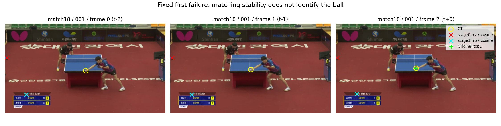

# 球候选能对应历史，但最大相似度更偏好稳定干扰物

日期：2026-09-13。状态：全部验证完成，量化边缘修正与输出接线复核完成。协议：[原三帧候选视觉对应v1](../protocols/blurball-candidate-correspondence-v1.md)。

## 核心判断

**当前描述符中存在可用的球历史对应信息，但“最大匹配相似度”不能充当球候选的可信度。** 在当前K16已有4px球候选且前帧可见时，stage0能在历史16px内匹配79.76%；当前位移≥16px时仍有72.05%。然而在原top1远错、当前集合有球的679例中，正确球候选的前帧最高cosine只在141例胜过远错候选。

固定的纯相似度读出几乎完全破坏原定位：stage0/1的全体PCK@4分别只有0.0931%/0.2016%，原cross为82.0797%。这不是坐标索引接错；完整保存输出核对和固定首失败图均确认，地板、记分牌等稳定位置比球更容易得到接近1的匹配分数。

这里的干扰物对应可以是真实、稳定的视觉对应，并不一定是“错误匹配”。因此上一项几何诊断提出的运动可靠性问题，还必须区分两层：**这个候选是不是球，以及给定这个候选时对应是否可靠。** 只改善第二层，可能更确信地选择稳定背景。

这个负结果的适用范围很具体：纯max-cosine读出丢弃了原定位器的候选分数，测试的是它能否独立承担球选择，而不是与外观证据联合学习后的能力。不能由此声称对应信息无用、融合必然失败或缺少某个新门控模块。当前没有训练新的motion模型，也没有证明方法新颖性。

## 数据、特征与计算路径

cross best3、全部match18–21的14,192个验证目标、12,896个V1、原因果`[t−2,t−1,t]→t`。K16当前候选及原q直接使用[上一项候选覆盖](2026-09-13-blurball-candidate-coverage.md)的结果，不读取过去目标的候选，因而没有引入t−3/t−4。

在已训练前缀的stage0（96×72×128）及stage1（192×36×64）上，按协议去空间均值、双线性抽取当前候选query、通道归一化，与两个历史帧的全部native格计算cosine。候选来自实际模型，GT只用于事后条件评价；条件“球query”指离GT最近且<4px的已有候选，并非推理时已知哪个候选是球。

两个层级共用同一前缀，生产提取14,332个唯一源帧，各只编码一次。跨batch保留最后两帧，避免重叠窗口重算；首批接线验证额外编码10帧，明确单列。没有新训练、视频解码或完整dense特征/cost存盘。最终测试没有使用。

## 条件对应：先保留候选覆盖分母

Δ1双端V1为12,680个，其中11,296个当前K16含4px候选；Δ2分别为12,547和11,176。下表的条件指标只在这些有球候选的子集上计算；最后一列回到全部双端V1，要求当前4px覆盖和历史16px匹配同时成立。

| 特征 | Δ | 条件query数 | 历史PCK@16 | native R@1 | R@5 | R@10 | 联合命中 / 全双V1 |
|---|---:|---:|---:|---:|---:|---:|---:|
| stage0 | 1 | 11,296 | 79.76% | 58.77% | 83.53% | 88.08% | 9,010 / 12,680，71.06% |
| stage1 | 1 | 11,296 | 69.99% | 51.69% | 78.21% | 84.85% | 7,906 / 12,680，62.35% |
| stage0 | 2 | 11,176 | 65.59% | 49.91% | 74.21% | 80.72% | 7,330 / 12,547，58.42% |
| stage1 | 2 | 11,176 | 56.49% | 41.11% | 67.75% | 76.22% | 6,313 / 12,547，50.31% |

历史PCK@16使用该层native格中心映射回原图后的严格`<16px`，native R@k要求真正的标签格进入前k名。两者含义不同。stage0与stage1同时改变层内容、格数和量化，不能单独把差值解释成深层球信息消失；但当前数据支持将浅层作为后续候选匹配的竞争输入，而非默认更深层更好。

### 非零位移与不同格

| 条件 | 双V1数 / 有当前球候选数 | stage0历史PCK@16 | stage1历史PCK@16 | stage0 / stage1联合率 |
|---|---:|---:|---:|---:|
| d1≥16px | 3,675 / 3,199 | 72.05% | 62.80% | 62.72% / 54.67% |
| d2≥16px | 7,986 / 7,069 | 60.01% | 51.66% | 53.12% / 45.73% |

同native格会明显抬高匹配表现。stage0的Δ1同格/不同格条件PCK@16为91.66%/76.85%，Δ2为85.43%/63.81%；stage1分别为78.00%/64.28%、70.50%/52.94%。这些分母因层级格大小不同而不同，不把同格组数值直接跨层配对。

大位移条件下仍有对应信息，因此结果不全由原地响应解释。但当前query已经过GT条件筛选，且没有证明全局正确匹配一定带来当前球发现能力。Δ1、Δ2的可见样本与位移分布也不同，不能把全部差值归给间隔。

四场的条件历史PCK@16如下，完整位移、拖影和可见性分组保留在JSON。

| 比赛 | stage0 Δ1 / Δ2 | stage1 Δ1 / Δ2 |
|---|---:|---:|
| match18 | 85.48% / 71.67% | 78.33% / 63.59% |
| match19 | 74.28% / 63.98% | 53.62% / 45.25% |
| match20 | 74.79% / 54.20% | 70.53% / 47.51% |
| match21 | 79.72% / 68.08% | 67.88% / 60.13% |

## 正确球的最高匹配分数经常输给远错候选

群体固定为：当前top1距GT≥16px、K16中有<4px球候选，且当前和该历史均V1。只比较两个已计算query的最高cosine，GT没有参与搜索或分数计算。距离错误不自动等于语义背景，下表使用“远错候选”表述。

| 特征 | Δ | 配对数 | 球候选胜 / 平 / 负 | 球−远错的平均最高分差 |
|---|---:|---:|---:|---:|
| stage0 | 1 | 679 | 141 / 0 / 538 | −0.07385 |
| stage1 | 1 | 679 | 154 / 0 / 525 | −0.09945 |
| stage0 | 2 | 672 | 144 / 0 / 528 | −0.08150 |
| stage1 | 2 | 672 | 138 / 0 / 534 | −0.11227 |

在d1≥16的144例配对中，stage0/1正确球仅胜28/23例；d2≥16的379例中仅胜79/65例。不能通过更确信“某处能稳定匹配”来自动解决当前球身份。

先前固定202个cross远错位中，Δ1有116个满足当前球候选和历史V1条件；stage0/1分别78/79个query匹配历史16px，但分数只在11/21例胜过原远错top1。Δ2对应113例，历史匹配53/52例，分数胜11/10例。这里已直接看到：有条件正确对应与竞争选择失败可以在同一固定群体中同时出现。

## 自动诊断读出：不是新的融合器

每个候选用`(near_max_cosine+far_max_cosine)/2`评分，每层独立取最高者，不使用GT、候选峰logit、历史q或其他门控；输出当前候选原坐标与原q。这是运行前固定的诊断，并未根据验证另选温度、权重或层。

| 读出 | PCK@4 | PCK@16 | 本地F1@4 | 4px救回 / 破坏 | 改变目标 |
|---|---:|---:|---:|---:|---:|
| 原cross top1 | 82.0797% | 85.8716% | 82.2349% | — | — |
| stage0最高匹配支持 | 0.0931% | 0.1163% | 0.0999% | 0 / 10,573 | 14,132 |
| stage1最高匹配支持 | 0.2016% | 0.2094% | 0.1915% | 0 / 10,559 | 14,145 |

stage0/1在12,896个V1中只保留12/26个4px正确位置；正确且输出为12/23个。原q不变，所以V0误出仍432个、V1拒绝仍2,205个；可见球的错误输出却分别达到10,679/10,668个。不能用原q保持来声称整个检测行为保持。

这项极端退化不能拿来否定保留外观分数的联合模型：本读出主动删除了已有定位器的球选择依据。它真正否定的是“最高cosine本身足以对球候选排序”这一简化解释。没有计算未预定的分数融合，也不把调回原top1称为新方法成功。

## 异常幅度复核与固定图例

针对几乎归零的结果，核对全部保存CSV：坐标逐点等于NPZ按上述支持规则选出的候选，q逐点等于原候选q。两层选中候选的平均历史cosine中位数分别0.9998534/0.9996516，原top1对应值为0.9067580/0.8210039。选中序号主要落在较后的候选，符合稳定次候选压过原球分数的路径，不是候选维或时间维求错最大值。

固定选择第一个“原top1正确、相似度读出远错”的验证目标，得到两层共同的match18/001/frame2，没有按更好看的失败重新挑选：



黄色圈为各帧GT；当前绿色加号是原top1；红/青叉分别为stage0/1选中的当前候选及它们在历史的最佳匹配格中心。图来自原RGB缓存，仅用于解释，没有作为模型输入。

stage0当前选择原图约(13.64,273.95)，两个历史最高cosine约0.99732，落在左侧静止地板区域；stage1选择约(167.36,565.06)，两个分数约0.98127，位于记分牌上方文字区域。原球top1约(640.99,358.52)，对应GT(642.125,357.865)。三帧图已目视核对：这些干扰位置确实稳定，但不是目标球。单图不能代表全部样本的语义，完整配对只使用位置错误定义。

## 实现、边缘修正与成本

[candidate_costs](../../src/ballmotion/correspondence.py)是既有对应工具中的小函数，不读取GT或q；[诊断入口](../../scripts/probe_blurball_candidate_correspondence.py)负责原权重、唯一帧复用、稳定排名和分组。两个特征层共享一次前缀，生产帧计数14,332与合法窗口唯一源帧数相等；首个真实batch的分段stage1与原`model.encode`逐元素相等。

定向测试覆盖非方形WH坐标、边界采样、采样后归一化、近远槽与候选次序、并列排名、条件指标与全体覆盖分母。旧cost-volume及endpoint回归通过。编译、Ruff F通过。

审查指出手写native格量化遗漏了仓库既有“最后半像素映射到边缘格”的规则。用一个合法末端小数坐标的分组测试复现失败后，改为复用`grid_targets`，相关测试通过。实际唯一影响帧是match19/004/frame71，坐标(250.13,719.58)；它从未被本次窗口用作历史，因此历史rank、cosine、自动输出不受影响。仅CPU重算条件分组，保留`results_pre_edge_fix.json`，最终`results.json`记录修正；没有因单个评价分组重跑前缀。

RTX 5070 Ti Laptop GPU，float32，matmul precision为highest。前缀/匹配/紧凑拼接共71.88秒，峰值allocated显存447.40MiB，计时包含首批额外接线验证，不含公共元数据/模型构造与后续分组/落盘。每层NPZ 9,197,466字节，保存最高分、匹配格、GT格rank及原目标索引；不存全量cost或特征图。这是离线诊断成本，不是部署吞吐。

实际命令：

```bash
/home/zshyc/miniforge3/envs/zshihyc/bin/python -u scripts/probe_blurball_candidate_correspondence.py \
  --run outputs/blurball/dino_cross_address_seed0 \
  --candidates outputs/blurball/spatial_interaction/candidate_coverage/cross_address.npz \
  --output outputs/blurball/spatial_interaction/candidate_correspondence
```

同输出目录保存两个层级的NPZ、验证CSV、完整分组结果、接线检查和固定图脚本；日志为其上级`candidate_correspondence.log`。旧候选、训练、图像与标签均保留原件。现有结果足以复用后续CPU分组，不重复提取本次描述符来追求同一统计。

## 对下一架构的约束

1. 保留当前球外观证据。原定位器已能排出大量正确top1，不能以普遍高相似度取代它。后续比较必须包含不加对应的外观竞争解释。
2. 历史key的任务身份需要依据。“它与当前query很像”与“它像历史球”不同；可靠背景对应不应自动增强球预测。应先利用已有模型检查历史球证据能否提供区分，而非立即增加新可靠性loss。
3. stage0在本次固定候选上的条件对应更好，可作为匹配输入候选；这不是要求重开已经停止的Tennis固定细节残差配方，也不证明stage1不含球信息。
4. 保持时间范围显式。现有`dino_repeat_current_seed0`配置确认为重新训练的`repeat_current`条件，best1及完整目标预测已存在；其单个输出只依赖该帧，可优先核对是否适合作为历史球证据的有限诊断来源。这与上一项冻结cross后把输入改成重复帧的分布外干预不同，不需要重新训练旧repeat组。任何组合的额外模型计算和不同参数来源都应单列，不能冒充单一三帧网络的等预算贡献。

下一项仍需要实测：历史任务证据与视觉对应联合后是否真的救回当前错误、是否破坏正确球，尤其在非匀速条件下。当前只得到可用条件对应和错误排序解释；新运动表示、自动收益和论文创新均未完成。
