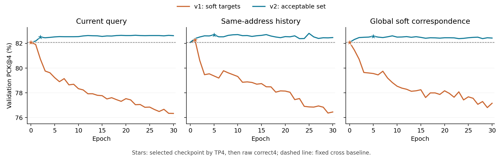

# 集合监督恢复了训练精定位，软对应仍未超过同址历史

日期：2026-09-13。状态：三条件各30轮已完成，best及固定last训练位置已评价。
协议：[候选残差读出v2](../protocols/blurball-candidate-residual-v2.md)。

## 主要判断

**把候选soft标签改成可接受位置集合监督后，三组训练定位均不再退步，验证也出现小幅增量。** 第30轮训练PCK4达到94.19%–94.48%，超过原cross的93.94%，也明显高于v1约89.3%。这支持先修订共同监督路径的决定，而不是把上一轮阴性直接归给motion表征。

**全图软对应仍没有独立优势。** 最佳验证PCK4分别为current82.50%、stationary82.69%、correspondence82.58%；对应相对同址历史少15个4px正确位置、少13个检测TP。相对只增加当前query的条件，它虽多10个raw正确位置，却少3个TP。未达到预定motion增量判据，不保留该全局软池化配方作为主贡献。

stationary相对原cross在四场raw4都净增，保留其v2 best5作为后续强竞争对照；它的单seed、同开发集选择不足以支持显著性、最终泛化或新的motion贡献。原cross及其他历史结果继续保留。

## 固定条件与唯一训练变化

与[v1](2026-09-13-blurball-candidate-residual.md)相同：cross best3固定K16与q/xy，stage0冻结特征缓存，真实连续`t−2:t→t`，三个9,281参数残差MLP，相同seed0初始化/批序/优化与各30轮。没有接训v1、重训骨干、重提取缓存或改变验证阈值。

v2只修改位置loss：令`A={候选到当前GT的原图距离严格<4px}`，最小化`−log(sum_{k∈A}softmax(z)_k)`。多个合格候选不强制平分概率，4px外候选没有正标签质量。仅当前V1且A非空监督，仍为31,887目标；全部38,854训练目标每轮遍历，全部14,192验证目标照常评价。

这个集合事件loss本身不是motion创新，也不保证任意有限loss下argmax正确。固定学习率没有对两版loss做梯度尺度校准，差值应归于“监督在这套固定优化条件下的变化”，而非宣称已排除全部优化效应。

## 完整学习曲线



橙色是v1，蓝色是v2，虚线为原cross。星号按运行前固定的TP4→raw4→最早epoch选优，不是按图中PCK4最高点另选。三个条件都完成30轮；图示全部epoch0–30，没有删除后期退步或缩短batch。图同时提供[SVG](../assets/blurball-candidate-set-supervision/validation-curves.svg)，已目视检查。

v1的共同训练退步在v2不再出现。v2后期TP仍可能下降，不能因raw定位曲线较平稳宣称训练已经收敛到最优或不会过拟合。

## 固定第30轮训练位置

下表从各自`last.pt`计算，先于加载验证best。可监督子集是全部训练V1且K16有4px正例，不是另选的容易帧。

| 条件 | 全训练V1 PCK4 | 可监督子集正确 / 31,887 | 子集PCK4 | 相对原cross正确数变化 |
|---|---:|---:|---:|---:|
| 原cross | 93.9367% | 31,001 | 97.2214% | — |
| current v2 | 94.2064% | 31,090 | 97.5005% | +89 |
| stationary v2 | 94.4761% | 31,179 | 97.7797% | +178 |
| correspondence v2 | 94.1913% | 31,085 | 97.4849% | +84 |

全训练V1分母33,002，包含1,115个K16不可达4px目标；子集以外不能通过重排新增4px正确位置。因此这个分母与子集指标都保留，不能以97%以上的条件指标替代全体93%–94%的定位。

同样条件在v1第30轮的全训练PCK4为89.4006%、89.2764%、89.3158%。结合本轮改进，可认为原soft标签配方存在明显精定位代价；不能据此认定集合loss是所有检测任务的最优目标，或把这一常见概率目标作为论文主创新。

## 最佳验证结果

| 条件 | 完成epoch | best epoch | PCK4 | PCK16 | 本地F1@4 | TP4 |
|---|---:|---:|---:|---:|---:|---:|
| 原cross | 来源best3 | — | 82.0797% | 85.8716% | 82.2349% | 9,876 |
| current v2 | 30 | 2 | 82.4984% | 86.7478% | 82.4098% | 9,897 |
| stationary v2 | 30 | 5 | 82.6923% | 86.9882% | 82.4930% | 9,907 |
| correspondence v2 | 30 | 5 | 82.5760% | 86.9417% | 82.3848% | 9,894 |

当前q始终不变：V1拒绝2,205，V0误出432。坐标变化仍会影响检测正确性，不能只按raw PCK高低判断整体检测收益。

| 自动配对方向 | 4px救 / 破 | raw4净变 | 检测TP4净变 |
|---|---:|---:|---:|
| cross→current | 81 / 27 | +54 | +21 |
| cross→stationary | 110 / 31 | +79 | +31 |
| cross→correspondence | 96 / 32 | +64 | +18 |
| current→correspondence | 27 / 17 | +10 | −3 |
| stationary→correspondence | 29 / 44 | −15 | −13 |

correspondence救回的96个raw位置中，40个当前输出、56个仍被原q拒绝；破坏的32个位置中22个输出。因此相对原cross虽净+64个位置，却仅净+18个检测TP。

## 比赛与大位移归因

| 比赛 | current相对cross raw4净变 | stationary相对cross | correspondence相对cross | correspondence相对stationary |
|---|---:|---:|---:|---:|
| match18 | +19 | +33 | +28 | −5 |
| match19 | −1 | +4 | −4 | −8 |
| match20 | +28 | +32 | +31 | −1 |
| match21 | +8 | +10 | +9 | −1 |

stationary在四场raw4均净增，但match21检测TP净−1，仍有输出状态的代价；这里将它保留为竞争对照，不宣布所有维度一致提升。correspondence四场均弱于stationary，且match19弱于原cross，直接未通过预定条件。

大位移分组也未给全局软对应提供清晰增量：

| 条件 | V1数 | current相对cross | stationary相对cross | correspondence相对cross |
|---|---:|---:|---:|---:|
| d1≥16px | 3,675 | +26 | +29 | +25 |
| d2≥16px | 7,986 | +54 | +60 | +55 |

以上为raw4净例数。correspondence相对current在d1组净−1、d2组净+1；不能把相对原cross的大位移收益直接归给全图搜索，新增当前候选外观读出已经解释了相近增量。两个位移群体共享样本，不是独立复现实验。

固定match21远错202例中，correspondence救13@4、20@16；原cross救回的74例又破坏3@4/16。stationary在202例救16@4，74例同样破3@4。这些固定失败群体没有推翻全量配对判断。

## 对下一种motion表示的约束

本轮已经排除了“只因v1软标签不断破坏训练精位置，所以才看不到对应增量”作为当前唯一解释：改善监督后，三个条件均能提高训练定位，但全局软池化仍未超过同址历史。因此不再扫描本配方温度、隐藏宽度或轮数。

还需正视一个结构事实：[当前池化](../../src/ballmotion/correspondence.py)只输出

\[
v(q)=\sum_j\frac{\exp(q^Tk_j/\tau)}{\sum_l\exp(q^Tk_l/\tau)}k_j.
\]

对**已经提取的历史key向量集合**任意重排空间地址，上式保持不变；它没有保留匹配发生在哪个位置、位移方向或多个位置假设。这个代数性质无需重跑视频证明，也不意味着移动真实图像后卷积特征一定不变。

因此本项实际检验的是位置无显式保留的、query条件化历史外观汇聚；不能把它直接当作完整motion representation，也不能把它的阴性解释成全局对应搜索没有价值。同址对照反而保留了“取当前地址处历史”的空间锚定，二者不仅搜索范围不同，汇总时保留的信息也不同。

下一结构研究必须明确**对应结果中的哪些空间与多假设信息需要保留，以及保留后是否帮助球身份和当前定位**。不能仅在平均特征上多加一层MLP，再将其命名为更强motion。历史球身份、背景竞争和当前候选遗漏仍是已有实测约束；保留地址本身也不是创新，仍需对照cost volume、SELFY/STSS、MotionSqueeze等最近邻。

## 工程、验证与产物

代码提交`4acda88`。新集合loss与真实可监督mask由原训练入口执行；默认soft保留v1复现，`--loss set`明确选择v2。恢复字段包括loss，不能把v1/v2接成同一run。比较入口读取并核对三个run的共同协议。

五项读出测试通过，其中新增两项覆盖集合概率/手算梯度、集合内重分配与分数平移，旧零初始化/近远槽/软标签回归保留。真实256目标CUDA smoke中233个可监督，初始集合loss0.08962，梯度有限；只证明通路。正式三run每轮遍历38,854目标、监督31,887、无全无监督batch跳过，epoch0原候选相等、best重新评价一致。独立数学审查确认目标和比较边界；Ruff F与diff检查通过。

三组训练、每轮验证、固定last训练评价及best最终预测耗时分别22.65s、19.90s、18.93s，合计约61.47s；峰值allocated显存均970.69MiB，含载入缓存。RTX5070Ti Laptop、float32，缓存加载不在上述计时内。没有重新提取前缀、解码或复制整幅特征，不把缓存训练速度称为视频端到端速度。

实际命令：

```bash
for task_condition in current stationary correspondence
do
  python -u scripts/train_blurball_candidate_residual.py \
    --features outputs/blurball/spatial_interaction/candidate_residual/features \
    --output "outputs/blurball/spatial_interaction/candidate_residual/set_supervision/$task_condition" \
    --condition "$task_condition" --loss set
done
python scripts/compare_blurball_candidate_residual.py \
  --root outputs/blurball/spatial_interaction/candidate_residual/set_supervision
```

实际Python为Conda `zshihyc`下绝对路径。`set_supervision/`保存三run、完整`comparison.json`和图生成脚本；每run保存配置、epoch日志、best/last、全部train/val预测及第30轮紧凑训练选择。PNG/SVG在`doc/assets/blurball-candidate-set-supervision/`。原始数据、旧训练和1.63GB共用特征缓存保留；AGENTS.md的用户修改未动。
