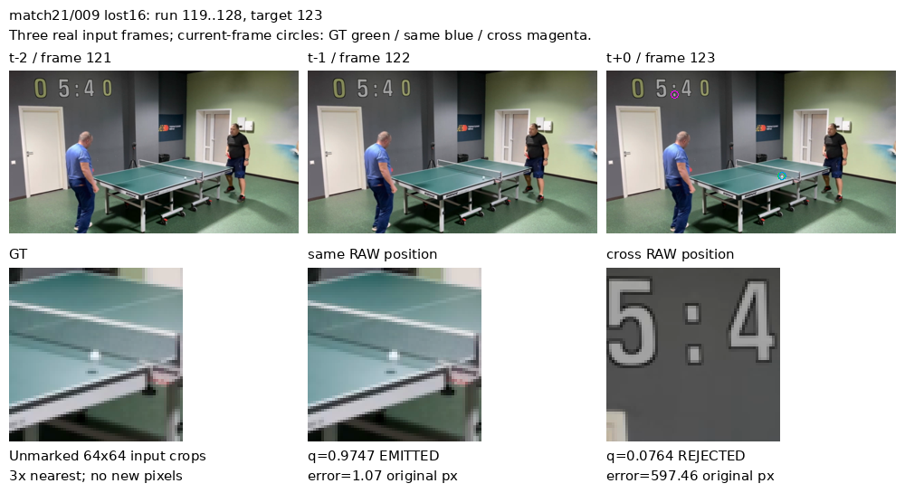
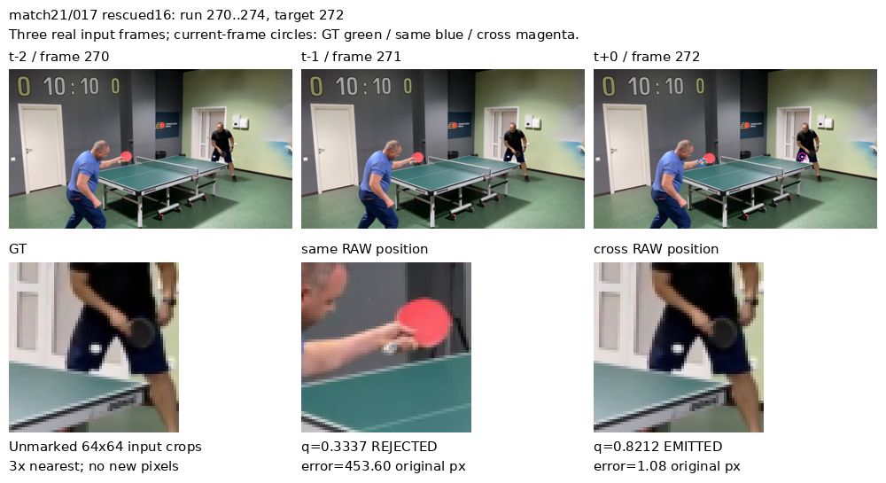
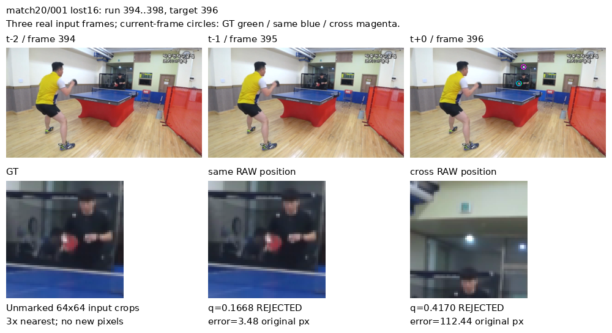
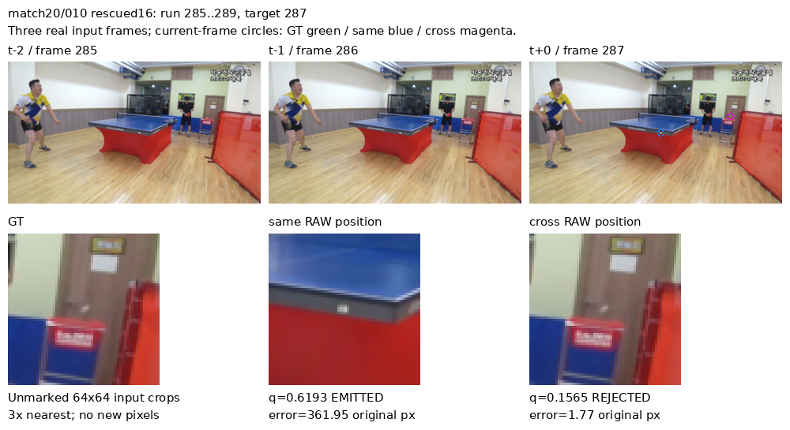

# 空间交互对照：match21的退步发生在哪里

日期：2026-09-13。状态：保存预测的完整状态拆分、连续段统计与固定样例视觉核对完成。

依据：[same/cross开发配对](2026-09-12-blurball-spatial-interaction.md#9月13日用户结束cross训练后的完整开发配对)。same best4与cross best3均保留；本项不再训练，不改阈值或选优，也不以局部样例否定全体验证结果。

## 问题与预先限定的诊断

cross总体固定重心PCK@4提高0.5816个百分点，但match21净少60个正确位置、净多128个≥16px远错位。需要区分：更多实际背景误检、更多拒绝时的错误raw位置、几像素细定位偏差，还是少数连续片段主导结果。

使用两组固定15×15/T1局部重心预测，完整14,192个验证目标。对V1以原图误差分为 `<4`、`[4,16)`、`≥16` 三带，再与各自q≥0.5输出/拒绝组成六状态；V0单列输出/拒绝两状态，不计算定位质量。这里的“raw位置”包括模型拒绝输出时仍可由热图解码得到的位置，不能把它自动称作实际误检。

全部四场均统计8×8状态转移、@4/@16救回和破坏、按rally分布及最大连续段。连续段只含同比赛/rally、真实原帧号相邻且满足同一转移条件的目标；不填帧、不补跨边界窗口。沿用已有诊断的≥4帧长度描述，不据结果调整阈值。

看图前选定规则：对于match20和match21，分别选最长的 `same<16→cross≥16` 与反向段；长度平局按clip和起始帧排序。每段只展示中间目标的真实三帧输入，以及当前GT/same/cross位置的未标记crop。选择先写入JSON，再读取RGB；没有按画面内容挑样例。这两场是前一配对中主要受益来源与主要受损来源，属于开发解释性选样，不是随机抽样或跨场独立验证。

## 关键结果：远错位增长主要被拒绝机制挡住

match21共有4,072个V1、395个V0。下面每列的六个V1状态总数均为4,072。

| match21状态 | same | cross | 变化 |
|---|---:|---:|---:|
| 正确且输出，<4px | 2,985 | 3,054 | +69 |
| 近错位且输出，4–16px | 28 | 29 | +1 |
| 远错位且输出，≥16px | 20 | 19 | −1 |
| 正确但拒绝 | 559 | 430 | −129 |
| 近错位但拒绝 | 117 | 48 | −69 |
| 远错位但拒绝 | 363 | 492 | +129 |
| V0输出 | 143 | 147 | +4 |
| V0拒绝 | 252 | 248 | −4 |

因此，**raw远错位增加128个，并不等于实际远距离误检增加128个**：实际输出的远错位净少1个，拒绝状态中的远错位净多129个。match21的F1上升与raw定位下降可以同时成立，因为正确输出增加69个，而正确但拒绝的位置少129个，合计raw正确净少60个。

逐帧配对进一步显示：same在16px内、cross变为≥16px的202个目标中，cross仅8个实际输出，194个拒绝（96.04%）；反向救回74个，净破坏128个。在@4的167个破坏中，130个变成≥16px远错位，37个落到4–16px。主要新增位置失败已经超出局部重心的微调范围，但多数没有被当作可靠球位置输出。

这不能说明拒绝概率已经校准，也不能用“多数拒绝了”取消V1定位失败；目标标注仍要求定位可见球。它只改变下一步要解决的问题：需要提高这些目标的视觉定位证据，而不是仅仅压低全部背景输出概率或降低输出阈值。

## 连续段与rally分布

202个@16破坏分布在19个rally。最长连续段10帧，≥4帧的段只包含40个目标，占19.80%；其余162个出现在长度1–3的段。@16破坏的段长分布为 `1:89, 2:23, 3:9, 4:2, 5:3, 7:1, 10:1`；反向救回74个，≥4帧段含9个目标。

按rally统计的@16净破坏，009为38、020为21、011为15、001为13，另外一些rally净受益（015净救回9、006净救回3）。因此，最长段值得查看，但不能把全部退步归给一个坏片段，也不能据此删除rally或改变数据边界。

同样，连续错误不是隐状态递推：当前两个模型仍逐三帧窗口独立预测。持久干扰和相近图像条件可以重复诱发错误，不能仅由段长推导出跟踪记忆污染或相机运动。

## 固定正反向样例

图像来自既有512×288 RGB mmap。上方为完整三帧输入的缩略图，下方为当前帧64×64输入crop、最近邻放大3倍。圈只用于当前帧全图定位；crop未覆盖标记。图中文字明确区分raw位置与是否输出，展示图不是模型输入。

| 比赛/rally、转移 | 原帧段 | 展示目标 | same误差/q | cross误差/q |
|---|---|---:|---|---|
| match20/001，破坏@16 | 394–398 | 396 | 3.48px / 0.1668，拒绝 | 112.44px / 0.4170，拒绝 |
| match20/010，救回@16 | 285–289 | 287 | 361.95px / 0.6193，输出 | 1.77px / 0.1565，拒绝 |
| match21/009，破坏@16 | 119–128 | 123 | 1.07px / 0.9747，输出 | 597.46px / 0.0764，拒绝 |
| match21/017，救回@16 | 270–274 | 272 | 453.60px / 0.3337，拒绝 | 1.08px / 0.8212，输出 |

**match21破坏：数字笔画竞争，但不是已输出的背景误检。** GT及same位置附近有清楚的白色球状亮点；cross的raw位置落到墙上计分牌字符区域，同时q很低。它说明这个输入仍存在能被same利用的位置证据，却未被cross成功用于定位。两组前缀与头都经各自训练，不能由该例单独证明是某层GELU、某个匹配机制或下采样造成信息丢失。

**match21救回：反向情况同样存在。** same的raw位置落在近端红色球拍/手部区域且拒绝，cross在远端黑衣运动员下身前的小白点附近正确输出。这个反例排除了“cross必然更易选择醒目干扰物”的统一解释；也不证明它已学到可靠的物理对应。

**match20破坏：两者都拒绝，位置证据强弱需保留不确定性。** same接近GT，cross的raw位置处在上方墙面/玻璃区域，附近有强亮反光及小标记。GT附近是黑衣运动员前方的弱小亮点，与球相容，但输入分辨率不足以把所有微小内容独立确认为球。不能把两个拒绝结果都算作发出的背景误检。

**match20救回：位置救回仍未转为正确输出。** same在球台边缘亮斑处输出；cross移到GT附近但拒绝。GT crop仅有很小的暗色短痕，无法仅凭这一幅图确认球的身份。这种变化再次说明位置正确与是否输出是两条评价轴。

四张图均经独立视觉核对。上述内容是可见外观与标签/预测位置的关系，不是对网络内部因果、真实运动方向或相机运动的测量。所有统计使用全体验证目标，四个样例不作为总体比例的依据。

## 研究决定与下一项最小证据

1. 维持前一配对的决定：不继续扩展当前仅移动GELU的结构路线；不能因match21的大位移净−1很小而临时放宽门槛，也不能称其显著退化。
2. 不采用统一降阈值或增加“背景抑制”模块来处理本次差异。194个新增远错位已被拒绝，降低阈值可能使它们变为输出；而提高拒绝会进一步损伤可见球召回。
3. 当前证据没有把失败归到搜索范围、细节消失或特定motion算子。下一步可用固定same/cross权重，把历史槽替换成当前帧，完整验证其对这些已固定破坏/救回群体的影响。这是推理输入干预，需要同时报告全体代价，不能替代已经完成的“重新训练repeat_current”控制，更不能把分布变化后的提升当作新模型性能。

该输入干预尚未运行。若固定错误能随输入历史改变而系统性改变，则继续研究历史证据使用；若不能，不能仅靠本次退步继续堆时序搜索模块。输入干预本身也不能证明哪一层丢失信息，仍需对应的表征读出证据。暂不启动新的长训练、增加候选模块或重复文献搜索。

## 实现和证据位置

`outputs/blurball/spatial_interaction/analyze_failures.py`复用既有预测身份读取和连续窗口构造；新增八状态及连续转移段的小型断言覆盖q=0.5、4/16px边界、V0、原帧缺口和clip切换。实际运行成功，完整计数与上轮保存指标相符；没有重跑模型测试。

`failure_structure.json`保存全部四场状态矩阵、每个rally的救回/破坏和看图前的选样；`render_failures.py`保存图像生成过程，并检查三帧缓存末帧与预测目标身份一致。没有重新解码、模型forward、伪标签、删样本、新依赖或内容指纹。两组checkpoint、原预测及紧凑局部logit缓存均保留。
