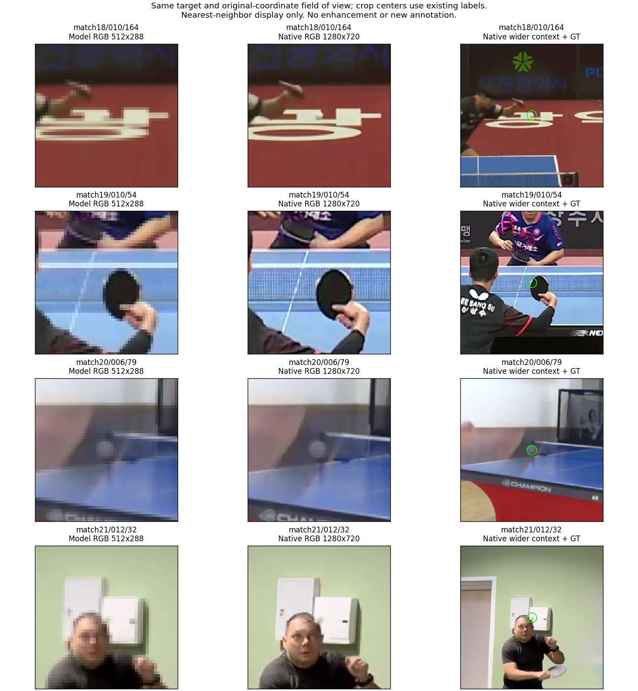

# center5自身的候选覆盖：把旧群体与新候选分开

日期：2026-09-14。性质：固定best的候选诊断，不是新训练或自动定位方法。

依据：[五帧最终结果](2026-09-14-blurball-five-frame-results.md)已说明新上下文改善部分旧失败，但旧K16的覆盖不能继承给center5。本轮测量新模型自己的有限候选，判断剩余问题是否仍有可供选择的近球位置；center3长度控制继续训练，不因本诊断更改结构或训练参数。

## 方法与来源

复用[既定候选规则](../protocols/blurball-candidate-coverage-v1.md)：空间logits上贪心取16点，抑制半径7格方窗；分数与15×15/T1重心始终取原logits，报告K=1/2/4/8/16和原图严格4/8/16px覆盖。候选提取不读GT或visibility，GT只用于oracle评价；q保持原模型值，不改阈值、不自动重排。

源模型为center5最佳epoch5，输入`t−2,t−1,t,t+1,t+2`，目标slot2；验证13,912个共同目标，V1为12,689。读取已缓存RGB，不解码视频。原局部logit缓存只有第一峰邻域，不能恢复全图次候选，因此这次完整前向有必要；只保存紧凑候选坐标、分数、原q和真实目标帧索引，不保存完整热图或重复窗口。

已完成的旧cross候选按真实缓存帧索引取相同目标子集，仅作历史参照；旧模型的时间输入、训练集合和预算不同，不能作为严格受控运动增益。旧701例保持原身份，新center5远错群体另行命名，不将两者混为同一个集合。

## 实现与验证范围

[export_blurball_candidates.py](../../scripts/export_blurball_candidates.py)增加实际需要的`--split val`和读取源窗口；默认训练导出保持原用法。共享提取函数显式接受`target_slot`，避免在中心窗口中把未来末帧保存成当前身份；模型帧数来自实际窗口，不固定构造三帧模型。

11项针对性测试通过，覆盖原候选抑制/并列/坐标、中心目标索引、原三/五帧和局部读出。全量导出还要求K1恢复原argmax、固定局部坐标与q决策。局部参考先加载，缺少必要参考时不浪费整次GPU前向。

实际命令：

```bash
/home/zshyc/miniforge3/envs/zshihyc/bin/python -u scripts/export_blurball_candidates.py \
  --run outputs/blurball/five_frame_context/center5_seed0 --split val \
  --output outputs/blurball/five_frame_context/center5_seed0/candidate_coverage
```

分析入口`outputs/blurball/five_frame_context/center5_candidate_analysis.py`只读取候选与元数据，输出`center5_seed0/candidate_coverage/coverage.json`。原始候选及来源记录在该目录`candidates.npz`和`manifest.json`。

候选覆盖是固定规则下的oracle上限。K16未覆盖不证明backbone信息消失；K16覆盖也不证明次候选具有正确球身份或可靠对应。V0不参与位置覆盖，但仍完整前向并保存；拒绝组不能从V1分母中排除。

## 实际结果

全部13,912个目标的K1 argmax与原输出一致，局部重心在1e−10绝对容差内复现，q最大差为0且发出/拒绝决定相同。前向及K16提取耗时254.11秒，峰值allocated显存451.52MiB；与center3训练共享GPU，不作为部署速度。NPZ为11,743,262字节，未保存16份局部patch。

| 来源 | K1覆盖4px | K2 | K4 | K8 | K16 | K16覆盖16px |
| --- | ---: | ---: | ---: | ---: | ---: | ---: |
| old_cross | 82.1814% | 84.7900% | 86.5789% | 87.8005% | 88.7146% | 96.6270% |
| center5 | 84.1832% | 86.1534% | 87.3040% | 88.3364% | 89.1717% | 96.4221% |

| center5群体 | V1数 | K1正确4px | K1错但K16覆盖4px | K16最好在4–16px | K16全在16px外 |
| --- | ---: | ---: | ---: | ---: | ---: |
| all | 12689 | 10682 | 633 | 920 | 454 |
| match18 | 3926 | 3467 | 192 | 198 | 69 |
| match19 | 1561 | 1400 | 72 | 75 | 14 |
| match20 | 3189 | 2260 | 261 | 434 | 234 |
| match21 | 4013 | 3555 | 108 | 213 | 137 |
| legacy701 | 701 | 327 | 174 | 148 | 52 |
| own_far16 | 1413 | 0 | 485 | 474 | 454 |
| emitted | 10253 | 9760 | 217 | 255 | 21 |
| rejected | 2436 | 922 | 416 | 665 | 433 |

## 对后续结构的限制

center5原位置4px外共有2,007例：633例可由固定K16中的其他坐标达到4px，920例最好的候选在4–16px，454例仍在16px外。4–16px只描述距标签的误差，不能把它们全部认定为同一真球的细定位偏差。

旧701例中，center5第一候选已正确327例，另有174例可由其他候选达到4px；148例只到4–16px，52例仍在16px外。旧候选覆盖率100%不再成立，新集合只有501/701（71.4693%）覆盖4px。

若只重排这16个固定坐标并保持q，GT oracle最多得到TP=9977、FP=581、FN=2712，本地F1@4=85.8347%。相对现有9,760个TP只多217个；另外416个潜在位置救回仍属于拒绝组。这个oracle不是训练或部署成绩，也不允许把GT用于实际候选选择。

新K16整体4px覆盖稍高于旧cross，但16px覆盖略低；两个候选集合和训练条件都变了，不能把K1提升全部归因于同一集合内的排序。对center5自身1,413个远错，只有485例的K16能覆盖4px，其中367例仍被q拒绝。

因此，不将固定q的候选重排作为解决全部残余错误的充分方案，也不立即扩大K。继续完成center3长度控制；选择后续基线后再依据该模型的真实候选、当前视觉证据和输出状态决定是否研究身份、细节或跨帧支持。已有center5候选可以复用，不再因调整评价分组而前向。

上述上限仅约束固定候选坐标与固定q。若后续允许新位置回归、其他图像证据或改变存在判断，上限需按新输出可达范围重新定义；不能用它否定所有候选式架构。

## 固定漏球样例：先看具体失败，再决定是否增加细节分支

本次从每个验证match的两个V1群体分别取一例：K16最佳误差在`[4,16)`或`[16,∞)`原图像素。每组先取符合条件的中位clip，再取该clip内符合条件的中位帧，共8例；不按邻帧visibility进一步筛选。这是可复查的定性选择，不是随机抽样，也不是错误类型的占比估计。

脚本为`outputs/blurball/five_frame_context/visual_center5_omissions.py`，选择和真实帧身份保存在`center5_seed0/candidate_coverage/visual_selection.json`。复用已保存K16和512×288 RGB缓存，不再次前向。图中上排展示全帧、第一候选和最接近标签的候选；下排展示五帧标签附近。各帧裁剪独立以各自标签为中心，不是运动对齐结果；V0邻帧只展示当前目标位置附近，不画伪GT点。标记图只用于诊断，不进入模型输入。

以下误差均为固定局部重心到原图标签的距离；最近候选序号从1开始。q是原模型存在分数，不能把它当成经过校准的正确定位概率。

| match/clip/帧与图示 | q | 第一候选误差 | K16最佳误差（序号） | 视觉观察与解释边界 |
| --- | ---: | ---: | ---: | --- |
| [18/010/162](../assets/blurball-center5-omissions/match18-010-162-best_4_to16.png) | 0.0224 | 19.31 | 10.40（14） | 标签位于远端球员手拍下方的白色地面文字附近；候选分别偏向手拍边缘和文字，缩小图中球难以独立辨认。 |
| [18/010/164](../assets/blurball-center5-omissions/match18-010-164-best_ge16.png) | 0.0016 | 545.06 | 38.97（2） | 第一候选跳到远处白色地面文字，最近候选仍偏向远端球员/球拍；标签附近存在同色背景竞争。 |
| [19/011/56](../assets/blurball-center5-omissions/match19-011-56-best_4_to16.png) | 0.9886 | 325.24 | 4.35（7） | 第一候选落在远处座席亮色结构，第7候选接近黑色标牌/球台边界处白色球影；前两帧可见拉长亮响应。身份选择与严格中心误差同时存在，不能称为球完全消失。 |
| [19/010/54](../assets/blurball-center5-omissions/match19-010-54-best_ge16.png) | 0.3529 | 379.28 | 32.20（5） | 标签靠近前景黑色球拍边缘；52、53帧球较明显，55帧V0、56帧V1。可能涉及接触或遮挡过渡，但图示不能确定遮挡成因或证明标签错误。 |
| [20/006/100](../assets/blurball-center5-omissions/match20-006-100-best_4_to16.png) | 0.3133 | 4.22 | 4.22（1） | 第一候选已在远端球员拍旁，只略超过4px，同时被存在判断拒绝；不属于第一候选远跳背景的例子。 |
| [20/006/79](../assets/blurball-center5-omissions/match20-006-79-best_ge16.png) | 0.4579 | 375.63 | 26.06（10） | 标签附近拍旁有灰白模糊圆状响应，最近候选偏向球台，第一候选落在远处挡板/地面支撑附近；输入中存在响应并未保证候选覆盖。 |
| [21/011/92](../assets/blurball-center5-omissions/match21-011-92-best_4_to16.png) | 0.0051 | 5.75 | 5.75（1） | 第一候选接近标签但仍偏移，浅色门/球拍附近的弱响应不易区分；极低q和细定位误差需要分别解释。 |
| [21/012/32](../assets/blurball-center5-omissions/match21-012-32-best_ge16.png) | 0.0011 | 496.96 | 255.69（15） | 标签靠近球员头发与墙上白色装置，第一候选在球网边缘附近，最近候选仍远落球台；局部弱证据和背景竞争并存。 |

这些样例的标签相邻帧位移约为1.31–95.63px，漏候选并不只出现在大位移样例中。该位移只是二维标签差，不能解释为真实物理速度或没有尺寸依据的rho，也不能由8例推断整体位移分布。

### 发布源分辨率是否能改变解释

只看缩小图不能判定resize是否丢掉球。因此对上述四个K16最佳仍在16px外的目标帧，补读发布视频的1280×720帧，与512×288缓存作同一原图视野的并排显示。这里的“源分辨率”指公开发布视频，不指传感器原始数据。未作增强、超分辨率或标签修正。



每行左侧是缩小输入的局部显示，中间是同视野未标记源帧裁剪，右侧是更宽源帧裁剪和标签环。发布源分辨率提高了纹理清晰度，但没有出现一致的“源图中球明确独立、缩小后完全消失”模式：

- 18/010/164的标签仍接近同色地面文字，原分辨率未消除分离困难。
- 19/010/54的球拍、球网边缘更清楚，但标签处仍难分离出独立球体。
- 20/006/79在两种分辨率中均存在灰白模糊响应，源图更清楚；这至少反对把该例直接归结为resize完全擦除了视觉证据。
- 21/012/32的头部和墙上装置更清楚，仍不能自信地从标签位置分离球。

独立视觉复核与以上判断一致，但人工目视不能代替可读出性实验。这里既不证明源图无可用信息，也不证明现有backbone保留了全部信息；更不能据此改动V1标签。样例选择有偏，不支持“多数失败与分辨率无关”的总体断言。

新增解码只用于此前缓存没有的四个源分辨率目标。`native_omission_detail.py`按原帧序号选帧，并将解码PTS及time_base与缓存元数据逐一对齐：18/010/164为41984、1/15360；19/010/54为55044、1/30000；20/006/79为79079、1/60000；21/012/32为8438、1/15360。四例均相符。未标记源帧、命令与来源记录保存在候选目录`native_frames/`，再次制图可直接复用；`native_detail.json`记录对齐结果。未添加哈希或校验和，ffmpeg的showinfo校验和计算显式关闭。

### 本轮研究决定

现有证据支持区分背景误选、近球细定位与拒绝输出，尚不支持把它们统一归结为resize，也不足以直接批准高分辨率分支。继续完成同目标群体的center3与center5长度控制，再决定下一项最小结构实验。新增图示和来源记录只补充诊断，不更改模型、训练设置、评价阈值或标签；本轮无需重跑模型测试或训练。

## 独立当前帧证据：已有单帧控制能补回多少

图像诊断后，进一步用已保存的`dino_repeat_current_seed0`最佳epoch1固定局部读出，检查它与center5的互补性。这个模型训练时三个输入槽都是真实当前帧，故其预测只依赖当前RGB；它不是把center5的历史槽临时改成重复帧。两模型使用同一512×288 RGB缓存，预测按match、clip和原帧号对齐，覆盖全部13,912个共同目标，原visibility和坐标逐项一致。

这是两个已有checkpoint的开发诊断，不是等训练条件消融。旧repeat采用baseline位置头、batch8和38,854个训练目标，共1,272,577参数；center5采用cross-address位置头、batch4和37,590个训练目标，共1,279,169参数，训练和选优条件也不同，详见[原repeat记录](2026-09-12-blurball-temporal-control.md)。前缀各自微调，不能把输出差异定位到某一个融合层，也不能用这项结果声称已隔离motion或模型容量。

### 存在互补，但多数残余位置不能由旧单帧直接补回

| center5的V1群体 | 数量 | repeat位置达到4px | repeat位置达到4px且发出 |
| --- | ---: | ---: | ---: |
| 第一候选已经正确 | 10,682 | 9,172 | 9,121 |
| 第一候选错、K16覆盖4px | 633 | 110 | 109 |
| K16最佳在4–16px | 920 | 89 | 87 |
| K16全部在16px外 | 454 | 8 | 8 |

center5的2,007个第一候选错误中，repeat救回207个原始位置，其中204个按自己的q发出；但若整体改用repeat，也会破坏center5原本正确的1,510个位置。207例分布在四场比赛的55个clip内，不能将相邻帧视为独立重复证据。各场原始位置救回/破坏分别为：match18的86/335、match19的14/261、match20的65/466、match21的42/448。

严格漏候选的1,374例中，repeat新增覆盖97例（7.06%）；其中K16全部在16px外的454例只补回8例（1.76%）。将repeat的一个固定位置加入center5固定K16，忽略q并让GT选位置，4px覆盖可从11,315/12,689提高到11,412/12,689，即89.1717%→89.9362%。这是候选位置并集的oracle覆盖，不是自动选择准确率；真实选择还需避免引入repeat的错误，且旧前缀要额外运行。

这97例说明，至少有部分当前输入证据可以被另一个已训练函数读出，却没有进入center5的16个固定候选。因此“这些球在resize后全部不可读”不是充分解释。但它既不证明center5特征中已经丢失球，也不证明“加任何当前帧分支都能得到这97例”；旧repeat函数的大多数其他输出还更差。

### 仅在center5拒绝时回退到repeat，也不是充分修复

预先固定一个无需标签的简单规则：center5的q<0.5时使用repeat的位置和q，否则保留center5。不扫描阈值、不按比赛选择来源。这是在保存输出上评价的双模型规则，不加入部署，不冒充单网络同计算量成绩；它未扩大center5的原五帧输入范围，但增加了另一个模型的编码与读出。

| 保存输出规则 | PCK@4 | 本地F1@4 | TP | FP | FN |
| --- | ---: | ---: | ---: | ---: | ---: |
| center5 | 84.1832% | 83.9678% | 9,760 | 798 | 2,929 |
| repeat_current | 73.9144% | 71.5464% | 9,325 | 4,053 | 3,364 |
| center5拒绝时采用repeat | 81.2909% | 78.6618% | 10,287 | 3,179 | 2,402 |

回退多得到527个TP，却增加2,381个FP。其中421个新增TP原本已被center5定位正确但拒绝，只有106个同时修复了位置错误；新增FP中1,585个来自V1错位输出，796个来自V0误出。V0仍按数据协议解释，不等于证明物理上没有球。只报告“救回527个”会掩盖更大的误出代价。

结论是保留当前视觉证据的研究动机仍然存在，但现有单帧checkpoint只能提供有限的互补证据，不足以批准直接回退、双模型拼接或候选重排。长度控制继续，不据此更改正在训练的center3。

### 架构命名不能代替机制改变

当前实际代码先按帧归一化，再作自由的1×1投影：`P[z_(t−k),…,z_t,…]`，随后进入非线性和空间混合，见[SpatialInteractionReadout](../../src/ballmotion/probe.py)。把同一归一化目标帧的线性投影`Q z_t`加到这个第一投影的输出、且在同一个非线性之前融合，可以直接并入P的目标帧列块。偏置同样可以合并。这种“新增当前帧路径”在这里仅是重参数化，不能自动增加可表达机制；初始化、正则化与优化轨迹仍可能改变。

真正区分现有路径需要明确改变什么：例如先保留独立的目标帧非线性响应、再与时间支持融合，或读取现有路径未直达读出的stage0细节。前者改变交互顺序与容量，后者改变空间信息路径，不能合并成一个模糊的“身份增强”贡献。它们都有近邻先例，见[现代检测器迁移审查](../literature/2026-09-13-modern-detectors-transfer.md)；本轮没有实现这些候选架构，也没有把互补oracle当作训练收益承诺。

### 来源与验证

本项脚本和JSON为`outputs/blurball/five_frame_context/current_complementarity.py`、`current_complementarity.json`，记录源配置、完整四场配对状态、群体计数和207个救回目标身份。只读已保存NPZ、CSV和元数据，无RGB读取、解码、backbone前向或参数更新。center5候选0及q与原局部预测逐值相同；两源身份/标签一致，三类错误分区的救回数之和等于全部207例。复用既有评价器和严格容差，不增加测试框架或重新验证数据包。

独立只读审查复核了上述来源、分组和q/位置拆分，支持等待center3完成后再决定结构。回退负结果仅否定这个固定双checkpoint规则，不否定未来共同训练的融合路径；207个互补例也不能反过来保证共同训练会成功。
