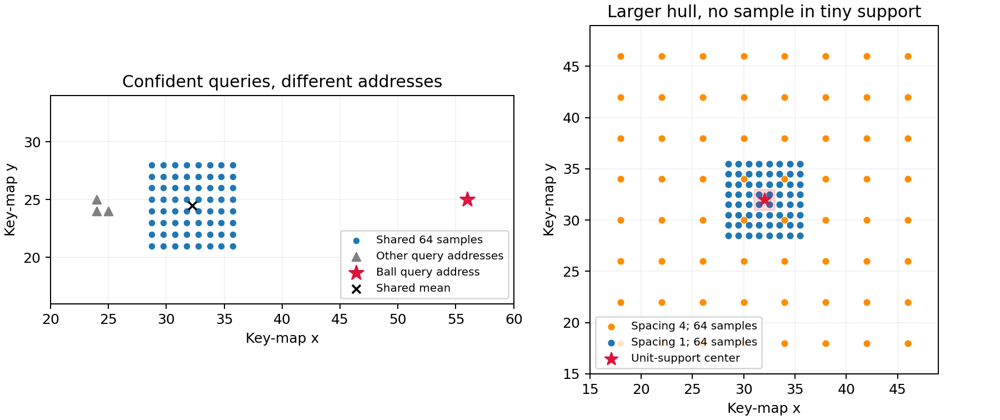

# 搜索区包含目标，不等于采到目标：ASpanFormer 的机制与细支撑边界

日期：2026-09-12

性质：文献证据、源码审查与可复算几何示例；不含真实球数据实验。

问题：在固定采样预算下，扩大搜索范围、预测不确定性和合并邻近 query，究竟改变了什么？

## 一、当前判断

ASpanFormer 已直接研究“先预测对应地址，再根据不确定性调整局部采样范围”。该机制比泛泛的全局/局部 attention 更接近本项目的候选方向，必须作为实质先例。

补读之后，需要把三件事分开：**连续搜索区域覆盖、实际采样地址覆盖、采样特征中的有效球证据。** 它们不能互相替代。另一个具体环节是邻近 query 的合并：每个 query 都预测得准确，不保证它们的均值仍落在任何真实对象上。

这些是机制边界，不是已经证明 ASpanFormer 在球视频上失败。它保留了全局信息交互和最终全图匹配，局部采样失误仍有恢复机会。当前没有运行该网络，也不据几何反例改变正在进行的 BlurBall 时序对照。

## 二、一手来源与阅读范围

Hongkai Chen 等，*ASpanFormer: Detector-Free Image Matching with Adaptive Span Transformer*，ECCV 2022，pp.20–36。

- [ECVA正式主文](https://www.ecva.net/papers/eccv_2022/papers_ECCV/papers/136920020.pdf)：已读方法、监督、实验、消融和成本；核对公式及表5/6原页。
- [ECVA补充材料](https://www.ecva.net/papers/eccv_2022/papers_ECCV/papers/136920020-supp.pdf)：已读网络设置、参数化、附加消融及flow损失推导。
- [arXiv版本记录](https://arxiv.org/abs/2208.14201v1)：本次记录仅见2022-08-30的v1；不把旧论文改称近期首发。
- [官方实现及本次代码版本](https://github.com/apple-aiml-research/ml-aspanformer/tree/ada1119a5b520b2dff94387b57c5e7818ad80b2f)：原Apple链接重定向至此。研究代理读取输入、attention、监督、损失及coarse/fine匹配；根代理复核地址解码、detach、cell聚合、采样尺度和损失。未下载权重或训练数据，未运行作者模型。

主文与源码的参数化分别说明；代码版本用于确定实际行为，不能静默替换论文描述。

## 三、完整路径中的各阶段

| 环节 | 实际作用 | 不能省略的边界 |
|---|---|---|
| 双图特征 | ResNet-18提供1/8特征用于交互、1/2特征用于最终细化 | 这里的“细层attention”仍是1/8尺度，不是原图逐像素搜索 |
| 初始化与四轮GLA | 最粗全局交互；中/细层按预测地址与尺度局部采样 | 每轮都保留全局路径，局部窗口不是永久地址截断 |
| 辅助地址场 | 每格点预测另一图的二维绝对坐标及尺度 | 名称flow不等于已经减去query坐标的位移，更不带物理速度单位 |
| 最终coarse匹配 | 全部1/8特征之间构造相关矩阵，dual-softmax与MNN筛选 | 仍有两图token数乘积的计算/内存项 |
| fine匹配 | 已选coarse对附近做局部相关和亚格点读出 | 这一步本身不承担远距离重新发现 |

上述方法与监督见[主文§3及补充A/B](https://www.ecva.net/papers/eccv_2022/papers_ECCV/papers/136920020.pdf)；最终匹配的实际全图矩阵见[coarse_matching.py](https://github.com/apple-aiml-research/ml-aspanformer/blob/ada1119a5b520b2dff94387b57c5e7818ad80b2f/src/ASpanFormer/utils/coarse_matching.py#L109)。

它不需要SIFT式关键点或目标初始化，但也不负责判断哪个匹配是球。把两张历史/当前帧送入双图匹配器，需要另外定义目标选择与标签语义。对称交互不自动意味着用了未来帧；是否因果取决于选定的两帧相对预测时刻的位置。

## 四、源码中的尺度、均值与真实采样点

### 1. 辅助尺度不是球存在概率

源码将前两项经sigmoid映射到目标特征图的宽、高范围，后两项作为 \(s_x,s_y\)。flow损失逐轴形如：

\[
\ell=s+e^{-s}(y-\mu)^2.
\]

采样时使用 \(\sigma=e^{s/2}\)。所以源码的 \(s\) 是log-variance式参数；补充材料则用log-standard-deviation书写高斯NLL。令 \(s=2\log\sigma\)，二者形式上相差整体倍数，可由相应损失权重吸收，不能仅因变量名不同就报告公式错误；也不能未经核对断言训练权重完全等价。[地址解码](https://github.com/apple-aiml-research/ml-aspanformer/blob/ada1119a5b520b2dff94387b57c5e7818ad80b2f/src/ASpanFormer/aspan_module/transformer.py#L126)、[实际损失](https://github.com/apple-aiml-research/ml-aspanformer/blob/ada1119a5b520b2dff94387b57c5e7818ad80b2f/src/losses/aspan_loss.py#L22)。

监督的对应来自深度和相机几何，尺度描述坐标回归难度；它没有因此成为球可见性、背景误选或“对应不存在”的校准标签。论文表6区分可配/不可配区域的平均尺度，是有用的描述证据，仍不等于条件覆盖率校准。

另一个实际训练边界是，局部attention收到的是detach后的地址场。匹配损失不经这条采样坐标路径反传到flow解码；共享特征和其他更新路径仍可受训练影响，不能称整个分支完全独立。[实际forward](https://github.com/apple-aiml-research/ml-aspanformer/blob/ada1119a5b520b2dff94387b57c5e7818ad80b2f/src/ASpanFormer/aspan_module/transformer.py#L104)。

### 2. 四个query共用一个地址集合

默认最细局部层的query按 \(2\times2\) 分组，每组共用 \(8\times8=64\) 个key/value样点。设该组四个预测地址为 \(\mu_i\)，则共享中心为 \(\bar\mu\)。源码先逐query计算采样间距，再独立平均：

\[
a_i=\max\!\left(\frac{2\cdot5\cdot\sigma_i}{8},1\right),
\qquad
\bar a=\frac14\sum_i a_i,\qquad
\bar\mu=\frac14\sum_i\mu_i.
\]

二维分量分别计算；归一化前的样点集合为：

\[
\mathcal Q=\{\bar\mu+\bar a\odot(k_x,k_y):
k_x,k_y\in\{-3.5,-2.5,\ldots,3.5\}\}.
\]

来源：[尺度转换、cell池化与采样](https://github.com/apple-aiml-research/ml-aspanformer/blob/ada1119a5b520b2dff94387b57c5e7818ad80b2f/src/ASpanFormer/aspan_module/attention.py#L49)。这里采用最细层，其他尺度还涉及池化和坐标缩放。

这个操作没有把 \(\mu_i-\bar\mu\) 的分歧并入尺度。对运动近似一致的邻域，这是一种合理的计算共享；对夹有独立运动小目标的邻域，它可能把若干分别可信的地址合成一个不对应任何点的位置。

这里讨论的是**不同query之间的地址分歧**，不是同一个query具有多个候选身份；两类多峰不能混叫同一现象。也不必把组平均解释成概率混合模型：源码并未声称它精确保留了混合分布矩。

### 3. 变大的区域为何可能采得更稀

当不确定尺度增大时，样点数仍固定为64，间距 \(\bar a\) 增大。样点外接矩形的一边为 \(7\bar a\)，而不是把矩形中所有位置都计算一遍。主文的名义span参数和代码中的radius_scale不能仅凭同为5就视为同一个实际宽度。

这并不意味着样点没有直接踩到球中心就完全看不见球：双线性取样、特征有效空间范围以及后续聚合都会影响证据。但“外接矩形含真中心”明显弱于“实际样点取得有区分力的球特征”。评价前者不能替代后者。

## 五、可复算的几何反例：只说明局部操作可能怎样失败

已运行[演示脚本](../../scripts/probe_aspanformer_support.py)，保存数值至根目录下outputs/literature/aspanformer-span-geometry/summary.json，并生成下图。



图中坐标单位为特征地址。左：三个背景query和一个独立运动query的地址均值离开真球地址。右：两组采样都包围中心，间距增大后样点避开中心附近的单位细支撑。

**设置事先由几何构造确定，没有在球数据上挑样本。** 第一例四个地址为 \((24,24),(25,24),(24,25),(56,25)\)，各轴标准差均0.4；末项视为理想情况下预测准确的球对应。共享中心变为 \((32.25,24.5)\)。第二例中心固定 \((32,32)\)，标准差从0.4改为3.2，对应间距1和4，均使用64个样点。

为了显示细支撑，定义连续的理想响应：

\[
h(q;p)=\prod_{d\in\{x,y\}}\max(1-|q_d-p_d|,0).
\]

该tent仅用于几何演示，不是从DINO提取的特征、作者的实际grid_sample结果或真实球形状。

| 设置 | 样点外接区域包含目标 | 最近样点距离 | 最大理想tent响应 |
|---|---|---:|---:|
| 四query共享地址，对球 | 否 | 20.25 | 0 |
| 仅用球自己的地址，几何参照 | 是 | 0.7071 | 0.25 |
| 固定中心，间距1 | 是 | 0.7071 | 0.25 |
| 同一中心，间距4 | 是 | 2.8284 | 0 |

可接受的结论是：组内独立运动可能影响共享地址，且固定采样数时连续覆盖不保证细支撑采样。单球自己的地址只是已知假设下的参照，不能冒充已经解决自动候选问题或同预算的改进算法。

**本示例没有运行上下游网络。** 它未测量真实特征感受范围、错误出现频率或最终匹配能否恢复，也不能据此声称ASpanFormer在体育数据上失败。它是一个明确的可证伪环节提示；是否成为论文主要问题，仍须由真实系统证据决定。

复算命令：

```bash
/home/zshyc/miniforge3/envs/zshihyc/bin/python scripts/probe_aspanformer_support.py
```

脚本不读数据或权重，使用CPU，内置该构造应满足的断言；运行时原BlurBall训练保持独占GPU。

## 六、已有正结果与成本应当怎样接受

主文表5在ScanNet的姿态AUC@5°上，固定span的分层attention为24.85，自适应span为25.61。该对照支持作者任务下自适应范围的条件收益；不能因为上面的几何反例就否认它。

主文表7又明确报告：640×480图像对、V100上，ASpanFormer为113.5 ms，所比较LoFTR为97.7 ms。ASpanFormer中attention为40.5 ms，匹配阶段仍需40.8 ms。这与“局部采样线性”不矛盾，却不支持整个系统比比较对象更快。数据准备边界与本地球任务不同，不能换成当前模型的部署速度。[主文消融与计时](https://www.ecva.net/papers/eccv_2022/papers_ECCV/papers/136920020.pdf)。

更根本的是，最终全图相关仍可选择局部span外的位置。若将来为省计算移除它，得到的是一个新受限系统；不能继承原论文的恢复能力、准确率或条件消融，同时只计算留下的便宜部分。

## 七、对本项目的实际影响

本次把可能的信息损失位置进一步细化为：**不同运动的query被合并、固定预算下实际样点太稀、局部错误是否有后续全局恢复。** 这些比“缺少大窗口”更精确，但目前仍是候选机制问题。

接下来若真实结果支持研究搜索覆盖，应在实际自动定位路径中分别测量连续支撑范围、离散样点/候选覆盖与条件匹配，保留上游失败对最终结果的影响；不以GT query演示替代自动发现。中心标签可以评估中心地址，不能直接生成背景的稠密几何监督。

当前继续完成[已锁定的BlurBall时序对照](../protocols/blurball-full-temporal-control-v1.md)。本次只增加了原始证据与几何说明，没有将ASpanFormer、uncertainty head或per-query搜索并入模型，也没有预设它们会提高球定位。
