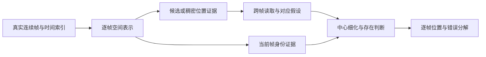

# 现代高效目标检测器对高速微小球运动表征的启示

日期：2026-09-13。性质：文献证据与迁移判断。范围：RF-DETR及近期高效/微小目标检测器对本项目空间证据、候选竞争和运动表示的启发；不代表已复现这些检测器。

## 1. 研究判断

RF-DETR、DEIMv2、D-FINE、近期YOLO及微小目标DETR都值得学习，但最值得迁移的是它们对**信息保留、候选分配、定位细化、训练监督和实际计算成本**的处理方式。它们的通用检测成绩不能直接决定体育小球模型，也不能替代对跨帧运动证据的研究。

当前优先级应是：完成已有五帧对照，明确哪些错误仍属于空间证据不足，哪些属于球与背景的身份竞争，再选择一个最小结构改变。比较完整检测器可以作为外部竞争基线；直接把整套RF-DETR或DEIMv2接到视频上，会同时改变预训练、主干深度、空间分辨率、监督和解码方式，难以回答运动表示为什么有效。

本轮得到五个明确判断：

1. **RF-DETR论文实际使用DINOv2；DEIMv2和TinyFormer才直接提供DINOv3检测证据。** 这些名称不可混用，也不要把检测器DINO与视觉预训练DINOv2/v3当作同一个模型。
2. **现代预训练的强语义与微小球的细位置是两种能力。** 更好的跨域微调或COCO整体AP，并不保证几像素目标在严格容差下更准。
3. **候选进入计算的机会与最终位置监督应分开。** 可以扩大搜索或候选准入，但不能因此扩大真实球标签、伪造球框，或把拖影长度当球半径。
4. **单帧空间attention、集合匹配、帧间视觉对应和运动轨迹分别解决不同问题。** 只有跨时间读取并验证了同一球的视觉关系，才有理由讨论motion representation的增量。
5. **空间细节分支是有先例、有潜力的对照，不是默认必加模块。** 本项目已经使用ConvNeXt浅层前缀，不能直接照搬针对纯ViT粗token的诊断。

下面按来源证据、本项目推论和实验决定分别展开。数字均注明所属条件，不把不同论文的AP与毫秒数拼成统一排行榜。

## 2. 本项目实际处在什么位置

### 2.1 当前模型不是完整RF-DETR式检测器

当前BlurBall实现使用官方DINOv3 ConvNeXt-Tiny权重，但只取stages0–1前缀。每帧独立提取192通道、stride-8特征，再按帧归一化、拼接五帧、压缩为32通道并作局部空间交互，最后用PixelShuffle输出逐位置logit与无球logit。512×288输入对应147,456个位置加1个无球类别。

模型入口见[build_dino_model](../../scripts/train_tennis_heatmap.py)，读出见[SpatialProbe与SpatialInteractionReadout](../../src/ballmotion/probe.py)，时间窗口见[BlurBall训练入口](../../scripts/train_blurball_midpoint.py)。当前五帧参数量为1,279,169。

这产生两个容易被忽略的事实。第一，本项目没有TAL的“anchor必须落在GT框内”规则，也没有Hungarian的一对一query分配；因此不能直接用这些规则的失败解释当前训练。第二，本项目只使用浅层前缀，并没有同时使用完整DINOv3的深层语义。不能一边强调RF-DETR的完整预训练语义优势，一边假定我们的轻量前缀已经拥有同样能力。

还需明确：stage0参与顺序传播，不等于它的stride-4特征直接进入定位头。当前没有这条直达路径；五帧特征随后共同从960通道压至32通道，也可能使身份、细位置与时间证据相互竞争。这是需要验证的瓶颈假设，不能仅凭通道压缩比例宣布信息已经消失。已有Tennis冻结细节分支实验未通过联合收益条件，限制的是当时配方，不能替代BlurBall端到端细节路径的结论。

### 2.2 已有实测限制了哪些简单解释

| 已有证据 | 它支持什么 | 它不能支持什么 |
| --- | --- | --- |
| Tennis冻结探针更换子格/非线性读出后改善 | 一部分细位置仍可从现有通道读出，头可能是瓶颈 | stride大就必然不可恢复，或增加任何头都会有效 |
| Tennis把输入增至1024后，stage2改善而stage1验证下降 | 输入尺度、层位和泛化共同作用 | 分辨率越高越好 |
| BlurBall候选中有真球，但背景也能持续高相似、高置信 | 稳定对应不足以确认球身份 | 继续扩大搜索范围一定能解决 |
| 多匹配地址的条件覆盖较高，但原拼接配方未得到独立收益 | 覆盖、证据解释和最终读出须分开 | 多假设思想整体无效 |
| 真实历史/未来预测可形成平滑错误轨迹 | 几何一致性不能替代视觉身份 | 物理先验完全无用 |

这些结论来自[子格读出](../experiments/2026-09-10-subcell-readout.md)、[输入尺度](../experiments/2026-09-10-input-scale.md)、[候选竞争](../experiments/2026-09-13-blurball-match-competition.md)、[多地址实验](../experiments/2026-09-13-blurball-candidate-addresses.md)和[真实前后预测诊断](../experiments/2026-09-13-blurball-predicted-context.md)，沿用原来的数据与单seed限制。

本轮检索期间，`center5`已完成12个完整epoch，最佳epoch5；共同验证集原argmax的本地F1@4为82.7548%，PCK@4为82.7488%。同一最佳权重、相同存在分数的固定局部重心读出分别为83.9678%和84.1832%。`causal5`已经自动开始，尚未完成。上述只是单臂结果，不能提前写成未来帧相对历史帧的收益。完整协议和输出路径见[五帧实验](../experiments/2026-09-13-blurball-five-frame-context.md)。

## 3. 为什么不能直接按检测排行榜选架构

### 3.1 框检测与球中心定位的监督不同

通用检测器通常预测类别和矩形框，训练损失及匹配经常依赖IoU。我们优先使用现有球中心、visibility以及BlurBall的拖影几何。没有真实宽高标签时，把中心扩成固定框并不等于获得了框标注：框大小成为人为超参，影响匹配、回归尺度、正样本数量和评价。

一个简单例子能说明问题。两个同样大小的正方形框，仅水平方向错位d，其IoU为`(w−d)/(w+d)`，其中`0≤d<w`。相同的1像素误差，w=4时IoU为0.6，w=16时约0.882。若w是人为设置的，就连“定位质量”也随设定变化。这是几何推导，不是任何新模型的实测。

因此，可以改造检测器以输出中心，但必须称为中心监督适配版本，不能直接沿用原模型的box训练归因和官方成绩。尤其不能把BlurBall半拖影长度当作该公式里的球尺寸。

### 3.2 COCO小目标不是我们的微小高速球测试

COCO官方评价按area划分小目标，small对应约32²像素以下的面积范围；它不是“宽高都小于8像素”的特定子集，也不约束速度、模糊或球身份。AP还综合框重叠和分数排序。来源：[1，COCO评价实现](https://github.com/cocodataset/cocoapi/blob/master/PythonAPI/pycocotools/cocoeval.py)。

在本项目中，必须继续测原图坐标误差、本地F1、原始位置与实际输出状态、按比赛的救回/破坏，以及位移和模糊条件。只有存在可信尺寸标注时才使用rho；否则用真实帧间位移和原始blur标签分别分析。

### 3.3 更快的单图检测不等于更快的视频定位

一个检测器的TensorRT FP16、batch1结果，与共享GPU上的PyTorch五帧训练、持续视频推理、解码和未来帧等待属于不同计时范围。参数少、FLOPs低、导出后延迟低三者也不能互相替代。

本项目需要区分逐帧前缀成本、时间融合成本、候选匹配成本、读出成本以及输入等待。允许未来两帧的center5增加的是信息与等待时间；不能以一次GPU forward很快来抹去这段等待。

## 4. RF-DETR：最值得学的是预算分配与归因方式

### 4.1 正确名称、论文和软件版本

正式题名为 *RF-DETR: Neural Architecture Search for Real-Time Detection Transformers*，Isaac Robinson等；arXiv:2511.09554，v2为2026-02-03，ICLR 2026。本文按RF-DETR理解“RFD ETR”。论文版与后续产品版分开：本次核实的稳定软件release为1.10.1（2026-09-07），软件中的分割、关键点preview和更新权重不自动属于原论文实验。[2，论文](https://arxiv.org/abs/2511.09554v2)，[3，官方release](https://github.com/roboflow/rf-detr/releases/tag/1.10.1)。

RF-DETR延续LW-DETR路线，引入DINOv2预训练及权重共享架构搜索。其COCO M顺序消融为：LW-DETR 52.6 AP，较温和训练配方51.6，加入DINOv2 53.6，再增加Objects365预训练54.3，最后NAS 54.6。这里有训练条件变化，属于顺序消融，不能拆成互相独立的因果增益，也不能简化成“换backbone提升全部成绩”。[2，Table 5](https://www.neeharperi.com/files/RFDETR.pdf)。

### 4.2 真实计算路径

官方实现继承LW-DETR等代码：输入经patch embedding成为token，ViT使用窗口与全局注意力，特征经projector后进入检测结构。多层输出或上采样不等于原图的多层细节都被保留。实际patchify是带步长卷积，需要把“原始信息来源”与“张量最终尺寸”分开看。[4，backbone实现](https://github.com/roboflow/rf-detr/blob/1.10.1/src/rfdetr/models/backbone/dinov2_with_windowed_attn.py)，[5，模型结构](https://github.com/roboflow/rf-detr/blob/1.10.1/src/rfdetr/models/lwdetr.py)。

encoder对空间token评分并取top-K候选，decoder以候选参考位置进行可变形采样和迭代框细化。这是一种将有限精修计算投入少量候选的设计，不是对所有高分辨率位置反复进行全局计算。[6，候选选择与decoder](https://github.com/roboflow/rf-detr/blob/1.10.1/src/rfdetr/models/transformer.py)。

对小球最有价值的借鉴是分开问：第一阶段是否让真球进入候选？第二阶段是否读到了有用局部证据？第三阶段是否把正确候选变成最终答案？如果第一阶段已经漏球，再强的decoder也只能处理错误前提。

但本项目已有K16候选、条件覆盖和精修相关实验。RF-DETR不会使“top-K后精修”突然成为新想法；它提供的是成熟竞争解释。真正需要解决的是跨帧读到什么、如何排除非球对应，以及为什么这种证据能提高当前帧定位。

### 4.3 NAS与空间预算的正确借法

论文搜索空间包含输入尺度、patch大小、窗口、decoder深度和query数量；完整NAS训练代价明显高于单一配置。RF100-VL结果是各数据集微调后的汇总，不能称为一个COCO模型的跨域零样本能力。论文延迟用T4、TensorRT FP16、batch1等条件，并说明forward间设置200ms间隔，测得的是该计时协议下的延迟而非持续吞吐。[2，实验及附录](https://www.neeharperi.com/files/RFDETR.pdf)。

本项目应借鉴“明确预算轴”，不复刻大规模NAS。有效空间位置数近似为`H×W/s²`，应与候选数、支撑帧数和精修次数一起报告。更小patch不一定更好：它也改变预训练适配、token数量、背景竞争和注意力成本。可先用已有层位/尺度实验缩小问题，不为搜索再建一套框架。

### 4.4 Keypoint Preview是否让中心标注直接可用

没有这么简单。当前官方关键点数据格式仍要求实例bbox加keypoints，损失依赖已匹配检测实例，并使用目标框面积等量。人体关键点预训练也不是球中心预训练。[7，官方数据格式](https://github.com/roboflow/rf-detr/blob/1.10.1/docs/learn/train/dataset-formats.md)，[8，关键点损失](https://github.com/roboflow/rf-detr/blob/1.10.1/src/rfdetr/models/heads/keypoints.py)。

因此，现在不把一个球中心填入pose格式就称为“无需额外监督的RF-DETR基线”。如未来确需这种基线，应显式修改实例匹配、中心损失和尺度依赖，并单独记录适配；不默认人工补框或引入pose任务。

## 5. RT-DETR家族：哪些改动作用在训练，哪些作用在推理

| 方法与直接来源 | 核实的机制 | 对本项目的实际启发 |
| --- | --- | --- |
| [9，RT-DETR，CVPR 2024](https://openaccess.thecvf.com/content/CVPR2024/html/Zhao_DETRs_Beat_YOLOs_on_Real-time_Object_Detection_CVPR_2024_paper.html) | 分开单尺度交互与跨尺度融合，并用质量相关query选择初始化decoder | 在不同分辨率上安排不同工作；候选入口必须单独评价 |
| [10，RT-DETRv2，arXiv:2407.17140](https://arxiv.org/abs/2407.17140) | 按尺度配置不同采样点预算，研究离散采样及训练配方 | 多尺度采样不是每层同样多才公平；近似采样要保留精位置验证 |
| [11，RT-DETRv3，WACV 2025](https://openaccess.thecvf.com/content/WACV2025/papers/Wang_RT-DETRv3_Real-Time_End-to-End_Object_Detection_with_Hierarchical_Dense_Positive_Supervision_WACV_2025_paper.pdf) | CNN/Transformer辅助正监督及分组扰动；附加结构主要用于训练 | 可以把训练监督路径与推理路径分开，但当前没有对应的Hungarian瓶颈 |
| [12，RT-DETRv4，arXiv:2510.25257](https://arxiv.org/abs/2510.25257) | 训练期向检测器注入视觉基础模型语义，调节蒸馏梯度强度 | 蒸馏位置与权重需实证；不是给已经使用DINOv3的模型再挂teacher就会有效 |

RT-DETRv3说明一个有价值的研究方法：若推理结构保持不变，训练期辅助分支仍可能改善优化。它不说明“加辅助loss就是免费收益”——训练计算、显存和超参选择仍有成本。我们若未来尝试浅层中心辅助头，必须先确认浅层可读出的信息没有被最终输出利用，不能为模仿新方法而构造辅助任务。

RT-DETRv4的高层语义蒸馏更适合“轻量学生需要从teacher获得语义”的情形。对本项目而言，现有浅前缀可能缺少深层上下文，但这个假设应与局部细节缺失分别测试。直接同时加入深层teacher、浅层分支和新motion模块，会失去区分它们的机会。

### 5.1 补查RT-DETRv4：深语义蒸馏不能直接复制到浅前缀

2026-09-14补查。arXiv记录仍只有2025-10-29的v1；作者仓库已在2026-06-18宣布ECCV2026录用。下述方法和表格依据v1，源码固定为上游提交`55fefaaed7efe2a5f72d0a18fd4e05965e35c292`，不把作者公告与另行核验的正式会议版本混称。[版本记录](https://arxiv.org/abs/2510.25257)、[作者公告](https://github.com/RT-DETRs/RT-DETRv4/tree/55fefaaed7efe2a5f72d0a18fd4e05965e35c292)。

**注入位置的负结果比模型名更有用。** v1 Table 3的36轮设置中，DEIM-L基线53.8 AP；只对S3/S4/S5分别蒸馏为53.7/53.7/53.8，三个backbone层共同蒸馏53.7，连同F5一起蒸馏53.8，仅AIFI后的F5蒸馏54.3。它支持特定节点选择，不能推出“每层都应匹配teacher”。同表没有提供这些位置各自的微小球严格中心误差。[论文§3、Table 3](https://arxiv.org/html/2510.25257v1#S4.T3)。

**发布teacher不是全分辨率细节监督。** `DINOv3TeacherModel.forward`先对归一化图像做2×2平均池化，再进入冻结的ViT-B/16，取归一化patch tokens；展平后按平方根恢复正方形网格。按本项目512×288输入推算，池化后256×144、patch网格16×9，共144个token；该恢复逻辑会得到12×12，token数量检查通过但空间布局错误。这是读取代码后的形状推导，没有运行上游teacher或修改其实现。若采用，必须按真实二维网格恢复；不能用正方形假设，也不能把这个teacher称为额外高分辨率球证据。[teacher源码](https://github.com/RT-DETRs/RT-DETRv4/blob/55fefaaed7efe2a5f72d0a18fd4e05965e35c292/engine/rtv4/dinov3_teacher.py#L53-L75)。

**特征匹配不是球身份监督。** 作者criterion将teacher图按需双线性缩放至student网格，逐token算cosine后对全部位置平均，未用球区域权重。我们推论：大面积背景也直接进入目标，全图对齐改善不能证明球与反光点的区分改善；但也不能反向断言teacher必然无用。模型端只在训练返回投影特征，推理不读取teacher。[criterion](https://github.com/RT-DETRs/RT-DETRv4/blob/55fefaaed7efe2a5f72d0a18fd4e05965e35c292/engine/rtv4/rtv4_criterion.py#L72-L106)、[模型训练分支](https://github.com/RT-DETRs/RT-DETRv4/blob/55fefaaed7efe2a5f72d0a18fd4e05965e35c292/engine/rtv4/rtv4.py#L25-L41)。

**梯度比例不是可靠性，也不是梯度方向一致。** 发布训练器统计总loss反传后指定模块的梯度L1占比；它没有分别估计检测loss与蒸馏loss的方向冲突，更没有估计球对应可靠性。代码按参数名`module.encoder.encoder`累计分子；无该前缀的单进程模型会得到零分子，不能原样搬到我们的`prefix/head`结构。这里报告迁移边界，不据此否定作者多卡结果。[梯度统计及调用](https://github.com/RT-DETRs/RT-DETRv4/blob/55fefaaed7efe2a5f72d0a18fd4e05965e35c292/engine/solver/det_engine.py#L19-L36)。

还需区分论文和发布调节规则：v1式(11)用目标比例除以当前比例更新权重；发布solver使用比例对应的odds比值，并限制每次倍率，后期EMA阶段重置默认值。配置中的`rho=2`按百分数解释。今后复现应选定版本，不把两套公式混写为一个实现。[solver更新](https://github.com/RT-DETRs/RT-DETRv4/blob/55fefaaed7efe2a5f72d0a18fd4e05965e35c292/engine/solver/det_solver.py#L91-L130)、[L配置](https://github.com/RT-DETRs/RT-DETRv4/blob/55fefaaed7efe2a5f72d0a18fd4e05965e35c292/configs/rtv4/rtv4_hgnetv2_l_coco.yml#L17-L24)。

**本项目决定。** 保留“深语义可能改善身份竞争”这个假设，暂不引入teacher/GAM。我们没有AIFI-F5节点，当前stride8浅前缀与上文获益路径不同。若后续残余错误仍指向语义不足，先测深层表征是否能区分实际真球与竞争背景，再决定直接读出还是训练蒸馏；不要同时加入stage0直达、新motion和teacher。

若以后采用冻结teacher，计算成本也不能被“推理免费”遮蔽：训练器每批在线提取teacher。当前同步翻转改变teacher输入，不能直接翻转原始缓存feature来冒充翻转图像的teacher输出；预训练Transformer并无我们已验证的精确翻转等变性。仅当固定输入可复用时才缓存实际teacher结果，不预建这条数据路径。[训练期teacher调用](https://github.com/RT-DETRs/RT-DETRv4/blob/55fefaaed7efe2a5f72d0a18fd4e05965e35c292/engine/solver/det_engine.py#L57-L66)。

## 6. D-FINE：分布细化值得借鉴，分布语义不能照搬

D-FINE的FDR在多个decoder层累积四条框边的离散offset分布，GO-LSD将末层定位分布用于较早层的训练监督。FDR属于推理表示；蒸馏主要属于训练。其核心消融在论文条件下从53.0 AP到FDR的53.8，再到GO-LSD的54.5；这不是球中心或运动分布结果。[13，ICLR 2025论文，§4、Table 5](https://proceedings.iclr.cc/paper_files/paper/2025/file/6cf58a87e3097e7d1f9be3e8693a93de-Paper-Conference.pdf)。

本项目已有[定位质量与D-FINE笔记](2026-09-11-localization-quality.md)，不重复建立第二套FDR定义。这里最值得补充的是三个迁移边界。

**边分布、中心分布、位移假设不是同一随机变量。** 球只有中心标签时，应定义中心offset或有限地址的分布，不能伪造四边监督。不同候选可能分别来自真球和计分牌；对它们求均值会得到没有视觉意义的中间位置。局部重心有效的前提与跨目标多峰求期望不同。

**末层不自动是真实teacher。** 若末层稳定选择了非球，向早层蒸馏会传播同一错误；需要知道末层在哪些样本和条件下更准。不能把置信度高或分布尖当作足够的蒸馏可靠性证明。

**“更细分布”不是运动创新。** 一个可研究的后续问题是：不同时间支撑是否使某些位移假设得到或失去视觉支持，且这种更新能否提高最终中心定位。这比只增加bins或decoder层更接近motion representation；但需与光流cost volume、点跟踪、D-FINE式细化及已有候选残差工作共同比较。

## 7. DEIM与DEIMv2：两个名字相近、问题不同的贡献

### 7.1 DEIM的Dense O2O到底密集在哪里

DEIM保持每个GT目标的一对一匹配，借助Mosaic/MixUp使一张训练图包含更多不同实例；不是让同一目标拥有多个正query。其MAL使用匹配框的IoU相关软目标。论文Table 6中，D-FINE-L的72轮基线54.0 AP，36轮Dense O2O为54.2，再加MAL为54.6，推理结构不因这些训练改动而新增模块。[14，CVPR 2025论文，§3、Table 6](https://openaccess.thecvf.com/content/CVPR2025/papers/Huang_DEIM_DETR_with_Improved_Matching_for_Fast_Convergence_CVPR_2025_paper.pdf)。

当前147,457类互斥中心预测的每个位置都参与softmax归一化和梯度，但只有一个原始中心/无球目标。它与Hungarian“每实例仅匹配一个query”的优化结构不同。DEIM不直接说明应把真球附近若干像素都改为正例，也不能直接提供本项目的无球或visibility规则。

对整个clip同步做Mosaic并非数学上不能保留各子片段内部对应，但它会造出多球、多相机运动源、改变目标尺寸和场景分布；当前单球输出任务无法原样接收。普通clip级翻转、尺度与裁剪也要同步更新所有帧和相关标签。这里应学习的是训练样本与目标机制的对应关系，而不是机械开关某一种增强。

值得保留的简单正向对照是所有帧共享的水平翻转或温和几何增强，坐标和拖影几何同步变换。它检验跨比赛泛化，不称为Dense O2O迁移；裁出球时还必须按明确协议处理位置与状态，不能静默改成原始无球标签。

### 7.2 DEIMv2与DINOv3的直接证据

*Real-Time Object Detection Meets DINOv3*（DEIMv2），arXiv:2509.20787，v4为2026-01-26。它使用DINOv3及紧凑蒸馏版本，以STA结合ViT语义和图像细节。论文中，S模型相对DEIM的AP_S从30.4到31.4，AP_M从52.6到55.3、AP_L从65.7到70.3；X的AP_S从38.8到39.2。小目标也有改善，但明显小于部分中大目标增量，不能说完全没有收益。[15，论文](https://arxiv.org/abs/2509.20787)。

作者代码的适配器有原图卷积分支和ViT多层特征，经过尺度变换与拼接投影提供多尺度输出；这是真正新增的推理路径，不能称零成本。[16，STA实现](https://github.com/Intellindust-AI-Lab/DEIMv2/blob/1d2ca42171570c713e78fc6a766ec5104b7f4724/engine/backbone/dinov3_adapter.py)。

它对本项目的价值很直接：更强预训练值得保留，同时还要测细位置到底由哪条路径提供。但现有ConvNeXt浅前缀已经与纯ViT路线不同。若增加P2后只改善原本清晰的小球、却增加球网和反光误报，就不能以“AP_S相关论文支持”保留该分支。空间能力增强需要同时审查身份竞争。

## 8. TinyFormer：本轮最贴近细节保留问题的新稿

### 8.1 论文真正给出的实验证据

*TinyFormer: Preserving Tiny Objects in YOLO-DETR Hybrid Real-time Detectors*，arXiv:2605.25046v1，2026-05-24。其SSA结合原图细节与DINOv3特征，PBM向多尺度融合加入浅层路径。COCO Table 4中，下列是同篇论文的组件比较，不是本项目结果。[17，论文§3–4及附录](https://arxiv.org/html/2605.25046v1)。

| SSA | PBM | AP | AP_S | FLOPs/G |
| --- | --- | ---: | ---: | ---: |
| 无 | 无 | 57.13 | 38.50 | 146.8 |
| 有 | 无 | 58.38 | 39.33 | 151.1 |
| 无 | 有 | 57.32 | 39.08 | 164.7 |
| 有 | 有 | 58.50 | 40.94 | 164.2 |

该表支持两条路径在其配方中的增量和组合价值，也明确增加了计算。PBM单独条件使用从ViT特征上采样的替代P2，并不等于已经有真实浅层信息。论文的VisDrone比较采用检测微调，不能称为零样本泛化。[17，Table 4、Appendix E](https://arxiv.org/html/2605.25046v1)。

### 8.2 代码核对纠正了两种容易误读的说法

`DINOv3SSAs_4Scale.forward`先执行ViT，再独立执行`sda(x)`卷积分支；P2来自原图分支，P3拼接该分支与上采样ViT特征。因此，确实有额外raw-image detail，但在这一实现中，融合发生在ViT输出之后，不能概括成把细节注入ViT内部自注意力层。[18，adapter源码](https://github.com/mmpmmpmmpjosh/TinyFormer/blob/main/engine/backbone/dinov3_adapter.py)。

X-PBM配置向neck输入stride `[4,8,16,32]`，但`out_indices=[1,2,3]`，decoder接收三尺度；P2参与neck融合，不是直接作为第四个decoder输入。源码还显示F5的尺度变换包含插值与投影，概念图中的卷积描述不能代替精确复现路径。[19，X-PBM配置](https://github.com/mmpmmpmmpjosh/TinyFormer/blob/main/configs/tinyformer/tinyformer_dinov3_x_coco_pbm.yml)，[20，neck输出](https://github.com/mmpmmpmmpjosh/TinyFormer/blob/main/engine/deim/hybrid_encoder.py)。

### 8.3 它的强动机不能升级成我们已经证明的事实

增加原图细节后AP提高，不足以证明旧特征中的球信息不可恢复；也可能是读出、优化、条件归纳偏置或监督更容易。我们自己的冻结探针已经显示，某些层换读出后仍能改善细位置。正确说法是“增加一条证据路径在该实验中有帮助”，不是“任何stride-16特征都不含微小目标”。

同理，Grad-CAM亮在目标附近不证明网络精确使用了球像素，也不证明跨帧读取的是同一球。对本项目，需要实际位置、背景竞争和干预结果，而非只展示更漂亮的激活图。

这里的明确借鉴是：**先把细节来源保留下来，再研究怎样使用；不把双线性上采样称为新增观察。** 至于是否需要PBM、几层注入、直接P2 decoder或更大的DINOv3，应由本地同预算对照决定，而不是把论文全部组件一起引入。

## 9. YOLO路线：最有用的部分并不一定是attention

### 9.1 YOLOv10：训练密集、推理简洁

YOLOv10以一致双分配结合one-to-many训练分支和one-to-one推理分支，并设计高效下采样、分类头及低分辨率部分注意力。在论文S模型的分配消融中，O2O单独43.4 AP，双分配44.3，O2M路径44.9；收益和取舍都应保留，不能说完全无损。[21，NeurIPS 2024论文](https://arxiv.org/html/2405.14458)。

本项目已经每帧只读出一个中心及存在状态，没有多框NMS这个主要瓶颈。移除NMS不是当前要解决的问题。可以借鉴训练阶段给更丰富证据、推理阶段保持轻量的原则，但不能因此引入一套无用的双检测头。

其下采样设计提示我们检查空间压缩处，而不是只在最深层加算力。不过，直接改动预训练ConvNeXt的下采样会改变权重适用结构；读取已有更浅层可能是更小的对照。两种做法不能混称为“同一backbone”。

### 9.2 YOLO26：小目标准入与真实标签分离

YOLO26是Ultralytics产品名称，不带v；官方产品于2026-01发布，论文arXiv:2606.03748于6月发布。STAL针对TAL的一个具体失败：小框内部可能没有网格anchor中心，因而缺少正分配；它扩展候选筛选用的支持范围，后续仍使用原框监督。其YOLO11s消融中，参考范围16时AP_S从29.0到29.6，但其他范围并非越大越好。[22，论文§3.3及Table 6](https://arxiv.org/html/2606.03748)。

作者实现的候选几何与后续top-k仍是两个步骤，因此不能仅靠宣传中的“至少若干anchor”推断每个样本实际得到多少监督。[23，TAL/STAL实现](https://github.com/ultralytics/ultralytics/blob/b6677f37597866210a2c345b723340ae75390d13/ultralytics/utils/tal.py)。

**这一机制是很好的诊断先例，但不是本项目现有bug。** 当前中心类别直接由坐标映射得到，不存在“框内无anchor导致该球完全无正类”的同一规则。真正可借鉴的是在候选或对应过滤中检查：是否几何条件先排除了真球？如果存在，可扩大准入支持，同时保持中心监督不变。没有这种失败，就不引入STAL式规则。

YOLO26官方还提供P2结构配置，但文档说明P2/P6为架构配置变体，不能把它们当成已有对应预训练权重和充分P2成绩。[24，官方架构变体说明](https://docs.ultralytics.com/models/yolo26/#architecture-only-variants)。对我们而言，P2是一个成本可测的空间假设；“官方有YAML”不是有效性证据。

### 9.3 YOLOv9：辅助监督可以保留，复杂辅助网络不必保留

YOLOv9的PGI在训练中通过辅助路径和多层信息组织改善梯度，推理保留主路径。这是训练期辅助监督的明确先例。[25，ECCV 2024论文](https://arxiv.org/html/2402.13616)。

可能的迁移是一个简单的浅层中心辅助头：仅当浅层探针有信息、最终头却未利用时，才有针对性。也必须考虑两个任务共享梯度是否冲突，是否只提高训练拟合。当前center5后期泛化回落，并不是继续增加辅助监督的自动理由。

### 9.4 YOLOv12与YOLOv13：相关性不是时序对应

YOLOv12的Area Attention通过分区减少单帧注意力成本，结合高效内存实现等设计；正式NeurIPS 2025版本与作者仓库后续Turbo版本要分开。分区降低常数但没有消除token数带来的规模效应。[26，正式论文](https://proceedings.neurips.cc/paper_files/paper/2025/file/7103444259031cc58051f8c9a4868533-Paper-Conference.pdf)，[27，作者实现](https://github.com/sunsmarterjie/yolov12)。

YOLOv13的HyperACE与FullPAD在单帧多尺度特征间组织高阶关系并分发增强信息。它是有价值的场景关系设计，但没有因此定义球在前后帧的对应地址；本次按arXiv/作者实现记录，不自行赋予未核实的会议状态。[28，论文](https://arxiv.org/html/2506.17733)，[29，作者仓库](https://github.com/iMoonLab/yolov13)。

对高速球，把五帧直接拼成一个大token集合再用这些attention，不会自动区分球迹、球员、场线和反光。场景关系可以帮助身份，也可能强化稳定背景。这需要以球定位结果检验，不能用“全局关系更强”作为充分理由。

## 10. 更直接的小目标DETR近邻不能遗漏

### 10.1 DQ-DETR与Dome-DETR：密度和query预算

DQ-DETR针对微小目标的位置初始化和密集场景query数量问题，利用计数/密度相关模块调整query。它是动态query用于tiny detection的明确先例，但场景中的大量实例与本项目通常一球不是同一个数量问题。[30，ECCV 2024论文](https://www.ecva.net/papers/eccv_2024/papers_ECCV/papers/09775.pdf)。

Dome-DETR用浅层密度图指导窗口计算和渐进query初始化；其方法包含保留核心query、过滤部分可变query，以及动态NMS。密度阈值降低到至少激活一块区域，不等于保证那块区域是真球。论文还报告稀疏与密集场景不同的实际计算规模。[31，ACM MM 2025论文，§3、附录B](https://arxiv.org/html/2505.05741v2)。

这两项对本项目最有价值的警示是：**稀疏执行依赖前置判断质量。** 单球不需要估计千级实例数量，但可能需要多个互相竞争的位置假设。把“目标数量少”误解成“一个query就足够”会把发现阶段与最终输出数量混为一谈；反过来，也没有必要为了一个球构建密度计数网络。

### 10.2 D³R-DETR：频率细节已有先例

D³R-DETR（arXiv:2601.02747v1，2026-01-06）延续Dome-DETR，用空间/频率分支改善密度表示。论文相对其重新实现的HGNetv2-B0基线从28.7到31.3 AP；不能把这个基线与Dome原文不同配置数字直接比较。[32，论文，§II–III](https://arxiv.org/html/2601.02747)。

频率滤波可提供方向、纹理线索，但高频不等于球：球网、文字、衣服和反光边缘同样有高频；运动模糊也可能削弱球的部分频率。对本项目，这类方法应进入创新审查和静态空间竞争解释，而不是直接把频域输出叫作motion。

### 10.3 PaQ-DETR：query多样性和质量监督也已有近期先例

PaQ-DETR（arXiv:2603.06917v2，2026-03-22）通过共享pattern形成动态query，并在中间层采用质量相关one-to-many监督、最终层保留one-to-one。它限制“动态query、多样性、质量相关正分配”这类宽泛创新表述。[33，论文§3](https://arxiv.org/html/2603.06917v2)。

本项目的多假设若只是在候选上增加pattern、attention或多样性loss，创新解释会很弱。需要展示假设对应的时间地址、每条支撑证据及其对真球/背景竞争的作用，而不是只展示候选数量变多。

## 11. 用一个统一的分解理解信息在哪一步丢失

这不是已批准的新模型，而是定位失败的分析图。不同论文主要强化不同箭头，不能用一个笼统的“attention不足”覆盖所有失败。

### 11.1 空间表示：网格粗与信息消失不是同义词

stride或patch决定采样与空间组织，但通道可能编码子格信息。只有证明在相同输入条件下更有能力的读出仍无法利用、而独立细节来源稳定救回特定错误，才逐步增强“输入/早期压缩限制”的解释。即便如此，也应说是相对于已测试读出和预算的实证，而不是完整信息论证明。

### 11.2 候选发现：不让下游条件成功掩盖上游遗漏

对最终只能从固定候选集合A中选择位置的重排器，令C表示A中存在容差r内的真位置，则有：

\[
P(\text{最终正确})=P(C)P(\text{最终正确}\mid C).
\]

若模型还会把候选移动到集合外，该等式中的C要改成细化机制的可达条件，不能照抄固定候选覆盖定义。这一区别决定了候选诊断是否真能解释最终模型。

扩大A可能提高覆盖，也可能增加竞争错误；因此不能单凭oracle覆盖宣布改进成立。RF-DETR、Dome-DETR、STAL各自说明了候选入口的重要性，但都没有替我们证明K取多少、支持域多大适合球。

### 11.3 身份与对应：两种正确性可能分离

正确的球候选可能因为模糊、遮挡而没有可靠对应；错误的计分牌候选却可能在前后帧拥有几乎完美的对应。因而“相似度高→是球”“周期平滑→是球”都不成立。

研究重点可以是：保持当前视觉身份线索，同时引入跨帧支持；当证据不足时，输出不能把被迫选出的位移包装为观测事实。拒绝、多假设和先验融合都有现有先例，贡献必须来自具体机制与体育小球证据，而不是术语组合。

### 11.4 精位置：不能用身份修复的收益掩盖中心变差

若背景误报减少但真实球中心被平滑偏移，整体F1可能掩盖某些位移/模糊条件下的损失。应分别看远错位、容差附近误差和存在拒绝。D-FINE提供了细化思路，但本项目现有固定局部重心本身就是一个应保留的便宜竞争解释。

## 12. 有限计算下，“看得细、找得远”到底贵在哪里

以下是**解析存储量**，不是本机耗时。输入512×288、4个支撑帧；每个相似度为一个float32标量，不含特征、通道乘加、中间attention、训练梯度或框架工作区。数值按数组元素数复算。

| 特征stride | 每帧位置N | 每对帧全位置相关N² | 四支撑相关量/MiB | 当前仅16个query对所有支撑位置/MiB |
| --- | ---: | ---: | ---: | ---: |
| 4 | 9,216 | 84,934,656 | 1,296 | 2.25 |
| 8 | 2,304 | 5,308,416 | 81 | 0.5625 |
| 16 | 576 | 331,776 | 5.0625 | 0.140625 |

若输入长宽同时翻倍，在stride不变时N增为4倍，全位置相关元素数增为16倍。分块或高效attention内核可以降低峰值存储，但不能据此假定总算术、访存和墙钟时间免费。另一方面，把query数减为16确实大幅缩小相关表示，却付出了当前候选可能漏球的风险。

这说明我们真正要比较的不是“CNN还是Transformer”四个字，而是三类计算分配：

- 全图保留便宜的空间证据，给少量位置额外精修；
- 当前候选较细，支撑帧搜索较广，但维持可解释的地址而非仅压成一个向量；
- 在可靠性不足时保留多个支撑解释，避免错误位移被硬化。

这三类都不是从零出现的新机制。已有候选覆盖、cost volume、稀疏匹配、可变形采样和本地负结果决定了它们必须怎样被比较。每次修改先说明减少哪一项具体计算，又会失去哪一种证据，不为了套用检测器技巧而增加新的结构层。

## 13. 对模型架构的具体建议

### 13.1 保持当前五帧实验作为时间信息基线

它回答固定五帧预算下中心上下文与因果上下文的差异。center5还改变了绝对时间距离和目标位置，因此不能单独归为时间方向符号的效果；也不能把它称为新motion模块已经胜出。等causal5完成后，用保存预测进行正式共同目标比较。

### 13.2 下一项优先根据失败选择一条证据路径

**如果主要问题是细位置不够，而真球已有稳定粗响应：** 优先考虑既有浅层stride-4细节、较细读出或局部中心细化中的一个。保持相同时间输入、目标集合与主监督，设置相近头容量的竞争条件。不要同时增加高分辨率输入、完整深层主干和复杂neck；否则不能知道哪种改变有效。

**如果主要问题是把稳定背景当球，而真候选可达：** 优先比较当前视觉身份或上下文是否不足。现有模型是浅前缀，适量深语义与浅层细节是两个不同候选；完整RF-DETR的泛化优势提示前者值得保留为可能性，DCR/DEIMv2/TinyFormer提示后者也不能忽略。选择依据应是固定错误群体和当前可读性，不是新模型名气。

**如果球身份已基本正确，跨帧对应仍失败：** 才把有限预算投向对应范围、空间地址保留或多时间支撑。在当前/同址历史/显式对应之间设置必要对照，区分匹配证据与普通非线性时序融合。此前多地址拼接未胜出是必须面对的结果，新的设计应解释改变了哪一步，而不是换名字重跑。

**如果训练拟合强、跨比赛泛化弱：** 先看当前修正器所见错误、外观和输入增强，必要时考虑候选来源对照。不能把后期验证下降自动归于“需要更大模型”“需要更重loss”或“必须交叉拟合”。[候选训练分布审查](2026-09-13-candidate-training-distribution.md)已界定这些区别。

### 13.3 一条可讨论的结构形状

可保留现有现代共享主干与二维中心输出，把后续设计约束成：**当前帧细位置证据 + 可追溯的跨帧支持 + 轻量中心读出**。在需要时增加一个最小空间路径或一个最小匹配机制，每次只引入能检验具体解释的改变。

其中较值得优先讨论的是候选层晚融合：当前帧分支保留球身份与细位置，时间分支仅在有限地址上读取对应支持，到候选评分处再汇合，而非一开始把所有帧共同压缩。它仍然是待验证方案，旧候选残差和多地址负结果意味着不能只改成两个分支就期待收益。先固定共同候选，分别看真球进入候选的比例、候选排序与拒配行为；只有独立路径带来净增益才考虑合并。无可靠跨帧匹配的null与最终“无球/不可定位”状态应分开：当前可见球可以暂时没有可靠对应。

这里“当前帧”只是最终目标，不意味着禁止未来输入；center5的前后支撑都可以参与。也不意味着所有帧都必须额外提取高分辨率分支：只给当前帧补细节与给所有支撑补细节，分别影响当前定位与对应辨识，应根据失败决定预算放在哪里。

高分辨率分支是否来自raw RGB、ConvNeXt stage0或ViT adapter，决定它提供的是新观察路径、已有信息读出，还是新训练参数。论文需要解释这个区别。不能把几种来源都叫“细节增强”后合并归因。

2026-09-14针对该候选方向补读了[FGFA、SELSA与Temporal RoI Align](2026-09-14-reference-support-aggregation.md)：目标残差、RoI细粒度query到支撑全图top-K及时间汇聚都有明确先例；候选前/后融合、地址汇聚和保留位移假设必须区分。该补读限制组合新颖性，不批准立即加入两分支。

## 14. 哪些方向现在不进入实现

| 方向 | 当前判断 | 重新考虑的具体条件 |
| --- | --- | --- |
| 完整RF-DETR NAS | 成本大，改变过多变量 | 项目明确把硬件适配/架构搜索本身设为研究问题 |
| 直接用RF-DETR pose preview接中心标签 | 原始接口仍依赖bbox | 明确批准并定义纯中心监督适配后 |
| DEIM式多图Mosaic作为主训练默认 | 改变单球与时间语义 | 有独立辅助任务和保持源时间的明确协议 |
| 直接移植STAL | 当前没有TAL的无正anchor机制 | 本地候选过滤确实出现准入几何遗漏 |
| 直接复制SSA/PBM/P2全套 | 已有浅层前缀，但缺少stride-4直达读出；尚未定位必要性 | 最小细节来源对照显示稳定净收益 |
| YOLOv12/13大空间attention/超图 | 静态关系不是跨帧球对应 | 证据表明缺少的确是全局场景上下文，且预算允许 |
| D-FINE式多阶段蒸馏 | 当前没有多阶段细化teacher优势 | 中间/末层有可测、可利用的定位差距 |
| 全图高分辨率all-to-all相关 | 代价增长快，已有背景竞争问题 | 先证明完整搜索是必要限制且便宜候选路线不足 |

这些是当前取舍，不是永久禁令。对于明确有效的改动，应保留；对于无增益的分支，应删除其无用实现和中间产物，保留足以复核结论的记录与可复用缓存。

## 15. 最小实验必须能推翻自己的解释

空间细节实验的反证不是“程序能运行”，而是新路径没有提高严格定位，或仅增加训练拟合，或在多个比赛放大背景误报。出现这些结果，就不能继续以token丢失为唯一解释。

候选实验的反证是覆盖提高但最终净正确数不增加，或者收益只在注入GT候选的oracle条件成立。此时应分析选择/精修或视觉身份，而非继续机械扩大K。

时序实验的反证是显式对应不优于同址历史、普通拼接或相近参数非线性头，或者未来支撑的提升只来自更近时间距离而非新的表示机制。已有负结果不能因为换了现代检测器就从相关实验中消失。

效率实验的反证是删减采样/缓存后改变位置、存在判断、时间对齐或训练梯度。当前有逐帧RGB缓存与批内重复帧复用；训练中backbone更新时不能跨优化步复用过期特征。新方法若缓存确定性的冻结表征，应明确其适用条件，不能把缓存速度当端到端训练或在线推理速度。

主要比较仍应保留old/new backbone × no/new motion的归因要求，固定划分、标签、目标帧和时间范围。小改动不必把整个矩阵全部重训；正式motion贡献需要在适用阶段补齐足够强且可比的竞争条件。

## 16. 论文贡献应该落在哪里

本轮文献不支持把以下宽泛表述当创新：更强DINO主干、浅层细节与深语义融合、动态query、多假设、分布细化、训练期多正监督、全局/局部关系或可靠性门控。它们都存在明确先例。

仍然值得研究的是一个更具体的问题：**当球的空间证据很弱、位置假设容易被背景夺走，而帧间位移又大于局部支持范围时，怎样在有限计算下让跨帧证据真正改变正确球位置的后验，而不是只强化最容易匹配的物体？**

要把它变成论文，至少需要同时呈现：真实候选发现能力、对应地址或支持证据、无可靠支撑时的行为、最终逐帧定位净收益，以及同预算静态/普通时序竞争解释。相机运动和模糊可以成为条件分析与后续机制变量，但不因此自动引入重型相机估计、三维轨迹或额外人工标注。

现代检测器能帮助我们建立更强、更公平的空间与训练基线；motion贡献仍需来自时间证据如何被表示和使用的可复核改进。

## 17. 检索范围、版本与证据限制

检索截止2026-09-13。本轮以RF-DETR及近年高效检测为中心，沿论文引用和作者实现扩展至实时DETR、YOLO及tiny-object DETR。深读重点为方法、训练/推理边界、组件消融和成本；不是把摘要、产品表格或代码存在视作已经复现。

| 来源组 | 本轮阅读范围 | 限制 |
| --- | --- | --- |
| RF-DETR | 正式论文/附录、release、候选/backbone/关键点代码 | 软件版本与论文配置有差异；未训练或导出 |
| RT-DETR/v2/v3/v4 | 原论文方法与相关消融；必要作者代码 | 不同版本的来源团队、训练条件与状态分别记录 |
| D-FINE/DEIM/DEIMv2 | 方法、损失与主要消融；criterion/adapter源码 | 复用已有D-FINE笔记，未复现COCO成绩 |
| TinyFormer | v1全文及附录；adapter、X-PBM配置、neck输出 | 新预印本；作者代码main按本次访问记录，未运行 |
| YOLOv9/v10/v12/v13/YOLO26 | 原论文方法/消融、官方或作者实现、STAL及P2接口 | Turbo、产品版和论文版不能混用 |
| DQ-DETR/Dome-DETR/D³R-DETR/PaQ-DETR | query、密度/窗口、频域或监督机制 | 航拍密集实例或通用框任务，非运动定位复现 |

补充检索还发现2026年的MR-DETR、DG-DETR、MicroDETR等小目标方向。部分只核实出版社摘要/在线信息，未把其具体模块或领先性用作设计依据；不能因检索命中就声称已全文审查。RTMDet也作为高效卷积与容量分配的历史参照读取，但其box分配不直接改变当前中心模型决定。来源：[MR-DETR](https://doi.org/10.1016/j.patrec.2026.01.004)、[DG-DETR](https://www.sciencedirect.com/science/article/pii/S0262885626002970)、[MicroDETR](https://www.sciencedirect.com/science/article/pii/S0031320326007120)、[RTMDet](https://arxiv.org/abs/2212.07784)。出版社卷期日期与首次在线时间也应分开，不按未来卷期推断已经完成同行评审复现。

不能承诺文献穷尽或“万无一失”。本报告的完成标准是：与当前设计有关的主要机制有直接来源、关键误读得到纠正、可借鉴点和迁移条件足够明确。后续架构发生实质变化时，再针对最近邻补检，而不是每次工程修改重读整个领域。

## 18. 主要来源索引

- **[1]** COCO Consortium，官方Python评价实现：[cocoeval.py](https://github.com/cocodataset/cocoapi/blob/master/PythonAPI/pycocotools/cocoeval.py)。
- **[2]** Robinson等，*RF-DETR: Neural Architecture Search for Real-Time Detection Transformers*，ICLR 2026，arXiv v2，2026-02-03：[论文记录](https://arxiv.org/abs/2511.09554v2)、[正式会议PDF](https://openreview.net/pdf?id=qHm5GePxTh)。
- **[3–8]** Roboflow，RF-DETR 1.10.1，2026-09-07：[release与源码入口](https://github.com/roboflow/rf-detr/releases/tag/1.10.1)；具体代码链接位于第4节。
- **[9]** Zhao等，*DETRs Beat YOLOs on Real-time Object Detection*，CVPR 2024：[正式论文](https://openaccess.thecvf.com/content/CVPR2024/html/Zhao_DETRs_Beat_YOLOs_on_Real-time_Object_Detection_CVPR_2024_paper.html)。
- **[10]** Lv等，*RT-DETRv2: Improved Baseline with Bag-of-Freebies for Real-Time Detection Transformer*，2024：[arXiv](https://arxiv.org/abs/2407.17140)。
- **[11]** Wang等，*RT-DETRv3: Real-Time End-to-End Object Detection with Hierarchical Dense Positive Supervision*，WACV 2025：[正式论文](https://openaccess.thecvf.com/content/WACV2025/papers/Wang_RT-DETRv3_Real-Time_End-to-End_Object_Detection_with_Hierarchical_Dense_Positive_Supervision_WACV_2025_paper.pdf)。
- **[12]** Liao等，*RT-DETRv4: Painlessly Furthering Real-Time Object Detection with Vision Foundation Models*，2025 arXiv v1；作者仓库已宣布ECCV2026录用（补查见§5.1）：[arXiv](https://arxiv.org/abs/2510.25257)、[作者项目](https://github.com/RT-DETRs/RT-DETRv4)。
- **[13]** Peng等，*D-FINE: Redefine Regression Task in DETRs as Fine-grained Distribution Refinement*，ICLR 2025：[正式论文](https://proceedings.iclr.cc/paper_files/paper/2025/file/6cf58a87e3097e7d1f9be3e8693a93de-Paper-Conference.pdf)。
- **[14]** Huang等，*DEIM: DETR with Improved Matching for Fast Convergence*，CVPR 2025：[正式论文](https://openaccess.thecvf.com/content/CVPR2025/papers/Huang_DEIM_DETR_with_Improved_Matching_for_Fast_Convergence_CVPR_2025_paper.pdf)。
- **[15–16]** Huang等，*Real-Time Object Detection Meets DINOv3*（DEIMv2），arXiv v4，2026-01-26：[论文](https://arxiv.org/abs/2509.20787)、[作者实现](https://github.com/Intellindust-AI-Lab/DEIMv2)。
- **[17–20]** Hsieh等，*TinyFormer: Preserving Tiny Objects in YOLO-DETR Hybrid Real-time Detectors*，arXiv v1，2026-05-24：[全文](https://arxiv.org/html/2605.25046v1)、[作者实现](https://github.com/mmpmmpmmpjosh/TinyFormer)。
- **[21]** Wang等，*YOLOv10: Real-Time End-to-End Object Detection*，NeurIPS 2024：[论文](https://arxiv.org/abs/2405.14458)、[作者实现](https://github.com/THU-MIG/yolov10)。
- **[22–24]** Ultralytics，YOLO26，2026：[论文](https://arxiv.org/abs/2606.03748)、[官方文档](https://docs.ultralytics.com/models/yolo26/)、[官方代码](https://github.com/ultralytics/ultralytics)。
- **[25]** Wang等，*YOLOv9: Learning What You Want to Learn Using Programmable Gradient Information*，ECCV 2024：[论文](https://arxiv.org/abs/2402.13616)。
- **[26–27]** Tian等，*YOLOv12: Attention-Centric Real-Time Object Detectors*，NeurIPS 2025：[正式论文](https://proceedings.neurips.cc/paper_files/paper/2025/file/7103444259031cc58051f8c9a4868533-Paper-Conference.pdf)、[作者实现](https://github.com/sunsmarterjie/yolov12)。
- **[28–29]** Lei等，*YOLOv13: Real-Time Object Detection with Hypergraph-Enhanced Adaptive Visual Perception*，2025预印本：[论文](https://arxiv.org/abs/2506.17733v2)、[作者实现](https://github.com/iMoonLab/yolov13)。
- **[30]** Huang等，*DQ-DETR: DETR with Dynamic Query for Tiny Object Detection*，ECCV 2024：[正式论文](https://www.ecva.net/papers/eccv_2024/papers_ECCV/papers/09775.pdf)。
- **[31]** Hu等，*Dome-DETR: DETR with Density-Oriented Feature-Query Manipulation for Efficient Tiny Object Detection*，ACM MM 2025，arXiv v2：[全文](https://arxiv.org/html/2505.05741v2)。
- **[32]** Wen等，*D³R-DETR: DETR with Dual-Domain Density Refinement for Tiny Object Detection in Aerial Images*，2026预印本：[全文](https://arxiv.org/html/2601.02747)。
- **[33]** Kang等，*PaQ-DETR: Learning Pattern and Quality-Aware Dynamic Queries for Object Detection*，arXiv v2，2026-03-22：[全文](https://arxiv.org/html/2603.06917v2)。

RF-DETR的必要前史另见Chen等，*LW-DETR: A Transformer Replacement to YOLO for Real-Time Detection*，2024：[论文](https://arxiv.org/abs/2406.03459)、[作者实现](https://github.com/Atten4Vis/LW-DETR)。本文的共享低层局部分类讨论与[DCR及候选训练分布笔记](2026-09-13-candidate-training-distribution.md)互补。
