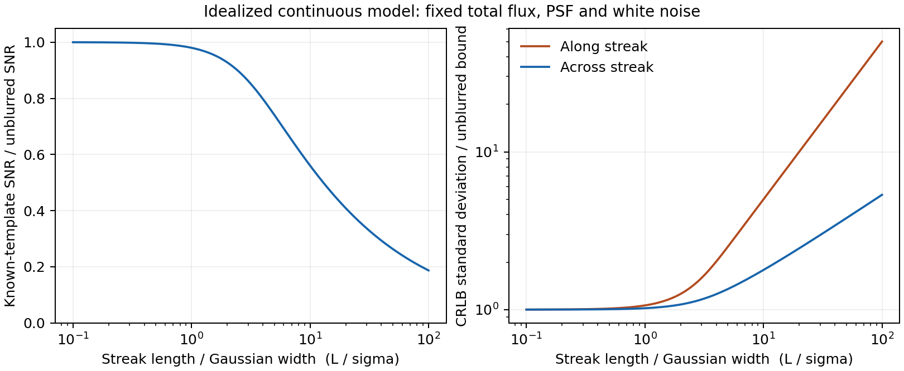

# 第二轮证据审查：标签测量语义、可观测量与 2025–2026 直接近邻

**范围与截点。** 本文是对第一轮 `sports_evidence.md` 的补充，主体检索与网页可用性截至 **2026-09-09**，**2026-09-10** 补核 BlurBall 官方 loader、线热图与 evaluator；**2026-09-12** 追加时间观测、曝光可辨识性与拖影检测的一手全文，以及明确条件下的中心信息推导。只讨论会改变“高速微小球 motion representation”研究设计的事实。第一轮文件保持不变；本附件中的明确修订及证据边界优先，不把论文的模糊表述补成未经证实的物理事实。

**阅读标记。** **[P]** 已读原始论文的相关章节/图表；**[R]** 已读作者官方仓库或项目页；**[A]** 只读摘要或元数据；**[U]** 尚未确认。链接均是原始论文、作者项目页或官方仓库，而非二手汇总。

## 会立刻改变研究设计的结论

1. **“球位置”不是跨数据集同一种测量量。** TrackNet 原始网球/羽毛球对快速拖影把 `(X,Y)` 定义为轨迹的 *latest position*（即运动前端/末端）；BlurBall 则人工标注拖影线段的**中点**。这两个监督目标相差一个随拖影长度、且依赖有向速度符号的偏移。未经 convention conditioning、数据集特有 head 或可审计转换时，不能把它们在同一 heatmap 回归头中当作同一个物理中心标签训练或直接比较。
2. BlurBall 给的是拖影主轴与 half-length，论文没有证明其 `p_b` 是球心在曝光中点的精确物理投影；正确表述是“**图像中可见 blur streak 的手工中点约定**”。作者仓库的 CSV loader 读入 `Frame, Visibility, X, Y, l, theta`，并用关于中心对称的线热图训练；其 evaluator 也按 $180^\circ$ 等价处理角度。因此该公开管线把 `theta` 用作**无向 orientation**，没有给出有符号 2-D velocity 或位移方向的监督证据。
3. 若没有真实每帧球直径 `s_t`，$\rho=\|p_t-p_{t-\Delta}\|/s_t$ **不可从现有中心点标注识别**。BlurBall 的 `l` 是拖影半长度，不是球半径；TrackNet 的 heatmap 半径也不是测量到的每实例球径。主实验应改用可审计的 `d_px`（原图和网络坐标都报）及 BlurBall 的 `l_px` 条件分桶；若仍报告 “rho proxy”，必须明确它不是题设的 rho。
4. 因标签制作已经使用邻帧甚至未来帧，**causal 与 offline 的差异不能只报一个混合总分**。TrackNet 的困难可见/遮挡标签可由相邻帧估计；TOTNet/TTA 的全遮挡标签显式利用遮挡前后可见点。评测应按 *visibility × annotation convention × 已知的 provenance* 三个可重叠维度切片，而不是把“直接视觉、模糊约定、轨迹推断”误写成互斥类别。这里并不规定主表必须 causal：项目可选择在线或离线任务，但输入时序和监督来源必须预注册并保持一致。
5. 新近 TTHQ/WACV 2026 已直接表明“高分辨率、现代 Transformer 式 backbone、三帧输入”本身是强近邻；它的预测目标是**中央帧**。因此 DINOv3/高分辨率分支不是贡献，仍须 `old/new backbone × old/new motion` 的归因。
6. 1000 Rallies 与 TT4D 都是值得写 related work 的 2026 近邻，却截至截点没有由论文/官方页证实的可直接复现实验资源；前者还是 event-camera + 多机位 200 Hz + 1 kHz 伪标签，后者是管线生成的 3-D 派生标签。两者都不应现在纳入“只用公开既有 RGB 2-D 标注”的主数据。

## 一手来源与阅读充分性

|来源|阅读深度|本文实际采用的事实|
|---|---|---|
|[TrackNet 原始论文（arXiv HTML）](https://arxiv.org/html/1907.03698)|[P] §III、Fig./数据与标签段|30 fps 1280×720；可见性定义；快速拖影的 latest-trace-position 标注；困难样本的邻帧估计。|
|[Shuttlecock/TrackNetV2 作者数据页](https://hackmd.io/Nf8Rh1NrSrqNUzmO0sQKZw)|[R]|当前 CSV 字段、二值 visibility 与 `(0,0)` invisible 约定；没有找到 blur-point 的物理定义。|
|[TTNet 原始论文（arXiv HTML）](https://arxiv.org/html/2004.09927)|[P] Fig.2、§5、§5.1|9 连续帧、最后一帧 ball target；OpenTT 标注的事件邻域与模型辅助产生方式。|
|[OpenTTGames 官方页面](https://lab.osai.ai/)|[R]|120 fps Full-HD；事件前 4 / 后 12 帧坐标/掩码；`(-1,-1)` absent；没有物理时刻定义。|
|[BlurBall CVPRW 2026 正式论文](https://openaccess.thecvf.com/content/CVPR2026W/CVsports/papers/Gossard_BlurBall_Joint_Ball_and_Motion_Blur_Estimation_for_Table_Tennis_CVPRW_2026_paper.pdf) 与 [官方仓库固定提交](https://github.com/cogsys-tuebingen/BlurBall/tree/2f0f5496f7ba4b5b1a36790749935121b2ce972d)|[P] §3.1–3.3、Fig.3、Table 1；[R] README、CSV loader、heatmap/evaluator|streak midpoint、`Frame/Visibility/X/Y/l/theta` schema、线方向/half-length，以及公开实现按 $180^\circ$ 周期使用 orientation。|
|[TOTNet 正式 CVIU PDF](https://rbouadjenek.github.io/assets/pdf/YCVIU_104657.pdf)|[P] §3.1、§4.5.1|TTA 的可见/遮挡标注协议、遮挡插值、online/offline 窗口；评测阈值。|
|[Uplifting Table Tennis / TTHQ 论文](https://arxiv.org/html/2511.20250) 与 [作者仓库 README](https://github.com/KieDani/UpliftingTableTennis)|[P]+[R]|TTHQ 规模/标注、三帧预测中央帧、高分辨率 Segformer++；标注 zip 的官方可下载入口和原始视频的取得方式。|
|[1000 Rallies（arXiv HTML）](https://arxiv.org/html/2606.25620)|[P] 摘要、§III|传感器/多相机、三角化与 1 kHz 伪标签；论文仅使用将公开的将来时。|
|[TT4D（arXiv HTML）](https://arxiv.org/html/2605.01234)|[P] 摘要、§1–3、资源声明|完整序列 3-D lifting、管线生成 140+h 派生数据；论文说“will release”。|
|[STARE / ESOT500，Nature Communications 2026](https://www.nature.com/articles/s41467-026-70240-6)|[P] 全文方法、Fig. 1/3/4/7、ESOT500 与机器人实验；[R] [作者仓库](https://github.com/ispc-lab/STARE) README|500 Hz 时间对齐 VOT 框，低频框线性插值的 RE，最近可用输出的 latency-aware 评价；是时间测量/评价先例，非自动 RGB 球发现。|
|[Recovering 3D Shapes from Ultra-Fast Motion-Blurred Images，arXiv:2602.07860 v1](https://arxiv.org/html/2602.07860v1)|[P] 正文、附录 H/M 与实验；[R] [作者项目页](https://maxmilite.github.io/rec-from-ultrafast-blur/)|极端曝光积分下三维形状非唯一的直接例子；已知相机、运动/blur setting 与 RGBA/alpha 条件说明其是可辨识性边界，不是 2-D 球中心算法。|

## 1. 标注的物理时刻/空间语义：逐数据集核验

### 1.1 对照表：能说什么，不能说什么

|数据/论文|坐标目标的已证实定义|标签如何来|方向或时刻歧义|对本项目的处理|
|---|---|---|---|---|
|TrackNet Tennis 原始数据|快速移动且有 blur/afterimage 时，论文写明 `(X,Y)` 取球轨迹的 **latest position**；不是拖影中点。[P]|VC=1 易见；VC=2 在画面但不易识别，文中给出通过前后邻帧人工标例；VC=3 遮挡例同样邻帧估计。|latest point 的含义依赖运动方向；CSV 不额外给出可审计的 blur 长度/方向字段。论文另称 heatmap “center”，与其标注规则不能等同。|将它命名为 **lead/latest-trace target**，不要写成物理球心；VC2/VC3 应在 `provenance=unknown/example-neighbor-assisted` 条件下单列，而非据论文示例伪造逐帧 direct/inferred mask。|
|TrackNet 原始羽毛球|在 fast blurry image 中同样明确为球 trace 的 **latest position**。[P]|原论文的 visibility 类与上述规则。|同上。|这是“原始 legacy 标注语义”，可用于解释 TrackNet 系列历史结果。|
|当前 Shuttlecock / TrackNetV2 下载页|页面仅称 X,Y 是 shuttlecock coordinates；visible=1 / invisible=0，invisible 时 X=Y=0。[R]|未提供详细标注手册。|没有证据说明当前 CSV 的 blur 坐标仍是 latest endpoint、球心或 streak midpoint；也没说明邻帧是否参与。|不得把 legacy 规则自动升级为当前 release 的确定事实。先对下载包中的 README/标注工具、样本视频及 CSV 做版本冻结审计。|
|OpenTTGames / TTNet 数据|官方页面只称 frame-to-`(x,y)` ball coordinate；`(-1,-1)` 为 absence。没有声明 center、leading edge 或曝光内时刻。[R]|事件人工标注；事件前 4 / 后 12 帧 ball coordinate/segmentation 为 deep-learning-aided。TTNet 论文说其自动标注器由人工帧训练，使用 4-frame sequence；但没有披露该序列对目标帧是因果、双向还是居中。[P]|因此不能说其坐标是曝光中点或端点，也不能仅凭模型辅助标注断言使用未来帧。**缺键不是 absent，而是未知。**|保留原始 frame index；只将存在 `(x,y)` 且非 `(-1,-1)` 的帧作为有位置监督，不把间隙重编号。对坐标物理语义写作 U。|
|BlurBall|人工在 streak 上画线，`p_b` 是该线段的 **midpoint**，并给出 `theta,l`；`l` 是 half-length。作者提到常规数据集标的是 leading edge。[P] 官方 loader 逐行读 `Frame,Visibility,X,Y,l,theta`，其中 `theta` 以 degree 传给线热图。[R]|26 场静态相机录制；论文未在所读段落给出 inter-annotator agreement 或重复标注误差。|Fig.3 说无 motion context 时 conventional front `p1` 可被误认成 `p2`。更强的一手实现证据是：`theta+180°` 生成相同的中心对称线热图，evaluator 也把跨 ±90° 的预测映射为同一轴方向。数值 CSV 的完整取值域/人工画线起终点排序仍未作为 release contract 说明，但**训练/评估语义已经是 $\bmod\pi$ 的轴，不是有符号 heading**。|把 `p_b` 写成 image-streak midpoint，不能强称“曝光正中时刻的球心”。仅监督轴/长度时用 orientation-mod-$\pi$ 损失；若要有符号速度，另从带时间戳的相邻位置导出并单独评价/遮罩。|
|TTA / TOTNet|可见和部分遮挡时，标注员直接标 **ball center**。[P]|全遮挡位置由遮挡前后可见点做 trajectory-consistent interpolation；长于 3 帧的遮挡以瞬时速度/方向估计，并二次审核。|全遮挡标签没有当前帧像素对应物，且明确含未来信息。论文也因此对 fully-occluded 用 10 px，而 visible/partial 用 4 px。|可按 TTA protocol 单列训练/评估 localization loss；但不得不加说明地作为当前帧 dense correspondence 正样本来证明视觉匹配机理。offline 结果也不能据此单独宣称纯视觉当前定位改善。|

### 1.2 TrackNet：末端而非“球中心”的原始证据

TrackNet 在数据处理段直接说明：因 motion blur/afterimage，`X,Y` “considered as the latest position of the ball’s trace”。同一段又给 VC2 的 0079 帧、VC3 的 0139 帧由相邻帧位置辅助估计的示例。见 [TrackNet §III](https://arxiv.org/html/1907.03698)。这足以否定“TrackNet 的标注统一为球中心”这一前提。

后续若用该数据训练 heatmap，模型可学到的是一种**图像标注约定**：高速模糊时指向 track 的前端。它不自动等于 frame timestamp 下的球几何中心、曝光积分中点，或跨数据集可对齐的物理状态。论文后面用 “center of tennis ball” 描述 heatmap 的措辞，不能推翻数据定义；研究设计应优先服从标签生成规则。

### 1.3 BlurBall：中点、轴与 180° 问题

BlurBall §3.1 对每帧标注 `[p_b, theta, l]`，由人工沿拖影画直线；其定义为

$$p_1=p_b+l(\cos\theta,\sin\theta),\qquad p_2=p_b-l(\cos\theta,\sin\theta).$$

这里的 `p_b` 是两端的图像线段中点，`l` 是半长度。短曝光下近似直线是作者采用这一定义的建模条件，不是对相机曝光期间真实 3-D 球心轨迹的校准证明。原始证据见 [BlurBall §3.1–3.3 与 Fig.3](https://openaccess.thecvf.com/content/CVPR2026W/CVsports/papers/Gossard_BlurBall_Joint_Ball_and_Motion_Blur_Estimation_for_Table_Tennis_CVPRW_2026_paper.pdf)。

两个容易造成错误实验叙述的点：

- Fig.3 说明传统的 leading front `p1` 在无 motion context 时可与 `p2` 混淆。这支持“单帧可见拖影给的是**无向线**”的判断；它不支持把单帧 axis 直接当成有符号速度。
- §3.3 的 PCA 热图基线以最大/最小投影差估计 `l`，并由主轴计算角度。PCA eigenvector 符号本身可翻转，所以该**预测器**不可能独自识别 `theta` 与 `theta+π`。官方实现将 CSV 的 `theta`（degree）传入 `gen_line_heatmap`，其端点为中心两侧的 `±l(cos(theta),sin(theta))`，故 $θ$ 与 $θ+180°$ 的监督图完全相同；[固定提交的 loader/heatmap](https://github.com/cogsys-tuebingen/BlurBall/blob/2f0f5496f7ba4b5b1a36790749935121b2ce972d/src/datasets/tabletennis.py) 和 [line heatmap](https://github.com/cogsys-tuebingen/BlurBall/blob/2f0f5496f7ba4b5b1a36790749935121b2ce972d/src/utils/heatmap.py) 可复核。其 [evaluator](https://github.com/cogsys-tuebingen/BlurBall/blob/2f0f5496f7ba4b5b1a36790749935121b2ce972d/src/utils/blur_evaluator.py) 也对跨 ±90° 的值作 180° 回绕比较。因而公开管线确定支持的不是 signed direction；人工 CSV 的原始角度数值域、画线起止端排序仍为 [U]，但并不影响“不能把它作 signed velocity GT”的结论。

因此跨 TrackNet–BlurBall 的 supervised target 偏移大约是沿带符号拖影轴的 `l`（在理想直线与同一图像 convention 下）；但 BlurBall 的单帧轴不提供所需符号。不要以未观测的符号把标签“换回前端”后当 ground truth。

### 1.4 Shuttlecock、OpenTTGames、TOTNet：应保留的不确定性

- [当前 Shuttlecock 页面](https://hackmd.io/Nf8Rh1NrSrqNUzmO0sQKZw) 只定义 CSV 与 binary visibility，不定义拖影时刻。它可能继承原 TrackNet 羽毛球约定，却没有一手 release-level 证据；论文应记录发布版本、来源文件名和本地数据索引，不能把推测写进方法。
- [OpenTTGames](https://lab.osai.ai/) 的真时间索引是数据语义的一部分：事件前后连续帧可作输入，未列出的帧是 unknown；`(-1,-1)` 才是 absent。没有找到 position 的中心/端点定义，也没有找到曝光时刻说明。TTNet 所说的 4-frame 自动标注器表明标签并非全人工，但不足以界定其时序方向或给出全数据误差分布。
- TOTNet 只对自己新建的 TTA 清楚规定 visible/partial 的 direct center 与 fully occluded 的轨迹插值；它不改变 TrackNet、OpenTT 或 Shuttlecock 原始坐标的物理语义。将 TOTNet 对 Tennis visibility 的二次叙述当作原 TrackNet 的重新定义是不安全的。

## 2. rho、标注噪声与 online/offline 比较

### 2.1 rho 的可观测性边界

设有同一 clip 的两帧位置标注 $p_t,p_{t-\Delta}$，二者都不是 absence 且使用同一标注约定，则

$$d_{px}(t,\Delta)=\|p_t-p_{t-\Delta}\|_2$$

可直接观测；同时报告原始分辨率和 resize 后坐标即可复现。相反，题设

$$\rho(t,\Delta)=d_{px}(t,\Delta)/s_t$$

还需要当帧真实图像球径 $s_t$。现有主数据的公开中心点 CSV/JSON不包含逐帧 `s_t`；类别恒定的物理直径也不能在未知深度、透视与对焦下变成图像球径。以下替代均**不**是可观测 rho：

|误替代|为什么不成立|
|---|---|
|TrackNet 论文使用的平均 ball radius / heatmap sigma|是训练 heatmap 设计量，非每帧测得球径。|
|TTNet 文中一般性的像素尺度描述|不是 release 的每帧 GT size。|
|BlurBall `l`|是曝光拖影的 half-length，随速度/曝光变，维度上也不是球半径。|
|用检测器或预测 heatmap 阈值估尺寸|难度分桶会依赖待比较模型的预测，形成循环评价。|

**建议的可审计替代指标。** 主文用 `d_px(t,Δ)` 分位桶（同时给 `Δ` 和 fps），并在 BlurBall 增加 `l_px` 与 blur/non-blur 条件；可另报 `d_px/sqrt(HW)` 作为分辨率归一化代理，但不得称为 rho。只有获得有来源、逐帧人工/几何 `s_t` 后，才把真 rho 作为主变量。若未来基于公开相机标定报告世界位移，那是另一个 camera-conditioned 度量，不能替代这里的 ratio。

### 2.2 监督质量不是单个“annotation-noise 数字”

|来源|已知不确定性|不应作出的结论|
|---|---|---|
|TrackNet VC2/VC3|原论文显式用邻帧作示例性估计。|不能把这些点当作只由当前帧视觉决定的零噪声 correspondence GT。|
|OpenTTGames|ball/segmentation 是 deep-learning-aided；TTNet 报告其自动标注模块的检测性能，但不是公开标注集每帧的人工复核误差。|不能把 TTNet 局部检测器的约 2.5 px 表现写成 OpenTTGames 统一 annotation noise。|
|BlurBall|人工线标，但所读论文未给 inter-annotator/重复标误差。|不能声称 midpoint/angle/length 标签精度已知。|
|TTA fully occluded|协议本身是带前后帧的插值；评测阈值放宽。|不能将它用作当前帧局部对应的精确监督。|

这意味着性能曲线必须至少按 `visibility/label-provenance` 分层，且 error bar 的解释不应超过标签来源提供的证据。

### 2.3 公平的 causal 与 offline 协议

[TOTNet §4.5.1](https://rbouadjenek.github.io/assets/pdf/YCVIU_104657.pdf) 已明确区分 online window `[t-N+1,...,t]` 和 centered offline window。两者都是合法任务；本项目不需要预设哪一个做主表。但下列控制变量不可省略：

1. **先命名任务。** `online/causal` 的输出帧为窗口最后帧；`offline/acausal` 的输出帧为中心帧（或写清延迟）。不可把 TTNet 的球头和事件头混为一谈：其球定位用 9 个连续帧并预测第 9 帧，[TTNet Fig.2、§5.1](https://arxiv.org/html/2004.09927) 是因果堆栈；事件分支的未来利用不等于 ball label 任务的定义。
2. **固定视频采样。** 不跨 rally/clip；OpenTTGames 绝不删除未标注帧再重新编号。对每个有标签 `t`，从真实连续 video frame 取历史/居中窗口，并记录所有时间索引。
3. **采用可交叉的 metadata 矩阵，而非三层互斥分组。** 每个评测行尽可能带三列：`visibility`（数据集发布的 VC/binary 值）、`annotation convention`（lead/latest、streak-midpoint、direct-center、unspecified 等）与 `provenance-known`（论文明确为 direct、明确为 inferred，或 unknown）。例如 TTA 的 visible/partial 是 `direct-center`，fully-occluded 是 `trajectory-inferred`；BlurBall 可以是 visible × streak-midpoint，但没有必要把它另建成不相交的 `E_convention`。TrackNet VC2/VC3 虽有邻帧估计示例，论文不能提供逐帧精确 provenance mask，应标 `provenance=unknown/example-neighbor-assisted`，不能臆造 `E_inferred` 全集。
4. **定位目标与对应监督分开声明。** 对带合法坐标的遮挡帧，仍可按数据集协议训练和评估 *localization loss*，并单列为 `trajectory-inferred` 或 provenance-unknown 的 protocol localization；它们只是不应自动作为“当前帧视觉 correspondence”正样本来支持该项机理主张。若保留带 future 的全遮挡标签，标明它是 dataset-protocol supervision；对 direct-visual / known-direct 子集另报主 localization 诊断。这样 causal/offline 的改善才不会被未来参与的标签制作掩盖。
5. **对标注 convention 的移动敏感性单列。** `d_px` 的跨帧差在一个数据集内可比较；跨 TrackNet–BlurBall 时，endpoint vs midpoint 会重写高速/强 blur 桶的坐标，不宜混合训练后只给一个 pooled metric。

### 2.4 2026-09-12 补充：时间采样与曝光观测的两个边界

#### STARE：低频标签重建误差不等于所有估计器的理论下界

Chu 等的 [STARE 正式论文](https://www.nature.com/articles/s41467-026-70240-6) [P] 使用 ESOT500 的 **500 Hz、时间对齐 bbox**：将其高频框下采样为某个低频率、用线性插值重建轨迹，再相对原 500 Hz 标注计算 reconstruction error (RE)。这使“低频 periodic labels 的线性插值会丢失高动态轨迹细节”成为实际可测命题。该工作还在任一世界时刻，以该时刻**之前最近可用**的模型输出与高频真值比对，因而把模型推理延迟造成的 stale output 记进 latency-aware error；其 Continuous Sampling 则在上次推理结束后立即取最新 event stream 继续处理。

这给本项目的是一个严格的**评价与标签语义**反例，而不是某种必装 motion module：

- STARE 的任务是 **GT `B_0` 初始化**的 event-camera VOT；其符号定义把 `B_0` 作为 tracking template box。它没有评估自然 RGB 内从无初始化候选自动发现几像素球，也没有报告球中心 PCK、曝光轴或大位移 correspondence 的收益。
- RE 只度量“此数据内的低频 bbox + 指定线性插值”相对其 500 Hz 标注的失真。它**不是**任意利用视觉、物理先验或额外传感器的估计器都不能突破的理论下界；500 Hz 标注也不自动成为无误差的连续世界真值。论文的实验足以说明需要保留采样率、时间戳和重建规则，不能升级为关于所有运动的绝对结论。
- “最近可用输出”相对世界时刻的 latency-aware error，和离线地把一个输入窗口回看后定位其目标帧的 retrospective input-frame error 是不同的测量量。固定 `[t-2,t-1,t]` 预测 `t` 的离线末帧协议可以是严格因果输入，却不能据此报成 STARE 意义下已计入实际运行时延的在线分数；反之亦然。

因此 OpenTTGames 的原始视频连续、标签稀疏时，仍保留真实 frame index：绝不能把少量有标签帧线性插值后称为“高频 GT”，也不能重编号成伪连续序列。允许做**明确命名的派生插值分析**，例如在有更密同源标注的诊断集上报告某条插值规则相对该参考的误差；它必须与原始标签和主基准分开。若以后用作派生训练监督，也须单列来源，不能当作原始 GT，更不能由测试标签生成训练样本。没有高频参考时，甚至这个 RE 也不能被诚实估计。

#### Ultra-fast blur：三维非唯一性不推出二维 midpoint 不可定位

Yu 等的 [arXiv:2602.07860 v1 全文](https://arxiv.org/html/2602.07860v1) [P；arXiv 于 2026-02-08 提交并标注 3DV 2026 accepted] 在附录 H 给出一个明确反例：cylinder 与 twisted cylinder 的旋转模糊图像相同，因此作者不把任一形状当作唯一 3-D ground truth，也不以 3-D loss 或静态图像 loss 评测该旋转恢复。这确实把强 motion blur 的“多个潜在物理状态可给出同一观测”说清楚了，而非将失败归咎于缺一个 attention。

但它的成功条件也同样明确：shape recovery 假定每图的 camera viewpoint 与 blur setting（平移/旋转速度）已知；平移恢复使用 multi-view RGBA 输入，目标函数使用 RGB 与 transparency，真实旋转实验又在受控黑背景中以阈值提取 object alpha。其指标是重渲染 blur 的相似度/shape-recovery 过程，非无初始化球检测或逐帧二维中心误差。作者项目页截至本次补读将代码标为 Coming Soon，故不从未公开实现推断额外细节。

由此对 BlurBall 可安全保留的结论是：拖影轴/长度、帧间有符号位移、完整曝光轨迹与三维物理状态是不同目标；单帧极端 blur 不应默认唯一决定后面三项。**不能**由该三维旋转例子推出数据协议要求的二维 streak midpoint 也不可辨识：例如一条曝光线段的端点互换会使方向不定，但端点中点保持不变。midpoint 的可测稳定性仍须用本数据集的中心误差、visibility 与 blur-length 条件直接检验；这篇 3DV 工作不构成引入相机标定、三维重建或逆渲染分支的充分理由。

### 2.5 2026-09-12 补充：检测拖影与定位中点需要不同信息

Nir、Zackay、Ofek 的 [*Optimal and Efficient Streak Detection in Astronomical Images*](https://arxiv.org/abs/1806.04204v2)（AJ 2018，arXiv v2于2018-10-08修订）从直线经PSF展宽的模型推导匹配滤波检测。以下用同类模型重推中心信息；**二维运动点源CRLB已有Bouquillon等2017年的直接先例，下文给出单位与极限对应。这不是新的理论或算法贡献，也不是球定位实测。** 轨迹搜索机制另见[时序累积补读](second_pass_search_motion.md#9-2026-09-12-补充直接沿运动假设累积证据)。

#### 条件模型与可推导范围

令 `x` 沿拖影轴、`y` 垂直拖影轴；`g_sigma` 为积分为1的一维高斯，`h_L=1_[-L/2,L/2] * g_sigma`。假设连续域平均观测为

`m(x,y)=xi h_L(x-mu_x) g_sigma(y-mu_y)`，

并叠加空间白高斯噪声，`E[n(r)n(r')]=B delta^(2)(r-r')`，其中 `delta^(2)` 是二维Dirac分布。`xi` 是单位线长通量，完整通量 `Phi=xi L`；`L` 是完整线段长度，`sigma` 是展宽尺度，不能把它们分别偷换成帧间位移或球直径。暂时假设 `L,sigma,xi,B` 和方向已知，只估中点 `mu`，视野无裁切、背景均值已去除。

这是连续域计算，`B` 是噪声协方差的强度；实际像素面积积分、有限采样、彩色压缩、遮挡、非匀速/亮度变化和结构背景均未纳入，不能直接把式子当成几像素体育视频的精度下界。

记

`A(L,sigma)=L erf(L/(2sigma)) - 2sigma/sqrt(pi) [1-exp(-L²/(4sigma²))]`。

它等于 `integral h_L(x)² dx`。给定正确模板时，匹配滤波的信噪比平方与两轴中心 Fisher 信息为

`SNR² = xi² A / (2 sqrt(pi) B sigma)`，

`J_parallel = xi² [1-exp(-L²/(4sigma²))] / (2 pi B sigma²)`，

`J_perp = xi² A / (4 sqrt(pi) B sigma³)`，`J_cross=0`。

推导用到 `J_ab=(1/B) integral (partial_a m)(partial_b m) dxdy`：沿轴导数 `h_L'=g_sigma(x+L/2)-g_sigma(x-L/2)`，主要在两个端点；垂轴导数来自整条拖影的横截面。零交叉项限定于当前对齐坐标与全域积分，在一般传感器坐标下需旋转信息矩阵。对当前模型下无偏或真值处局部无偏的中心估计，`J^-1`给出协方差的Cramér–Rao下界；它不直接约束有偏神经读出，也不声称未知的其他参数已被处理。

#### 为什么可检测性与中点精度会分开

当 `L` 远大于 `sigma`，固定单位长度亮度 `xi` 时，`SNR²` 和 `J_perp` 近似随 `L` 增长，`J_parallel` 却趋于常数。此时总通量 `Phi=xi L` 也在增长，不能说成拖影凭空增加信息。直观原因是：延长内部均匀区域增加检测能量和横向约束，却没有增加新的端点。目标因此可以更容易被检测，同时沿轴中点精度不继续改善。

如果改为固定总通量 `Phi`、固定 `B,sigma`，则长拖影近似满足

`SNR² ~ Phi²/(2 sqrt(pi) B sigma L)`，

`J_parallel ~ Phi²/(2 pi B sigma² L²)`，

`J_perp ~ Phi²/(4 sqrt(pi) B sigma³ L)`。

对应的下界标准差沿轴约随 `L` 增长、垂轴约随 `sqrt(L)` 增长。两种比较固定的量不同，不能把它们混成“拖影越长必然越难／越容易”。实际增加曝光时间还可能同时改变通量、拖影长度和背景噪声；Nir等§II对此另有曝光条件分析，不能套用固定通量结论。[原文§II](https://arxiv.org/html/1806.04204v2#S2)

图为上述公式的计算示意，均相对相同通量、PSF与噪声的无拖影点源归一化。左图是已知正确模板的SNR；右图是两轴CRLB标准差，数值越大代表下界越宽。横轴是 `L/sigma`，不是 `rho`；曲线不含BlurBall样本或模型实测，不表示本项目网络必然达到该界。

这里的已知模板SNR也不是未知位置/方向全图搜索后的误警率。搜索更多模板时要处理最大响应的分布；把正确模板的条件SNR当成自动发现结果，会漏掉这个步骤。

#### 直接理论先例与单位对应

Bouquillon等，[*Characterizing the astrometric precision limit for moving targets observed with digital-array detectors*](https://arxiv.org/abs/1707.01447v1)，A&A606:A27，2017，[正式DOI](https://doi.org/10.1051/0004-6361/201628167)。已读主文§2–5及相关附录；该文在像素计数模型下推导直线拖影的平行/垂直CRLB，并比较采样、噪声、曝光和实际测量。原文缓存为 `outputs/literature/bouquillon-2017-moving-target-astrometry.{pdf,txt}`。

令方形像素边长为 `a`，每像素背景计数方差为 `beta`。在过采样、背景主导且空间均匀的极限，本节连续噪声强度应对应 `B=beta/a²`，不是直接令 `B=beta`。取 `lambda=L/(2sigma)`、固定总通量 `Phi`，两轴无拖影共同方差界为 `V0=8 pi beta sigma^4/(Phi² a²)`。本节两轴方差界相对 `V0` 分别为

`R_parallel=lambda²/[1-exp(-lambda²)]`，

`R_perp=lambda²/[sqrt(pi) lambda erf(lambda)-(1-exp(-lambda²))]`。

小长度展开分别为 `1+lambda²/2+lambda^4/12+…` 和 `1+lambda²/6-lambda^4/180+…`，对应原文式(31)/(38)；大长度对应式(33)/(39)。这确认了同一近似极限的系数与趋势，不能把本节连续高斯模型说成任意像素阵列的精确Poisson界；有限采样须回到原文式(30)/(36)。[原文§4.3及附录A](https://arxiv.org/pdf/1707.01447v1)

噪声条件也确实改变结论：原文过采样、亮源主导且固定总光子时，长拖影的沿轴方差约随 `L` 增长，垂轴方差却不随 `L` 变化，见式(34)/(37)。因此上图的固定白噪声曲线不能替代所有相机条件；普通压缩RGB亮度也不能直接作为这里的背景计数方差。

测量语义还有一个近期直接例子：Wu等的 [*A Centroiding Algorithm for Point-source Trails*](https://arxiv.org/abs/2503.06631)（AJ169:183，2025）将目标定义为曝光中时刻的 `s(0)`，明确非匀速时它可不同于几何中心。方法使用已知PSF与轨迹拟合，复杂轨迹需人工控制点初始化；不是自动球发现。它进一步要求我们保留BlurBall手工线段中点的原定义，而不把拟合得到的物理时刻偷换成源标签。[全文§2–3](https://arxiv.org/pdf/2503.06631)

#### 核对与对当前实验的意义

仅用CPU对三组 `(L,sigma)=(0.5,1),(4,1.5),(32,2)` 的平均观测做中心有限差分和数值积分，核对上述SNR²及两轴信息公式；最大相对差约 `5.01e-9`。可重跑 `python outputs/literature/blur-information-check.py`，输入与结果在相邻JSON中。这个数值核对只证明实现与推导一致，没有读取数据、拟合BlurBall参数或评估真实估计器。

对本地研究，它提供一个应保留的解释：沿拖影轴的较大误差可能同时来自成像条件和具体读出，不能一概归为帧间motion丢失。反过来，真实背景、标签与网络都不满足上述理想模型，因而也不能用该推导替已观察到的错误开脱。已经成立的固定读出收益继续有效；历史是否提供额外中点证据仍由正在运行的真实历史/重复当前帧对照决定。

## 3. 2025–2026 直接近邻补检

### 检索协议与排除原则

检索截至 2026-09-09，覆盖 arXiv 与作者项目/代码；关键词包括 `sports ball detection`, `ball tracking`, `table tennis`, `tiny ball`, `motion blur`, `dataset`, `2025`, `2026`。这里不声称穷尽。只保留会改变本项目空间/时间表示判断、数据可用性或新颖性边界的项；3-D reconstruction、event-camera、足球的一般检测论文若不提供可复用 RGB 2-D 定位证据，则只作边界反例。

|工作|证据与实际阅读|与本项目的关系|数据/资源结论（截至截点）|
|---|---|---|---|
|**Uplifting Table Tennis / TTHQ**，WACV 2026|[论文 §3.2、§4](https://arxiv.org/html/2511.20250) [P]；[作者项目页](https://kiedani.github.io/WACV2026/) 与 [官方 README](https://github.com/KieDani/UpliftingTableTennis) [R]|直接的高分辨率 2-D ball detector：Segformer++，输入三张连续图，输出**中央帧** heatmap。论文的动机正是 high-resolution 防止 tiny ball 在下采样中消失；也针对 blur/occlusion。它不是显式大范围 correspondence search。|**TTHQ annotations 可验证公开**：README 指向 `tthq_annotation.zip` 官方下载；原始 19 个 YouTube 视频由 `video_list.txt` 指引用户自行取得并用 ffmpeg 处理。论文称 1920×1080、9,092 个人工 ball frames，非 dense 全帧。使用前仍须核视频可获得性、YouTube 权利、下载版本及 split；它可作新近基线/稀疏标注的补充，不宜替代连续密标主集。|
|**1000 Rallies**，arXiv:2606.25620|[P，摘要和 §III](https://arxiv.org/html/2606.25620)|四 event cameras + 14 台 200 Hz APS、三角化 3-D 轨迹、回投 event image，并将轨迹拟合/上采样为 1 kHz。它说明高速状态可借高频/多视角缓解模糊，但这是不同传感器与标注产生问题。|论文只写 “dataset and code **will be made** publicly available”；文内/页面未给 dataset、APS/RGB raw video 或 exported 2-D labels 的可下载 URL。论文把 APS Bayer 转 BGR 供其流程使用，不等于发布 RGB。**截至截点不得纳入实验数据。** 其 1 kHz 标签是拟合/伪 GT，也不应当作人工 2-D 密标。|
|**TT4D**，arXiv:2605.01234|[P，摘要、§1–3、资源声明](https://arxiv.org/html/2605.01234)|完整未切分 rally 的 lift-first 3-D trajectory/spin，确实压缩“global sequence / occlusion / motion latent”可首次声称的空间。其前端使用既有 2-D tracking、校准与大量合成训练，超出当前只做 2-D clip localization 的边界。|声明的是 “**will release** TT4D dataset”；无已验证下载/代码资源。140+h 产物由其 pipeline 派生，不是独立人工 RGB 2-D GT。此时只入 related work，不能用于训练/独立 test。|
|**TOTNet / TTA**，CVIU 2026|[P](https://rbouadjenek.github.io/assets/pdf/YCVIU_104657.pdf)，[官方代码/数据入口](https://github.com/AugustRushG/TOTNet)|不是新漏项而是当前最相关的遮挡反例：3-D Conv、visibility weighted loss、occlusion augmentation；且标签含 future-supported interpolation。|若仓库内容实际可取得，可作**独立的 occlusion diagnostic**；不允许把它当成 direct correspondence dataset。|
|**RacketVision**，arXiv:2511.17045|[A，摘要与 [作者仓库入口](https://github.com/OrcustD/RacketVision)]|球—球拍姿态融合与 trajectory forecasting；相关于后续利用球拍作为干扰/上下文，但不等于逐帧微小球 correspondence。|本轮未读完整 schema/许可，不能建议加入主实验；保留为待核验。[U]|
|**Tinyfootball / Symmetry 18(4):587 (2026)**|[A/U，只有 DOI [10.3390/sym18040587](https://doi.org/10.3390/sym18040587)；MDPI 页面在本次抓取中 429]|足球 small/tiny ball 是外围新颖性筛选对象。|没有完成全文/代码/数据许可核验，**不写入核心相关工作或实验计划**。|

### 新近文献造成的反例

- TTHQ 已以三帧通道拼接 + 高分辨率 transformer 处理 blur/occlusion，所以“引入现代预训练 backbone 或短时间上下文”没有足够新颖性。要证明新 motion module，必须在相同 high-res feature budget 下把 *difference/change cue* 与 *correspondence/multi-hypothesis cue* 分开，并给大位移 `d_px` 分桶。
- 1000 Rallies 说明可以通过事件相机和高频多视角避开 RGB blur，但它不是“标准 RGB 中有限计算 large-displacement correspondence”的竞争方案。引用它时应把它作为 sensing contrast，而不是声称其验证了本方法。
- TT4D 已做全序列 lifting、轨迹/spin/物理筛选；因此论文不能泛称首次“用 global motion context”或“处理轨迹缺失”。新贡献须限定到**在连续 RGB clip 内、保持 tiny spatial evidence 的可计算 correspondence representation**。

## 4. 可直接写入立项/实验蓝图的修订项

1. 将研究对象的 GT 记为 $y_t^{(D)}$，其中 `D` 是数据集特有的 *annotation convention*；不要写成无条件的物理球中心 $p_t$。在方法和跨域表格中报告 `D=lead/latest`、`D=streak-midpoint`、`D=unspecified`、`D=center-direct` 或 `D=trajectory-inferred`。
2. 删除“现有公开中心标签足以计算 rho”的隐含前提。第一版难度定义为 `d_px × visibility × blur-length(仅 BlurBall) × resolution`；真 rho 留为未来有直径 GT 后的扩展。
3. 不把 blur `theta` 作为无条件 signed displacement supervision。第一版可安全预测 `cos(2theta), sin(2theta)` 或 axis line-field，并明确这是 orientation；若另用相邻 `p` 给方向，遇到 absence、endpoint/midpoint convention 转换、反弹和长间隔必须遮罩。
4. 预先提供两个可比较 protocol：`causal-last` 和 `offline-center`，但每一个都固定 window、帧率、resize、clip boundary、目标时刻与同一 evaluation subsets。不要以一个模型含未来输入、另一个不含未来输入的 pooled all-label 分数做归因。
5. 将 `visibility × annotation convention × provenance-known` 的可用切片与全量汇总同时列出；这些轴可以重叠或有 unknown，不能伪造为精确互斥 mask。全量汇总反映对该数据集 benchmark 标签的拟合，不能单独支持“当前视觉证据更强”的科学主张。
6. TTHQ 可作为“近期高分辨率现代 backbone”相关工作和可选稀疏人工标注外部检验；在其视频权利、版本与 split 审核前，不能把它承诺进主实验。

## 5. 尚未解决、必须在建 manifest 前核验的问题

1. **当前 Shuttlecock release：** 哪个 zip/commit 对应论文使用版本？其 `X,Y` 在模糊帧究竟为 latest endpoint、中心还是中点？是否有原始 annotation tool/readme？
2. **BlurBall `theta`：** 官方仓库已确认其 CSV 字段为 `Frame, Visibility, X, Y, l, theta`，并以 degree 传入对称线热图；训练/评估语义为 orientation mod 180°。但 release-level 文档仍未声明原始 CSV 的精确数值域或人工画线端点排序；这不妨碍否定 signed-direction supervision，却限制了对标注员角度编码的进一步结论。
3. **OpenTTGames：** JSON 内 key 缺失、`(-1,-1)`、可能的 segmentation mask 三者在每个 split 的精确含义；ball coordinate 是 mask centroid、box center、人工点还是自动 detector point？需读下载包 license/README/loader，而非猜测。
4. **TrackNet Tennis：** 对完整 CSV，VC2/VC3 哪些点实际由邻帧推断、是否可逐帧追溯？原论文只给示例，不能据此构造精确 provenance mask。
5. **TTHQ：** annotation zip 的许可证、视频下载可用性、训练/val/test 的 video-level 划分，以及人工 ball point 的物理定义。README 已确认 annotation archive，但未取代这些审计。
6. **报告精度：** 任何单一的 annotation-noise 数字、每帧真实球尺寸或 blur-angle signed-direction 都没有在上述主数据论文中得到充分一手证据；在得到 release-level schema/重标注研究前，应明确标为未知。

## 可复用结语

这个项目最稳固的测量对象不是抽象“真实球位移”，而是**带数据集特有标注约定的连续图像定位**。核心实验应证明模型在可直接审计的 `d_px` 大位移、tiny spatial evidence 和明确时序窗口下，是否真的提高 correspondence-supported localization；并把拖影端点/中点转换、遮挡插值和离线未来信息从这一主张中隔离出来。

## 2026-09-11补充：BlurBall基线实现会遇到的评价差异

为本项目[因果中点协议](../protocols/blurball-causal-midpoint-v1.md)再次定点读取同一固定上游提交，未重开已确认的中点/轴语义，也未读取最终测试标签。

[BlurEvaluator的更新分支](https://github.com/cogsys-tuebingen/BlurBall/blob/2f0f5496f7ba4b5b1a36790749935121b2ce972d/src/utils/blur_evaluator.py#L35-L66)将可见且输出但位置错误记为FP1，不同时记FN；[聚合](https://github.com/cogsys-tuebingen/BlurBall/blob/2f0f5496f7ba4b5b1a36790749935121b2ce972d/src/utils/blur_evaluator.py#L98-L129)用FP1+FP2计算precision、仅用可见拒绝的FN计算recall。其RMSE仅统计GT可见且模型输出的项；公开代码未定义PCK。容差为原图Euclidean距离严格<4px，见[配置](https://github.com/cogsys-tuebingen/BlurBall/blob/2f0f5496f7ba4b5b1a36790749935121b2ce972d/src/configs/runner/eval_blurball.yaml)。因此本项目另列错位同时计FP/FN的local F1、全部V1的raw-argmax PCK及条件误差，不能混为作者数字。

[loader](https://github.com/cogsys-tuebingen/BlurBall/blob/2f0f5496f7ba4b5b1a36790749935121b2ce972d/src/dataloaders/dataset_loader.py#L176-L214)在Visibility=0时创建空热图，不回归CSV占位；这只能支持“无合法可见中心输出”，不能证明物理无球。其[空间变换](https://github.com/cogsys-tuebingen/BlurBall/blob/2f0f5496f7ba4b5b1a36790749935121b2ce972d/src/dataloaders/dataset_loader.py#L21-L27)是以max(H,W)为scale的中心仿射，对1266×720会与本地宽高独立resize不同；18–21验证均1280×720这一事实来自已固定本地manifest，并非论文通用保证。

[发布模型](https://github.com/cogsys-tuebingen/BlurBall/blob/2f0f5496f7ba4b5b1a36790749935121b2ce972d/src/configs/model/blurball.yaml)为三输入三输出MIMO，step是推理滑窗步长，不是本项目的输入间隔。其公开训练列表包含本项目验证18–21，README也未将每个checkpoint与中点/前端版本及自用split一一绑定。因此本地三输入末帧模型从官方DINO预训练及新头开始；不直接加载这些球模型权重或与其论文成绩排名。
